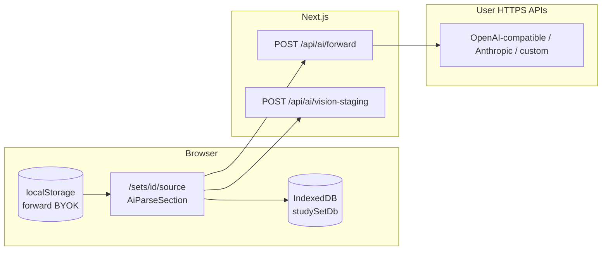

# Architecture

**Analysis Date:** 2026-04-13

## Pattern overview

**Overall:** Next.js 15 App Router monolith — Server Components for shell/layout/redirects, client components for PDF, IndexedDB, and long-running parse UI, Route Handlers for same-origin AI proxying and vision staging.

**Key characteristics:**

- **Local-first persistence** in IndexedDB via `src/lib/db/studySetDb.ts` (schema constants `DB_NAME`, `DB_VERSION` in `src/types/studySet.ts`; current version **5**). Optional one-time migration from legacy local-only data: `src/lib/db/migrateLegacyLocalStorage.ts`.
- **BYOK / forward-only:** One forward triple (base URL, API key, model id) in `localStorage`, merged from legacy keys once — `src/lib/ai/forwardSettings.ts`, `src/types/question.ts`. Vendor HTTP that would be CORS-blocked in the browser goes through **`POST /api/ai/forward`** (`src/app/api/ai/forward/route.ts`, client `src/lib/ai/sameOriginForward.ts`). Parse surface availability is declared in `src/lib/ai/parseCapabilities.ts`.
- **Human-in-the-loop:** Draft questions from parse flows land in IDB; review promotes to approved bank (`src/lib/review/approvedBank.ts`, review components under `src/components/review/`).

**Domain split (normative for new code):** Ingestion/parse vs learning/session boundaries and forbidden imports are documented in `docs/ARCHITECTURE-domain-boundaries.md`. Learning surfaces consume materialized `Question` data; they must not pull in multimodal parse orchestrators. Stable read-side surface: `src/lib/learning/index.ts`.

## Layers

**App shell and routing**

- Purpose: URLs, nested layouts, dashboard, settings, per-set wizard chrome.
- Location: `src/app/layout.tsx`, `src/app/(app)/layout.tsx`, `src/components/layout/AppShell.tsx`, `src/components/layout/AppProviders.tsx`, `src/components/providers/app-root-providers.tsx`, `src/components/layout/AppTopBar.tsx`, `src/components/layout/CommandPalette.tsx`, `src/components/layout/LibrarySearchContext.tsx`.
- Home entry: `src/app/page.tsx` redirects `/` → `/dashboard`.

**Study set wizard (per set)**

- Purpose: Linear study flow and step navigation.
- Location: `src/app/(app)/sets/[id]/layout.tsx` wraps children with step UI; `src/components/layout/StepProgressBar.tsx` maps steps (`source` → `review` → `play` / `flashcards` → `done`). `src/components/layout/ParseProgressStrip.tsx` surfaces parse progress where wired.
- Note: `src/app/(app)/sets/[id]/parse/page.tsx` redirects to `/sets/[id]/source` (parse UI lives on the source step).

**Document ingestion (native text layer)**

- Purpose: PDF → plain text when a text layer exists; stored on the document for routing estimates and policy.
- Location: `src/lib/pdf/extractPdfText.ts`, `src/lib/pdf/getPdfPageCount.ts`, `src/lib/pdf/validatePdfFile.ts`, `src/lib/pdf/pdfWorker.ts`.
- Call sites: `src/app/(app)/sets/new/NewStudySetPdfImportFlow.tsx`, `src/lib/db/studySetDb.ts` (create path when no pre-extracted text).

**PDF → images (vision / OCR / layout prep)**

- Purpose: Client-side rasterization to JPEG data URLs for multimodal APIs and thumbnails.
- Location: `src/lib/pdf/renderPagesToImages.ts` (`renderPdfPagesToImages`, `renderSinglePdfPageToDataUrl`).

**AI parse pipeline (orchestrated in UI)**

- Purpose: Strategy-specific flows — full-page vision, optional OCR prefetch, layout-chunk MCQ extraction, optional vision fallback — → draft `Question[]` (and flashcard vision items where applicable).
- Primary orchestrator: `src/components/ai/AiParseSection.tsx`.
- Supporting libs: `src/lib/ai/parseRoutePolicy.ts`, `src/lib/ai/runVisionSequential.ts`, `src/lib/ai/parseVisionPage.ts`, `src/lib/ai/runVisionBatchSequential.ts`, `src/lib/ai/visionBatching.ts`, `src/lib/ai/runOcrSequential.ts`, `src/lib/ai/ocrAdapter.ts`, `src/lib/ai/layoutChunksFromOcr.ts`, `src/lib/ai/runLayoutChunkParse.ts`, `src/lib/ai/parseChunk.ts`, `src/lib/ai/dedupeQuestions.ts`, `src/lib/ai/mapQuestionsToPages.ts`, `src/lib/ai/stageVisionDataUrl.ts`, `src/lib/ai/visionStagingStore.ts`, prompts under `src/lib/ai/prompts/`.
- OCR persistence: `src/lib/ai/ocrDb.ts`, `src/lib/ai/ocrStorage.ts`, types `src/types/ocr.ts`.

**Data layer (browser)**

- Purpose: CRUD for study sets, documents, drafts, approved banks, media blobs, parse progress, OCR rows, quiz sessions, wrong-answer history.
- Location: `src/lib/db/studySetDb.ts`. PDF rehydration: `src/lib/studySet/pdfFileFromDocument.ts`. Activity: `src/lib/studySet/activityTracking.ts`.

**Review and learning sessions**

- Purpose: Edit drafts, validate MCQs, approve bank; play quiz and flashcards; track wrong answers.
- Location: review `src/components/review/*`, `src/app/(app)/sets/[id]/review/page.tsx`; play `src/components/play/PlaySession.tsx`, `src/app/(app)/sets/[id]/play/page.tsx`; flashcards `src/components/flashcards/FlashcardSession.tsx`, `src/app/(app)/sets/[id]/flashcards/page.tsx`; done step `src/app/(app)/sets/[id]/done/page.tsx`. **`src/app/(app)/sets/[id]/practice/page.tsx`** is a **server redirect** to `/sets/[id]/play` (alias route).

**API surface (Next Route Handlers)**

- `src/app/api/ai/forward/route.ts` — AI forwarder (Bearer for OpenAI/custom, Anthropic headers when used).
- `src/app/api/ai/vision-staging/route.ts` + `src/app/api/ai/vision-staging/[id]/route.ts` — image staging for upstream `image_url`.
- `src/app/api/ai/vision-test-image/route.ts` — static test PNG.
- `src/app/api/parse-jobs/route.ts` + `src/app/api/parse-jobs/[id]/route.ts` — stubs behind server-parse flag; default product behavior remains **client-side** parse orchestration.

---

## Parse pipeline (deep dive)

### 1. Overview: native text vs vision / layout

**Native PDF text (text extraction path)**

- At import or study-set creation, `extractPdfText` in `src/lib/pdf/extractPdfText.ts` runs in the browser and fills `StudySetDocumentRecord.extractedText` (see `NewStudySetPdfImportFlow.tsx`, `studySetDb.ts`).
- That string is **not** fed directly into the unified parse MCQ extractor today. It feeds **`decideParseRoute`** in `src/lib/ai/parseRoutePolicy.ts` via character count vs page count (e.g. `MIN_CHARS_PER_PAGE_FOR_TEXT_SIGNAL`) so the UI can label “strong text layer” hints.
- **Unified user parse** (`runUnifiedParseInternal` in `AiParseSection.tsx`) always requires vision-forward readiness and an `activePdfFile`. It routes by strategy:
  - **`accurate`** → `handleVisionParse` (vision-first).
  - **`hybrid`** → `handleHybridParse` (OCR quality gate, then either full vision or layout-chunk pipeline).
  - **`fast`** (default for non-accurate branch) → `handleLayoutAwareParse` (rasterize + optional OCR + layout chunks, or vision if OCR disabled / missing).

**Vision / multimodal path**

- Every unified parse path that proceeds starts from **`runRenderPagesAndOptionalOcr`**: `renderPdfPagesToImages` in `src/lib/pdf/renderPagesToImages.ts`, then optionally `runOcrSequential` in `src/lib/ai/runOcrSequential.ts` when OCR is enabled and not suppressed (product surface skips OCR prefetch — see comments in `AiParseSection.tsx`).
- Vision MCQ extraction uses **`runVisionSequential`** + **`parseVisionPage`** / **`parseVisionPagePair`** when “attach page images” is on (per-page strict loop) or for sequential pair mode; **`runVisionBatchSequential`** when attach is off and batching applies (`handleVisionParse` branch).

**Where the user triggers parse**

- **`AiParseActions`** (`src/components/ai/AiParseActions.tsx`): **Parse** / **Cancel** buttons call `onParse` → `handleUnifiedParse` → `runUnifiedParseInternal`.
- **`AiParseSection`** also exposes **`runParse` / `cancel`** via `forwardRef` + `useImperativeHandle` for embedded flows (e.g. auto-start when draft empty).
- Host pages: **`src/app/(app)/sets/[id]/source/page.tsx`** (parse hub); embedded instances on other set steps as wired by parent components.

**Key entry components**

- `src/components/ai/AiParseSection.tsx` — strategy, progress overlay state, rasterization, OCR, `runVisionSequentialWithUi`, layout-chunk pipeline, persistence via `putDraftQuestions` / `putDraftFlashcardVisionItems`.
- `src/components/ai/AiParseActions.tsx`, `AiParseSectionHeader.tsx`, `AiParseParseStrategyPanel.tsx`, `AiParsePreferenceToggles.tsx`, `AiParseEstimatePanel.tsx`, progress context in `src/components/ai/ParseProgressContext.tsx`.

### 2. Vision prep: `renderPagesToImages.ts`

**Exports**

- **`renderPdfPagesToImages(file, { signal, maxPages, maxWidth, jpegQuality, onPageRendered })`** — loops pages `1..min(numPages, maxPages)`, renders each with pdf.js to a canvas, **`toDataURL("image/jpeg", jpegQuality)`**, collects `{ pageIndex, dataUrl }[]`.
- **`renderSinglePdfPageToDataUrl`** — one page helper for other call sites.

**Defaults / caps**

- `VISION_MAX_PAGES_DEFAULT` = **20** (`src/lib/pdf/renderPagesToImages.ts`).
- `VISION_MAX_WIDTH_DEFAULT` = **1024** px width cap (scale down if wider).
- `VISION_JPEG_QUALITY` = **0.78**.

**Abort / progress**

- **`AbortSignal`**: checked before the batch loop, before each page, and after `arrayBuffer()`; throws `AbortError` when aborted mid-batch.
- **`onPageRendered`**: invoked after each successful page with `PageImageResult` and `{ totalPages }` (capped count) for thumbnails / overlay log (`AiParseSection` `setParseOverlay`).

**Failure**

- `getDocument` or per-page render errors propagate (logged via `pipelineLogger`); `pdf.destroy()` runs in `finally`.

### 3. Sequential vision API: `runVisionSequential.ts`

**Progress type**

- `VisionParseProgress`: `{ current, total, questionsSoFar }`. **`onProgress`** is invoked after each completed page (attach), after single-page completion, and after each overlapping pair step (default multi-page). On **`FatalParseError`**, progress fires once with terminal counts before return.

**Branch A — `attachPageImages` + valid `studySetId` (“strict per-page”)**

- Iterates **`pages.length`** times, one **`parseVisionPage`** call per page.
- After each page’s questions, **`tryAssignQuestionImageIds`** stores the page JPEG in IDB via **`putMediaBlob`** (`src/lib/db/studySetDb.ts`), sets `sourcePageIndex`, `questionImageId`, `sourceImageMediaId` on questions.
- **Retries**: up to **2** attempts per page (`attempt < 2`). **`FatalParseError`** → immediate return with `fatalError` and **`dedupeQuestionsByStem`** on accumulated questions. **`isAbortError`** → break attempts without counting as `failedSteps` if aborted.
- Non-fatal failures: **`reportPipelineError`**, then second attempt; if still not `ok`, **`failedSteps += 1`** and continue (partial run).
- **`attachImageFailures`**: incremented when blob attach for a page fails but parse returned questions.
- Return always applies **`dedupeQuestionsByStem`** to the collected list.

**Branch B — exactly one page**

- Single **`parseVisionPage`**, up to **2** attempts, same fatal/abort/retry semantics, sets `sourcePageIndex` on questions, **`onProgress`** once at end, **`dedupeQuestionsByStem`**.

**Branch C — default multi-page without attach (“overlapping pair”)**

- **`total = pages.length - 1`**. Loop **`i = 0..total-1`** with **`left = pages[i]`**, **`right = pages[i+1]`**, calls **`parseVisionPagePair`** (adjacent pages in one request).
- Up to **2** attempts per pair; **`failedSteps`** increments if both attempts fail (and not aborted). **`FatalParseError`** short-circuits with deduped questions; abort breaks out.
- **`sourcePageIndex` is not set inside this branch** in `runVisionSequential` (mapping is applied later in `finalizeVisionParseResult` via **`applyQuestionPageMapping`** in `src/lib/ai/mapQuestionsToPages.ts`).

### 4. Per-request multimodal shape: `parseVisionPage.ts`

**Single page — `postVisionCompletion`**

- Builds OpenAI-style **`messages`** with one user **`content`** array: one `text` part + **exactly one** `{ type: "image_url", image_url: { url } }`.
- **`forwardAiPost`** sends that body to `/api/ai/forward` (no “all pages in one message” in this module).

**Pair — `postVisionCompletionPair`**

- Same pattern with **two** `image_url` parts (`imageUrlA`, `imageUrlB`) for left/right pages.

**Resilience inside `parseVisionPage` / `parseVisionPagePair`**

- **`imageTransportUrls`** → **`stageVisionDataUrlForUpstream`** then **`visionImageUrlTryOrder`**: try **`data:`** first; if staging returned a **public** HTTPS URL, try that second.
- Loop over URL candidates; on HTTP **400**, retry same URL with **`response_format` removed** (`json_object` off).
- **401 / 429** → **`FatalParseError`** (user-facing messages).
- Other non-OK → build error, try next transport URL if any.
- Parsed assistant text → **`questionsFromAssistantContent`** from `src/lib/ai/parseChunk.ts`.

### 5. Transport: staging + forward

**`stageVisionDataUrl.ts`**

- Browser: **`stageVisionDataUrlForUpstream`** `POST`s JSON `{ dataUrl }` to **`/api/ai/vision-staging`** (same-origin). On failure or SSR, returns `{ url: dataUrl, staged: false }`.
- **`visionImageUrlTryOrder`**: if staged URL is not publicly fetchable (e.g. localhost origin), only **`[dataUrl]`** is used — remote models often cannot fetch localhost; comments reference **`VISION_UPSTREAM_IMAGE_TIP`** and **`BLOB_READ_WRITE_TOKEN`**.

**`src/app/api/ai/vision-staging/route.ts` (POST)**

- Validates `data:` + base64, size cap **`VISION_STAGING_MAX_BYTES`** (from `src/lib/ai/visionStagingStore.ts`, **12 MiB**).
- If **`BLOB_READ_WRITE_TOKEN`** is set: uploads to Vercel Blob, returns **public** `url`.
- Else: **`putVisionStaging`** in-memory — GET handler serves **`/api/ai/vision-staging/[id]`** for **~10 min TTL**, **max 80** entries (see `visionStagingStore.ts`).

**`src/app/api/ai/vision-staging/[id]/route.ts` (GET)**

- With Blob token: **`head`** + **307** redirect to blob URL. Without: serves bytes from memory store.

**`forwardAiPost` — `src/lib/ai/sameOriginForward.ts`**

- Browser-only **`fetch("/api/ai/forward", …)`** with `{ provider, targetUrl, apiKey, body }`.

**`src/app/api/ai/forward/route.ts`**

- Validates **`provider`** (`openai` | `anthropic` | `custom`), **`targetUrl`** (https, or http localhost/127.0.0.1), forwards POST with appropriate auth headers. Vision parse uses **`openai` | `custom`** from **`getForwardOpenAiCompatKind`** / props in `AiParseSection.tsx`.

### 6. Product implications

**Intermittent / multi-phase UX**

- User-visible phases: **`visionRendering`** (rasterize) with per-page thumbnails in overlay, then **OCR** (if enabled), then **many chat-completion round-trips** (per page, per pair, or batched path). Progress bars use different **`total`** semantics: e.g. attach mode **`total = pages.length`**; pair mode **`total = pages.length - 1`**; batch path uses batch count from **`buildVisionBatches`**.

**Dedupe at end**

- **`dedupeQuestionsByStem`** in `src/lib/ai/dedupeQuestions.ts` runs at the end of **`runVisionSequential`** (and when merging chunk + vision fallback in **`runLayoutChunkPipelineFromPrepared`**). Duplicate stems across pages/pairs collapse to first-seen order.

**Partial failure and data loss**

- **Non-fatal step failures** (`failedSteps`): run continues; user may get **partial question lists**; summary in **`finalizeVisionParseResult`** reports failed steps.
- **`FatalParseError`**: pipeline returns early; **already-extracted** questions are still **deduped and returned** in memory, but **`persistQuestions`** in **`finalizeVisionParseResult`** runs only when **`!aborted && !fatal`** — so **IDB draft may not be updated** on fatal errors after partial extraction.
- **User cancel (`AbortController`)**: abort stops further API calls; persistence follows the same “no persist if aborted” guard for the happy path in finalize helpers.
- **Attach failures**: questions may exist **without** reference images (`attachImageFailures` / toast).
- **Staging TTL / Blob lifecycle**: in-memory staging expires; Blob objects are not auto-deleted by this app (see comment in `stageVisionDataUrl.ts`).

---

## Data flow (concise)

**1. Create study set and attach PDF**

- Flows from `src/app/(app)/sets/new/page.tsx` and dashboard create `StudySetMeta` and `StudySetDocumentRecord` (extracted text, optional `pdfArrayBuffer`) via `studySetDb` APIs, with `extractPdfText` where applicable.

**2. Source step — parse**

- `src/app/(app)/sets/[id]/source/page.tsx` loads meta + document, shows upload/PDF info, `AiParseSection`.
- Unified parse: rasterize → optional OCR → vision sequential / batch and/or layout-chunk + optional vision fallback → validation/mapping → drafts in IDB.
- Progress persisted in `parseProgress` store; logging via `src/lib/logging/pipelineLogger.ts`.

**3. Review → approve**

- Review UI reads/writes `draft` and `approved` stores.

**4. Play / flashcards**

- Sessions read approved bank; wrong-answer history uses `studyWrongHistory`.

## Optional diagram (study flow)

## State management

- React component state; parse progress context in `src/components/ai/ParseProgressContext.tsx` and overlay `src/components/ai/ParseProgressOverlay.tsx`.
- No global Redux/Zustand — durable state is IndexedDB and `localStorage` for settings.

## Error handling

- Typed parse errors: `src/lib/ai/errors.ts` (`FatalParseError`, abort detection); upstream bodies summarized in `src/lib/ai/upstreamErrors.ts`.
- Retries: `src/lib/ai/pipelineStageRetry.ts` (`withRetries` used from `studySetDb.ts` and parse pipeline).
- Optional remote: `src/lib/observability/reportPipelineError.ts`.

## Cross-cutting concerns

- **Validation:** `src/lib/validations/`, `src/lib/ai/validateQuestions.ts`, `src/lib/review/validateMcq.ts`.
- **Authentication:** Not applicable for v1 product shell.
- **Logging:** `pipelineLog` / `pipelineLogger.ts`; optional Sentry when configured.

---

*Architecture analysis: 2026-04-13*
