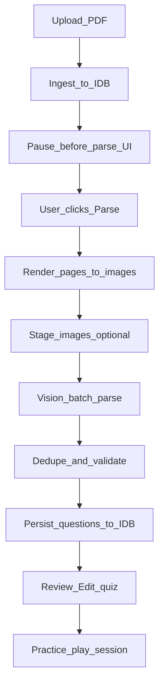

# Quiz workflow (Doc2Quiz) — end-to-end lane

Tài liệu này mô tả **workflow Quiz** hiện tại trong codebase: từ **Upload PDF → (pause) Parse → Vision batch → Persist → Review/Edit → Practice**.

Mục tiêu là để bạn **debug nhanh** các vấn đề kiểu: parse ra `0 questions`, batch fail, `POST /api/ai/forward 524`, “agent trả rồi mà web chưa thấy quiz”, hoặc token usage bất thường.

---

## 1) Entry points (pages/routes)

- **Create quiz from file**: `src/app/(app)/edit/new/quiz/page.tsx`
  - Render `NewStudySetPdfImportFlow` với `contentKind="quiz"`.
- **Unified upload + parse UI**: `src/app/(app)/edit/new/NewStudySetPdfImportFlow.tsx`
  - “Pause before parse”: upload xong **không tự parse**, user bấm **Parse**.
  - Nhúng `AiParseSection` với:
    - `surface="product"`
    - `parseOutputMode={parseOutputModeFromContentKind(contentKind)}` → quiz → `"quiz"`
- **Practice (play)**: `src/app/(app)/quiz/[id]/page.tsx`
  - Render `PlaySession` trong `src/components/quiz/QuizSession.tsx`

---

## 2) State model: contentKind → parseOutputMode

- Map lane:
  - `StudySetMeta.contentKind === "quiz"` → `parseOutputMode === "quiz"`
  - `StudySetMeta.contentKind === "flashcards"` → `parseOutputMode === "flashcard"`
- Mapping function: `src/types/visionParse.ts` → `parseOutputModeFromContentKind()`

Quiz lane **không dùng** flashcard schema/store.

---

## 3) High-level pipeline (product surface)

### Key invariant (product lane)

- Product parse (quiz + flashcards) đi **vision batch**: `runVisionBatchSequential` (không dùng sequential vision pair trong product surface).
- OCR có thể chạy để **mapping**, nhưng **MCQ generation** vẫn là vision.

Orchestrator UI: `src/components/ai/AiParseSection.tsx` (`handleVisionParse`).

---

## 4) Upload / ingest (tạo study set)

Trong `NewStudySetPdfImportFlow.tsx`:

- User upload file → tạo `parseContext` gồm:
  - `studySetId`
  - `file`
  - `pageCount`
- UI hiển thị “Ready to parse” + nút **Parse**.

Điểm debug:
- Nếu `parseContext.studySetId` rỗng → nhiều bước persist sẽ bị skip/giảm tính năng.

---

## 5) Parse orchestration (AiParseSection)

File chính: `src/components/ai/AiParseSection.tsx`

### 5.1 Chuẩn bị (render pages)

Hàm: `runRenderPagesAndOptionalOcr(...)` (được gọi trong `handleVisionParse`)

- Render PDF → `PageImageResult[]` (mỗi page: `pageIndex`, `dataUrl`)
- Với quiz lane, OCR có thể được bật (tuỳ toggle/capability) để dùng cho **page mapping**.

### 5.2 Vision batch (quiz lane)

Đường chạy product batch-only:

- `planVisionBatches(pages, "min_requests")`
- `runVisionBatchSequential({ mode: "quiz", pages, ... })`
- UI log:
  - `Vision batch parse · N page images · ...`
  - Nếu fallback legacy: `Retrying vision with legacy windows ... 10+overlap2`

### 5.3 Dedupe / persist / completion logs

Sau `runVisionBatchSequential`:
- UI thêm các phase log:
  - `Deduplicating and validating...`
  - `Saving X questions to database...`
  - `Done! Redirecting to review...`

Những log này giúp thấy khoảng “agent trả rồi mà web chưa nhận quiz” thực ra đang ở **dedupe/persist/redirect**.

---

## 6) Vision batch engine (runVisionBatchSequential)

File chính: `src/lib/ai/runVisionBatchSequential.ts`

### 6.1 API calls

Một batch request là **1** `POST /api/ai/forward` với `messages[role=user].content` gồm:
- 1 đoạn `text` (prompt)
- N phần `image_url` (mỗi page 1 url)

### 6.2 Image staging (giảm lỗi gateway)

`stageVisionDataUrlsBatch()` (client) gọi:
- `POST /api/ai/vision-staging` **một lần** với `{ dataUrls: string[] }` (chunk max 20)
- Trả về `results[]` (partial success)

Route:
- `src/app/api/ai/vision-staging/route.ts`
  - Nếu có `BLOB_READ_WRITE_TOKEN` → trả public blob URL
  - Không có token → same-origin URL + in-memory TTL (local dev upstream thường **không fetch được**)

### 6.3 Fallback strategy

- Preset mặc định: `"min_requests"` (cố gắng ít request nhất)
- Nếu “monolith” fail và đủ điều kiện → fallback `"legacy_10_2"` (10 pages/window + overlap 2)

### 6.4 Failure modes to watch

#### A) `POST /api/ai/forward 524 in ~125000ms`

Bạn đã thấy log kiểu:

- `POST /api/ai/forward 524 in 125881ms`

Điều này thường là **upstream timeout** (Cloudflare/Vercel edge timeout/proxy timeout), hoặc model endpoint treo quá lâu.

Debug checklist:
- Giảm số trang/batch (tạm) hoặc dùng provider/model nhanh hơn
- Kiểm tra base URL/model có đúng OpenAI-compatible chat completions không
- Kiểm tra mạng / rate-limit / gateway

#### B) `Invalid JSON from chat API` / trả về text dài nhưng không parse được

Nếu model trả về *plain text* thay vì JSON schema, parse sẽ fail và batch có thể ra `0 items`.

Dấu hiệu:
- response chars rất lớn
- batch retries hết nhưng vẫn `0 questions`

Hiện pipeline đã log attempt error và (khi là Invalid JSON) sẽ log **response preview** để bạn biết model đang trả gì.

#### C) `Empty model message content`

Model trả JSON hợp lệ nhưng `choices[0].message.content` rỗng → parse fail.

#### D) “Low token per image” warning

Nếu \(estimatedTokens / imageCount < 200\) → log cảnh báo `⚠️ Low token count...`.
Gợi ý response bị cắt/đổi format/endpoint không đúng.

---

## 7) Persist / storage (Quiz)

Quiz approved bank lưu trong IndexedDB store `approved`.

DB module: `src/lib/db/studySetDb.ts`

- `putApprovedBankForStudySet(studySetId, ApprovedBank)` — lưu quiz bank và (nếu có) clear `approvedFlashcards`
- `getApprovedBank(studySetId)` — load quiz bank

Trong parse pipeline (UI):
- Persist draft / approved được điều phối trong `src/components/ai/AiParseSection.tsx`
  - Quiz branch dùng `persistQuestions(...)` và/hoặc `putApprovedBankForStudySet(...)` tuỳ phase/route

---

## 8) Review/Edit (Quiz)

Key idea:
- Quiz lane có bước review/edit để sửa stem/options/correctIndex trước khi practice.

Bạn sẽ muốn dò các routes/components dưới `src/app/(app)/edit/quiz/...` và `src/components/edit/...` (tuỳ cấu trúc hiện tại) để thấy:
- Load bank từ `getApprovedBank()`
- Save bank qua `putApprovedBankForStudySet()`
- Validation: `isMcqComplete` từ `src/lib/review/validateMcq.ts`

---

## 9) Practice (QuizSession)

Practice entry:
- `src/app/(app)/quiz/[id]/page.tsx` → `PlaySession` (`src/components/quiz/QuizSession.tsx`)

`PlaySession` thường:
- Load approved bank (`getApprovedBank(studySetId)`)
- Filter playable questions (`isMcqComplete`)
- Track mistakes/completion (`src/lib/sets/activityTracking.ts`)

---

## 10) “Where to fix” cho bug bạn vừa gặp

Bạn gửi log:

- UI: “parsed 0 questions. 2 batches failed”
- Server: nhiều `POST /api/ai/forward 524 in 125xxxms`

Hướng fix ưu tiên:

- **Timeout / 524**:
  - giảm batch size hoặc đảm bảo endpoint/model nhanh
  - kiểm tra upstream URL có phải `/v1/chat/completions` (OpenAI compat) không
- **Format lỗi** (Invalid JSON):
  - xem “Response preview” trong parse log
  - siết prompt trong `src/lib/ai/visionPrompts.ts` (Quiz branch) để luôn trả JSON object đúng schema
- **Staging**:
  - đảm bảo `BLOB_READ_WRITE_TOKEN` khi chạy local dev nếu upstream là remote model server (không fetch được `localhost` URLs)

