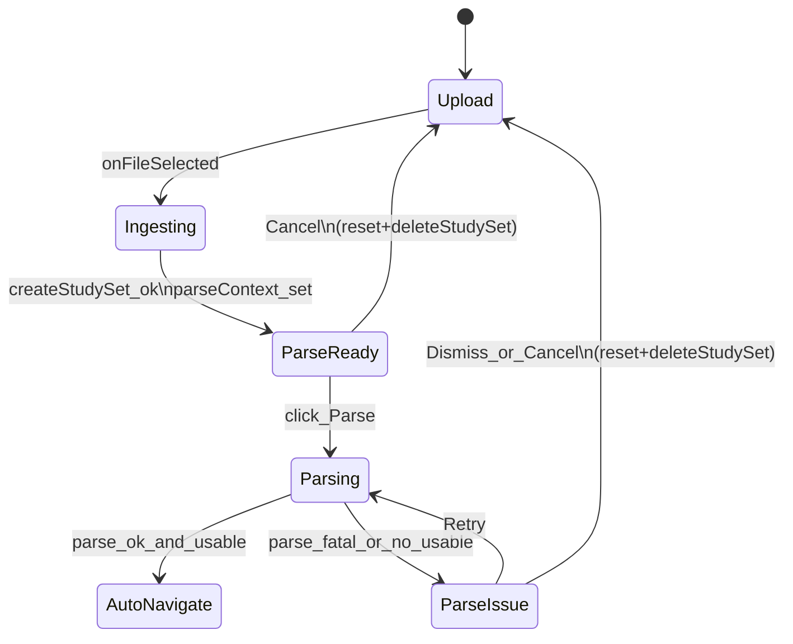

# Generate flow (UI): Quiz + Flashcards

## Purpose
Map the **current UI composition** for the “Generate from PDF” flow (Quiz + Flashcards), with a focus on:
- Component tree + responsibility boundaries
- State-driven rendering (what shows when)
- Where “live progress” and “parse controls” appear

This is intended as a blueprint for rebuilding UI while keeping the backend pipeline intact.

## Scope
- Included: `/edit/new` chooser, `/edit/new/quiz`, `/edit/new/flashcards`, shared `NewStudySetPdfImportFlow` layout, embedded parse UI.
- Excluded: edit/review routes, play pages.

## Top-level routes and wrappers

### `/edit/new` chooser
File: `src/app/(app)/edit/new/page.tsx`

UI blocks:
- Back link (to `/dashboard`)
- Hero + “How it works”
- Two format cards:
  - Quiz → `/edit/new/quiz`
  - Flashcards → `/edit/new/flashcards`

### `/edit/new/quiz`
File: `src/app/(app)/edit/new/quiz/page.tsx`

Composition:
- `QuizNewImportWorkbench`
  - Back link (to `/dashboard`)
  - `NewStudySetPdfImportFlow` configured for `contentKind="quiz"` + `getPostParseHref = quizPlay(id)`

Wrapper: `src/components/edit/new/quiz/QuizNewImportWorkbench.tsx`
- Provides `StudySetNewImportStepProvider` (import step context)
- Adds a technical backdrop (`QuizNewImportTechnicalBackdrop`)
- Wraps children in a scrollable `<main>` (overflow-y-auto, overscroll-contain)

### `/edit/new/flashcards`
File: `src/app/(app)/edit/new/flashcards/page.tsx`

Composition:
- `FlashcardsImportWorkbench`
  - Back link (to `/dashboard`)
  - `NewStudySetPdfImportFlow` configured for `contentKind="flashcards"` + `getPostParseHref = flashcardsPlay(id)`

Wrapper: `src/components/edit/new/flashcards/FlashcardsImportWorkbench.tsx`
- Provides `StudySetNewImportStepProvider`
- Adds the technical grid backdrop (`FlashcardsImportTechnicalGrid`)
- Same scrollable `<main>` pattern

## Shared workhorse UI: `NewStudySetPdfImportFlow`
File: `src/app/(app)/edit/new/NewStudySetPdfImportFlow.tsx`

### Primary state inputs (render drivers)
- **Ingest state**
  - `ingestBusy: boolean`
  - `importPhase: "idb" | "pdf" | "persist" | "ai" | ...` (UI uses it for `UnifiedImportStatusCard`)
  - `loadingFileName: string | null`
  - `ingestPreviewFile: File | null`
  - `ingestPageCount: number | null`
  - `error: string | null` (upload/ingest failures)
- **Parse context state**
  - `parseContext: { studySetId, file, pageCount } | null`
  - `parseRequested: boolean` (start button “Starting…”)
  - `parseError: string | null` (parse run failure/no usable output)
  - `parsing: boolean` (derived from `useParseProgress().live`)
- **Flashcards-only config**
  - `flashcardGenerationConfig` (+ `FlashcardsGenerationControls` UI)
- **Document preview**
  - `documentPreviewOpen: boolean` (collapsible pdf viewer)

### Layout: one panel that morphs across phases
The flow has 2 major render “modes”:
- **Upload chrome** (`showUploadChrome`): when not ingesting and no parse context
- **Import layout** (`showImportLayout`): when ingesting or parseContext exists

#### Upload chrome (initial state)
Blocks:
- Centered header:
  - `pageHeading`
  - `pageSubcopy`
- `UploadBox` (tall)
  - `error` displayed if validation/ingest fails
  - `onFileSelected` kicks off the pipeline

#### Import layout (ingest + parse)
Container:
- `motion.div` (fade/slide in)
- 2-column grid on `sm+`:
  - **Left column**: “Document” + live preview area
  - **Right column**: status + parse controls

### Left column: Document + “what’s being generated”

#### Collapsible Document preview
Card-like block:
- Button header: “Document” + chevron
- When expanded:
  - `NewImportPdfViewer file={previewFile}`

`previewFile` selection logic:
- During ingest: `ingestPreviewFile`
- During parse: `parseContext.file`

#### Live preview area (format-dependent)
Rendered when `importLiveChromeActive` (ingestBusy OR parsing) and no `parseError`:
- **Flashcards**: `FlashcardsImportDeckSkeleton`
  - Count is derived from `pageCountForSkeleton`
- **Quiz**: `ImportQuizLivePanel`
  - Polls the **approved bank** for `studySetId` while parsing
  - Mixes “skeleton slots” with live question preview cards as they appear

### Right column: status + parse controls

#### `UnifiedImportStatusCard`
Always shown in import layout, binds to:
- `contentKind`
- `fileName` (from `loadingFileName` or `parseContext.file.name`)
- `importPhase`
- `ingestBusy`
- `parseContext`
- `runAiParseOnNewPage`
- optional `onCancelParse` when `parsing` is true

This card is the “single place” that communicates ingest/parse progress status in the right rail.

#### Inline parse section (only once parseContext exists)
When `parseContext && runAiParseOnNewPage`:
- Optional format-specific blocks:
  - Flashcards:
    - `FlashcardsGenerationControls` (disabled while parsing)
  - Both:
    - “Ready to parse” alert (only when not parsing + no parseError)
- Embedded `AiParseSection` (variant="embedded", surface="product")
  - `parseOutputMode` is derived from `contentKind`
  - `suppressEmbeddedRunningProgress={parsing}` to avoid duplicate progress blocks if parent shows progress

#### Parse error block (and recovery controls)
When `parseError` is non-null:
- Destructive `Alert` showing the message
- Actions:
  - **Retry** → rerun parse (keeps same studySetId)
  - **Dismiss** → resets + deletes the created study set

#### CTA row (Parse / Cancel)
Below `AiParseSection`:
- If no `parseError`: primary **Parse** button
- Always: **Cancel** button (resets + deletes the created study set)

## `ImportQuizLivePanel` (quiz-only live preview)
File: `src/components/edit/new/import/ImportQuizLivePanel.tsx`

Responsibilities:
- Keeps `questions[]` local state
- When enabled, polls `getApprovedBank(studySetId)` every ~650ms
- Renders:
  - a list of live `QuestionPreviewCard`s
  - skeleton cards to fill up to a target slot count derived from page count
- Provides a “navigator” sidebar for imported questions (UI-only; still part of import screen)

## UI state map (what shows when)

## Key UI deltas: Quiz vs Flashcards
- **Backdrops**: Quiz uses `QuizNewImportTechnicalBackdrop`; Flashcards uses `FlashcardsImportTechnicalGrid`.
- **Left rail preview while running**:\n  - Quiz uses `ImportQuizLivePanel` (polls approved bank and shows questions streaming in).\n  - Flashcards uses a deck skeleton (no live item polling panel).\n- **Controls before parsing**: Flashcards shows `FlashcardsGenerationControls` in the right rail.

