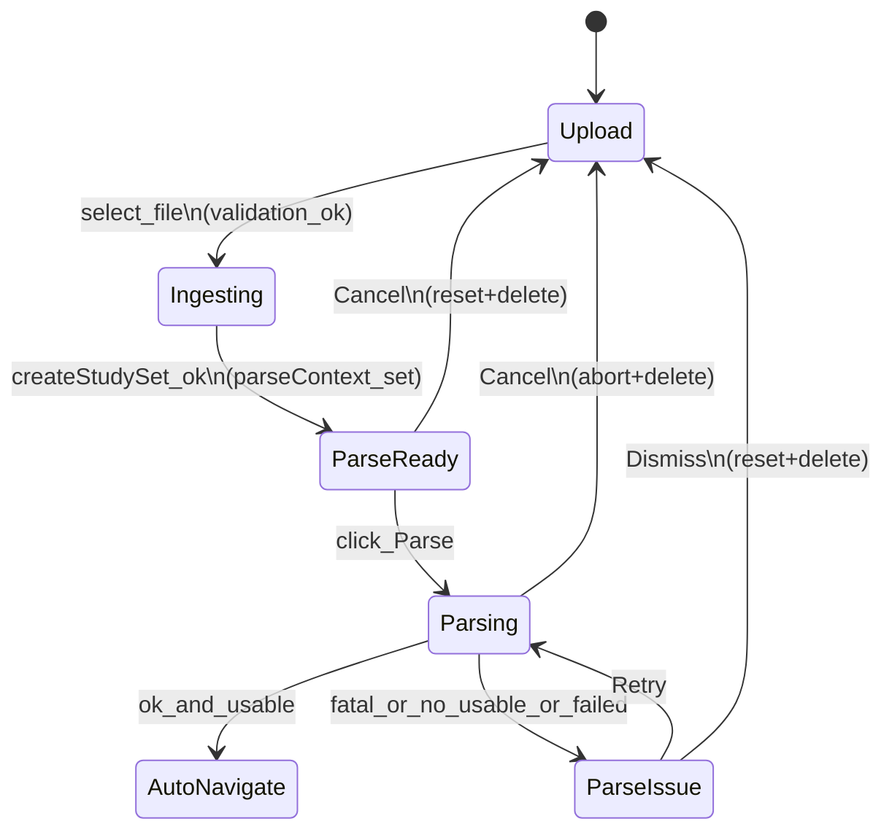

# Generate flow (UX): Quiz + Flashcards

## Purpose
Describe the **user journey** for generating **Quiz** and **Flashcards** from a PDF, from first entry to automatic navigation into play mode. This is meant to support a **UI/UX rebuild** while preserving backend semantics:
- “When does the user feel progress?”
- “What control do they have (cancel/retry)?”
- “What does success mean (usable output)?”
- “What are the failure modes and recovery paths?”

## Scope
- Included: `/edit/new/*` upload → ingest → inline parse → auto navigate to play.
- Excluded: editing/reviewing questions/cards and post-play review.

## Core experience contract (shared across Quiz + Flashcards)

### Success definition (usable output)
Navigation to play happens only when parse finishes with **usable output**:
- Quiz: at least 1 complete MCQ (validated by `isMcqComplete`)
- Flashcards: at least 1 card with non-empty `front` + `back`

### User control
At any point during inline parse:
- **Cancel**: resets the flow and **deletes** the created study set (cleanup).
On parse issues:
- **Retry**: re-runs parse against the same created study set id.
- **Dismiss**: resets the flow and deletes the created study set.

### Trust & progress surfaces
The flow uses multiple “proof of work” cues:
- Import status card (phase-aware)
- Left rail “Document” preview (collapsible)
- Live panel (quiz) or skeleton deck (flashcards)

## Journey 1: Quiz generate (end-to-end)

### Step A — Choose format
User enters `/edit/new`:
- Sees “Create Quiz” card with features and output hint.
- Clicks **Choose Quiz** → navigates to `/edit/new/quiz`.

### Step B — Upload
On `/edit/new/quiz`:
- Page tells user: upload a PDF, AI will generate quiz and go straight into practice.
- User selects a file in the upload box.

**Possible friction points (and current behavior):**
- Wrong type (non-PDF) → immediate validation message.
- Too large file (> 10MB) → immediate validation message.

### Step C — Ingest (automatic, no user action)
After file selection, UI shifts into the “import layout”:
- Right rail shows phase updates (IDB → PDF → Persist).
- Left rail shows:
  - Collapsible “Document” preview (user can open/close)
  - Live preview area (skeleton slots initially)

Perceived progress signals:
- File name presence (in status card)
- Page count-based skeleton slots (visual “something is happening”)

### Step D — Parse-ready moment (hand-off to user)
Once the study set is created in IDB, the page enters `importPhase="ai"` and shows:
- A “Ready to parse” message (when not running)
- Parse configuration UI inside the embedded parse section (mostly hidden by `surface="product"`)
- A primary **Parse** button

User action:
- Clicks **Parse**

### Step E — Parsing (active work)
During parsing:
- Right rail status continues to show progress.
- Left rail switches to quiz live panel behavior:
  - Starts polling the approved bank
  - As questions are persisted, actual question cards appear in the list
  - Remaining slots are filled with skeleton cards

This creates an important UX effect:
- The user sees **real content** streaming in, not just an indeterminate spinner.

### Step F — Completion → Auto-navigate
If parse completes and there is at least one usable MCQ:
- The flow auto-navigates to `/quiz/[id]`

### Step G — Parse issue states (recovery)
If parse finishes but:
- has `fatalError`, or
- is ok but has **no usable MCQs**, or
- fails to finish successfully

Then the UI shows a **Parse issue** message with two recovery paths:
- **Retry**: attempts another parse run for the same created study set.
- **Dismiss**: resets the flow back to Upload and deletes the created study set (cleanup).

Important nuance for UX design:
- “Retry” preserves the studySet id and the already-ingested PDF in IDB.
- “Dismiss/Cancel” is destructive (deletes meta/document/banks/media/progress records).

### Step H — Cancel semantics (mid-flow)
At any time once the flow is in parse context, user can press **Cancel**.
Effect:
- parse is aborted (if running)
- created study set is deleted
- UI returns to upload state

This is effectively a “Start over” that guarantees no half-baked sets remain in the library.

## Journey 2: Flashcards generate (end-to-end)

### Step A — Choose format
User enters `/edit/new`:
- Clicks **Choose Flashcards** → navigates to `/edit/new/flashcards`.

### Step B — Upload
User selects a PDF.
Same validation behaviors as quiz (type/size errors).

### Step C — Ingest (automatic)
UI shifts into import layout:
- Right rail: phase updates (IDB → PDF → Persist → AI).
- Left rail:
  - Collapsible Document preview
  - Flashcards deck skeleton (card-shaped placeholders)

Flashcards UX intent differs from quiz:
- It does not “stream real cards” into view during parse (in current UI).
- It emphasizes “a deck is being created” rather than “questions are arriving”.

### Step D — Parse-ready moment (hand-off)
Once parse context exists:
- Flashcards shows **generation controls** (e.g., config/toggles) before starting.
- User hits **Parse**.

### Step E — Parsing
During parsing:
- Right rail shows status/progress.
- Left rail stays as deck skeleton (no live polling panel).

### Step F — Completion → Auto-navigate
If parse completes and yields at least one usable flashcard item:
- Auto-navigates to `/flashcards/[id]`.

### Step G — Parse issue states (recovery)
Same recovery affordances:
- **Retry** keeps the set and tries again.
- **Dismiss** deletes the set and returns to Upload.

## State machine (shared)

## Failure buckets (user-facing)
These buckets are what the user perceives (not necessarily all internal errors):
- **Upload validation**: wrong file type, file too large.
- **IDB**: storage unavailable / blocked.
- **PDF open**: could not read page count or extract text.
- **Persist**: set creation failed (meta/document write).
- **AI parse**:
  - fatal parse error
  - parse finished but produced no usable items
  - aborted parse (user cancels)

## UX hooks to preserve (or intentionally redesign)
- **Clear phase separation**: upload → ingest → parse → start studying.
- **Document preview** as a confidence anchor (what file is being processed).
- **Destructive cancel** that guarantees cleanup (library won’t accumulate broken sets).
- **Format-specific “what you’ll get” cues**:\n  - Quiz: live question stream is motivating.\n  - Flashcards: deck skeleton + generation controls sets expectations.

## Suggested rebuild seams (where UX can change without breaking backend)
These are safe places to rebuild UI/UX while keeping the same pipeline:
- Replace the 2-column layout with a single “canvas” + collapsible inspector, as long as you keep:\n  - parse context creation\n  - Parse/Cancel/Retry/Dismiss actions\n  - status/progress surface
- Swap quiz live polling with a different “proof of work” (e.g., progressive counts, staged milestones) as long as parse still persists to approved bank.
- Move generation controls into a pre-parse stepper (Flashcards) without changing the parse call signature.

