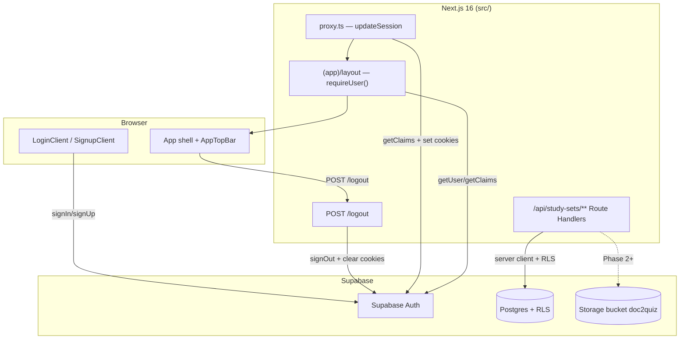

# Phase 1: Foundation - Research

**Researched:** 2026-07-25
**Domain:** Supabase (Postgres + Auth + Storage) + Next.js 16 App Router SSR auth + pipeline API skeleton
**Confidence:** HIGH

## Summary

Phase 1 restores the backend foundation stripped during v2.0: real Supabase connectivity, a **single v2.1 baseline migration** replacing six legacy files, and step-based API route stubs aligned to `docs/pipeline.md`. The frontend shell already exists; `src/lib/client/*` are mocks and `src/lib/supabase/*` plus `src/middleware.ts` were removed from disk but remain recoverable from git HEAD.

The highest-risk work is **auth cookie refresh** — Next.js 16 renamed `middleware.ts` → `proxy.ts` [CITED: nextjs.org/docs/app/api-reference/file-conventions/proxy], and current Supabase SSR guidance uses `@supabase/ssr` with `getClaims()` in the proxy (not deprecated `auth-helpers`) [CITED: supabase.com/docs/guides/auth/server-side/creating-a-client]. The project already has `@supabase/ssr@0.12.3` and `@supabase/supabase-js@2.110.8` installed [VERIFIED: npm registry]. Wire `src/proxy.ts` to restore v1 `updateSession` logic (adapted for `getClaims()`), restore `requireUser()` on `(app)/layout.tsx`, and fix logout — `AppTopBar` currently navigates to `/login` without calling `signOut()` (CORE-AUTH-02 gap).

Schema design should carry forward proven v1 patterns: composite FK `(study_set_id, user_id)`, `UNIQUE (id, user_id)` on parent tables, user-scoped RLS on every table, and `doc2quiz` storage bucket with `owner = auth.uid()` policies [VERIFIED: codebase `20260418_000001_doc2quiz_cloud_first.sql`]. New tables `canonical_documents` (1:1 with `study_sets`) and `canonical_sections` replace v1 `study_set_documents` / OCR / media tables. Replace `status` (`draft`/`ready`) with `pipeline_stage` per CONTEXT.

**Primary recommendation:** Restore `src/lib/supabase/*` from git HEAD, migrate session refresh from deleted `middleware.ts` into `src/proxy.ts` using Supabase's current proxy pattern, ship one idempotent baseline SQL file, and scaffold authenticated API routes with a shared `requireApiUser` helper — no new npm packages.

<user_constraints>
## User Constraints (from CONTEXT.md)

### Locked Decisions

#### SQL migration reset
- **D-01:** Delete **all 6** existing files in `supabase/migrations/` and replace with **one** fresh baseline migration for v2.1. No incremental ALTERs on v1 schema.
- **D-02:** Do **not** reset the remote Supabase project in Phase 1 — schema files only. User will apply/reset manually when ready.
- **D-03:** Old migrations are **not** archived to `.planning/` — full delete. Git history retains them if needed.

#### Canonical knowledge schema
- **D-04:** **1:1** relationship — `study_sets` + `canonical_documents` (FK). One import → one study set → one canonical document row.
- **D-05:** `canonical_documents` holds: original file storage reference, `raw_markdown`, `canonical_markdown`, `metadata` (jsonb: language, content_type, title, clean_filename, input_type, source_url, etc.), timestamps.
- **D-06:** **`canonical_sections`** table — one row per stable section (`ordinal`, `heading`, `body_markdown`, optional `section_type`). Supports flashcard coverage picker in Phase 5.
- **D-07:** Drop v1 tables entirely from baseline: `media_assets`, `ocr_results`, `canonical_document_extractions`, `generation_output_cache`, `study_set_documents`. No v1 PDF/OCR columns.

#### Practice content tables (carry forward shape)
- **D-08:** Include `approved_questions`, `approved_flashcards`, `quiz_sessions`, `study_wrong_history` in the fresh baseline — same general shape as v1 (4-choice MCQs, front/back cards, session stats, wrong-history). Adapt FKs to new `study_sets` + user-scoped RLS.
- **D-09:** Remove `draft`/`ready` publish semantics from `study_sets.status`. Use `pipeline_stage` enum/text instead: `input` → `raw` → `canonical` → `mode_selected` → `quiz` | `flashcards`. `content_kind` remains `quiz` | `flashcards` | null.

#### Original file storage
- **D-10:** **Supabase Storage** bucket `doc2quiz` for uploaded originals (PDF, Office, images, audio). `canonical_documents.original_storage_path` + `original_filename` + `original_mime_type` reference the object.
- **D-11:** Paste and YouTube URL inputs store source reference in metadata only (no storage object). Phase 2 implements upload; Phase 1 creates bucket + RLS policies in migration.

#### Auth restoration
- **D-12:** Replace `src/lib/client/*` stubs with real Supabase clients: `browser.ts`, `server.ts`, `middlewareClient.ts`, `auth-guard.ts`.
- **D-13:** **Email/password only** for v2.1 (same as v1). No OAuth providers in Phase 1.
- **D-14:** Restore `requireUser()` on `(app)` layout — protected routes redirect unauthenticated users to `/login`.
- **D-15:** Wire `src/proxy.ts` for Supabase session refresh (replace passthrough). **No dev backdoor.**

#### API route skeleton
- **D-16:** **Step-based routes** aligned to `docs/pipeline.md` — not one monolithic orchestrator. Phase 1 creates route files with stub handlers (501 or structured "not implemented" JSON).
- **D-17:** Route map:
  - `GET/POST /api/study-sets` — list / create study set
  - `GET/PATCH/DELETE /api/study-sets/[id]` — study set CRUD
  - `POST /api/study-sets/[id]/ingest` — validate + MarkItDown (stub → Phase 2)
  - `POST /api/study-sets/[id]/canonicalize` — canonical builder (stub → Phase 3)
  - `POST /api/study-sets/[id]/quiz/generate` — MCQ generation (stub → Phase 4)
  - `POST /api/study-sets/[id]/flashcards/generate` — flashcard generation (stub → Phase 5)
- **D-18:** All API routes require authenticated user; use server Supabase client + RLS.

#### Input validation stub
- **D-19:** `INPUT-VAL-01` — create shared validation types/constants (supported MIME types, max sizes per format) in `src/lib/pipeline/validation.ts`. Enforcement logic lands in Phase 2; Phase 1 exports the contract.

### Claude's Discretion
- Exact column names and enum vs text for `pipeline_stage` and `metadata` keys
- Whether `study_sets.subtitle` is kept or dropped
- Migration filename timestamp
- Minor RLS policy naming — must be user-scoped on all tables

### Deferred Ideas (OUT OF SCOPE)
- **MarkItDown integration** — Phase 2
- **Canonical Knowledge Builder AI** — Phase 3
- **Quiz / flashcard generation** — Phases 4–5
- **OAuth / social login** — not v2.1
- **Remote `supabase db reset`** — user action when ready, not Phase 1 automation
- **Legacy v1 API routes** (`generate-from-file`, OCR, parse progress) — remove or replace during execution; not part of v2.1 pipeline
</user_constraints>

<phase_requirements>
## Phase Requirements

| ID | Description | Research Support |
|----|-------------|------------------|
| CORE-AUTH-01 | User can log in and remain authenticated across sessions | Restore `@supabase/ssr` clients; wire `proxy.ts` session refresh; `requireUser()` on `(app)` layout; email/password via existing Login/Signup UI |
| CORE-AUTH-02 | User can log out from the app shell | Restore `POST /logout` route with `signOut()`; fix `AppTopBar` to call logout endpoint (currently only `router.replace("/login")`) |
| CANON-09 | System stores original file, raw Markdown, canonical Markdown, metadata, and sections in Supabase | `canonical_documents` + `canonical_sections` tables with RLS; storage bucket `doc2quiz` + policies; columns per D-05/D-06/D-10 |
| INPUT-VAL-01 | System validates input type and size before conversion | `src/lib/pipeline/validation.ts` exports MIME allowlist + max-size constants per `docs/pipeline.md`; enforcement deferred to Phase 2 |
</phase_requirements>

## Architectural Responsibility Map

| Capability | Primary Tier | Secondary Tier | Rationale |
|------------|-------------|----------------|-----------|
| Session refresh / cookie sync | Frontend Server (proxy) | — | Next.js 16 `proxy.ts` runs before routes; must refresh Supabase auth cookies [CITED: nextjs.org/docs/app/api-reference/file-conventions/proxy] |
| Page-level auth gate | Frontend Server (RSC layout) | Database (RLS) | `requireUser()` in `(app)/layout.tsx` redirects unauthenticated users; RLS is defense-in-depth |
| Email/password login/signup | Browser (client components) | API / Auth (Supabase) | Existing `LoginClient` / `SignupClient` call browser Supabase client |
| Logout | API / Backend (`POST /logout`) | Browser (shell trigger) | Server `signOut()` clears httpOnly cookies reliably |
| Study set + canonical CRUD | API / Backend | Database | Route handlers use server Supabase client; RLS enforces `user_id = auth.uid()` |
| Pipeline step stubs (ingest, etc.) | API / Backend | — | Step routes return 501 until Phases 2–5 |
| Original file storage | Database + Storage (Supabase) | API (Phase 2 upload) | Phase 1 creates bucket + RLS; upload logic is Phase 2 |
| Input validation contract | Shared lib (`validation.ts`) | API (Phase 2 enforcement) | Constants/types only in Phase 1 |
| Practice tables (questions, sessions) | Database | API / Browser (later phases) | Schema in baseline; populated in Phases 4–5 |

## Standard Stack

### Core

| Library | Version | Purpose | Why Standard |
|---------|---------|---------|--------------|
| `next` | 16.2.11 | App Router, `proxy.ts`, Route Handlers | Project framework [VERIFIED: npm registry] |
| `@supabase/supabase-js` | 2.110.8 | Postgres, Auth, Storage client | Official Supabase JS client [VERIFIED: npm registry] |
| `@supabase/ssr` | 0.12.3 | Cookie-based SSR auth helpers | Replaces deprecated `auth-helpers-nextjs` [CITED: supabase.com/docs/guides/auth/server-side/creating-a-client] |
| `zod` | 4.4.3 | Validation types/schemas (Phase 2+) | Already in project; use for `validation.ts` contract types |

### Supporting

| Library | Version | Purpose | When to Use |
|---------|---------|---------|-------------|
| Supabase CLI | 2.109.1 (local) | Migration authoring, local dev | Apply baseline locally; **not** remote reset in Phase 1 |
| `supabase/EMAIL_AUTH_SETUP.md` | — | Disable email confirmation | Required for signup → immediate session (existing project doc) |

### Alternatives Considered

| Instead of | Could Use | Tradeoff |
|------------|-----------|----------|
| `@supabase/ssr` + cookies | `@supabase/auth-helpers-nextjs` | Deprecated; breaks Next.js 16 SSR [CITED: supabase.com/docs] |
| `proxy.ts` | `middleware.ts` | `middleware` deprecated in Next.js 16; project already has `src/proxy.ts` passthrough [CITED: nextjs.org/docs] |
| `getClaims()` in proxy | `getUser()` in proxy | Docs recommend `getClaims()` for token refresh + page protection; `getUser()` adds network round-trip [CITED: supabase.com/docs/guides/auth/server-side/creating-a-client] |
| Single baseline migration | Incremental ALTERs on v1 | User locked: full delete + one fresh file (D-01) |

**Installation:** No new packages required for Phase 1.

**Version verification:**
```bash
npm view @supabase/ssr version      # 0.12.3
npm view @supabase/supabase-js version  # 2.110.8
npm view next version               # 16.2.11
```

## Package Legitimacy Audit

> Phase 1 installs **no new packages**. Existing dependencies verified on npm registry.

| Package | Registry | slopcheck | Disposition |
|---------|----------|-----------|-------------|
| `@supabase/ssr` | npm | skipped (pre-installed) | Approved — official Supabase |
| `@supabase/supabase-js` | npm | skipped (pre-installed) | Approved — official Supabase |
| `zod` | npm | skipped (pre-installed) | Approved — widely used |

**Packages removed due to slopcheck [SLOP] verdict:** none
**Packages flagged as suspicious [SUS]:** none

## Architecture Patterns

### System Architecture Diagram



### Recommended Project Structure

```
src/
├── proxy.ts                          # Next.js 16 proxy — calls updateSession
├── lib/
│   ├── supabase/
│   │   ├── env.ts                    # NEXT_PUBLIC_SUPABASE_URL / ANON_KEY
│   │   ├── browser.ts                # createBrowserClient (client components)
│   │   ├── server.ts                 # createSupabaseServerClient (RSC, routes)
│   │   ├── middlewareClient.ts         # updateSession for proxy
│   │   └── auth-guard.ts             # requireUser() for (app) layout
│   ├── client/
│   │   ├── supabase.ts               # thin re-export → supabase/browser (minimize import churn)
│   │   └── studySetDb.ts             # real queries (Phase 1: minimal CRUD or defer to API)
│   ├── api/
│   │   └── requireApiUser.ts           # shared 401 guard for route handlers
│   └── pipeline/
│       └── validation.ts             # INPUT-VAL-01 contract
├── app/
│   ├── (app)/layout.tsx              # await requireUser()
│   ├── (auth)/logout/route.ts        # POST signOut → redirect
│   └── api/study-sets/
│       ├── route.ts                  # GET, POST
│       └── [id]/
│           ├── route.ts              # GET, PATCH, DELETE
│           ├── ingest/route.ts       # POST stub
│           ├── canonicalize/route.ts # POST stub
│           ├── quiz/generate/route.ts
│           └── flashcards/generate/route.ts
supabase/
└── migrations/
    └── YYYYMMDDHHMMSS_v21_baseline.sql   # single file (D-01)
```

**Note:** Delete `src/middleware.ts` if reintroduced — Next.js 16 uses `proxy.ts` only [CITED: nextjs.org/docs]. Git HEAD had `middleware.ts` calling `updateSession`; port that logic into `src/proxy.ts`.

### Pattern 1: Supabase Proxy Session Refresh (Next.js 16)

**What:** Refresh auth tokens on every matched request before RSC/API render.
**When to use:** Always — without it sessions expire silently [CITED: supabase.com/docs/guides/auth/server-side/creating-a-client].

**Example:**
```typescript
// src/proxy.ts — adapt from git HEAD middleware + Supabase example
import { type NextRequest } from "next/server";
import { updateSession } from "@/lib/supabase/middlewareClient";

export async function proxy(request: NextRequest) {
  return await updateSession(request);
}

export const config = {
  matcher: [
    "/((?!_next/static|_next/image|favicon.ico|mathjax|.*\\.(?:svg|png|jpg|jpeg|gif|webp)$).*)",
  ],
};
```

```typescript
// src/lib/supabase/middlewareClient.ts — use getClaims() per current Supabase docs
// Source: https://github.com/supabase/supabase/blob/master/examples/user-management/nextjs-user-management/lib/supabase/proxy.ts
import { createServerClient } from "@supabase/ssr";
import { NextResponse, type NextRequest } from "next/server";
import { getSupabaseAnonKey, getSupabaseUrl } from "./env";

export async function updateSession(request: NextRequest) {
  let supabaseResponse = NextResponse.next({ request });

  const supabase = createServerClient(getSupabaseUrl(), getSupabaseAnonKey(), {
    cookies: {
      getAll() {
        return request.cookies.getAll();
      },
      setAll(cookiesToSet, headers) {
        cookiesToSet.forEach(({ name, value }) => request.cookies.set(name, value));
        supabaseResponse = NextResponse.next({ request });
        cookiesToSet.forEach(({ name, value, options }) =>
          supabaseResponse.cookies.set(name, value, options),
        );
        Object.entries(headers).forEach(([key, value]) =>
          supabaseResponse.headers.set(key, value),
        );
      },
    },
  });

  await supabase.auth.getClaims();
  return supabaseResponse;
}
```

**Preserve from v1:** `x-next-pathname` header injection (git HEAD `middlewareClient.ts`) for `requireUser()` redirect `?next=` — still valuable for deep links.

### Pattern 2: Server Route Handler Auth Guard

**What:** Every `/api/study-sets/**` handler checks auth before business logic.
**When to use:** All pipeline API routes (D-18).

**Example:**
```typescript
// src/lib/api/requireApiUser.ts
import { NextResponse } from "next/server";
import { createSupabaseServerClient } from "@/lib/supabase/server";

export async function requireApiUser() {
  const supabase = await createSupabaseServerClient();
  const { data: { user }, error } = await supabase.auth.getUser();
  if (error || !user) {
    return { error: NextResponse.json({ error: "unauthorized" }, { status: 401 }) };
  }
  return { supabase, user };
}
```

RLS provides second layer — even with a valid session, rows are scoped to `auth.uid()`.

### Pattern 3: Fresh Baseline Migration (Single File)

**What:** One SQL file defines entire v2.1 schema idempotently where practical.
**When to use:** D-01 — replace all 6 files in `supabase/migrations/`.

**Recommended table set:**

| Table | Purpose |
|-------|---------|
| `study_sets` | User-owned study set; `pipeline_stage`, `content_kind`, title metadata |
| `canonical_documents` | 1:1 with `study_sets`; storage refs + raw/canonical markdown + metadata jsonb |
| `canonical_sections` | N:1 with `canonical_documents`; ordinal, heading, body |
| `approved_questions` | MCQ bank (v1 shape) |
| `approved_flashcards` | Flashcard bank (v1 shape) |
| `quiz_sessions` | Practice session stats |
| `study_wrong_history` | Mistakes drill state |
| `storage.buckets` | `doc2quiz` private bucket |

**Composite FK pattern (carry from v1):**
```sql
-- study_sets
constraint study_sets_id_user_id_unique unique (id, user_id)

-- canonical_documents (1:1)
constraint canonical_documents_study_set_fk
  foreign key (study_set_id, user_id)
  references study_sets (id, user_id) on delete cascade,
constraint canonical_documents_study_set_id_unique unique (study_set_id)

-- canonical_sections
constraint canonical_sections_document_fk
  foreign key (canonical_document_id, user_id)
  references canonical_documents (id, user_id) on delete cascade
```

**`pipeline_stage` recommendation:** `text` with `CHECK` constraint (discretion D-09) — easier to evolve than enum without migration churn:
```sql
pipeline_stage text not null default 'input'
  check (pipeline_stage in ('input','raw','canonical','mode_selected','quiz','flashcards'))
```

### Pattern 4: Pipeline Step Stub Response

**What:** Structured 501 until implementation lands.
**When to use:** ingest, canonicalize, quiz/generate, flashcards/generate routes.

```typescript
return NextResponse.json(
  {
    error: "not_implemented",
    step: "ingest",
    message: "MarkItDown ingest is implemented in Phase 2.",
  },
  { status: 501 },
);
```

### Anti-Patterns to Avoid

- **Keeping `middleware.ts` alongside `proxy.ts`:** Next.js 16 deprecates middleware; use `proxy.ts` only.
- **Trusting `getSession()` on server:** Not re-validated; use `getClaims()` or `getUser()` [CITED: supabase.com/docs].
- **Client-only logout (`router.push('/login')`):** Leaves Supabase session cookies valid — fails CORE-AUTH-02; use server `signOut()`.
- **Applying baseline to remote without user action:** D-02 — schema files only; document manual `supabase db reset` or `supabase migration up`.
- **Service role key in browser or route handlers:** Bypasses RLS; use anon key + user session only in Phase 1.
- **Archiving old migrations to `.planning/`:** Explicitly forbidden (D-03).

## Don't Hand-Roll

| Problem | Don't Build | Use Instead | Why |
|---------|-------------|-------------|-----|
| Cookie session management | Custom JWT refresh | `@supabase/ssr` `createServerClient` | Subtle cookie sync bugs cause random logouts [CITED: supabase.com/docs] |
| Row-level security | App-only `WHERE user_id` checks | Postgres RLS policies | Defense in depth; v1 pattern proven in repo |
| Storage access control | Custom bucket ACLs | `storage.objects` RLS policies | Supabase Storage is RLS-native [CITED: supabase.com/docs/guides/storage/security/access-control] |
| Auth token crypto | Custom session store | Supabase Auth | Security-critical |
| SQL migration ordering | Manual remote DDL | Supabase migration files + CLI | Reproducible baseline |

**Key insight:** Phase 1 is plumbing — reuse v1 RLS/storage patterns and official Supabase SSR utilities rather than inventing abstractions.

## Common Pitfalls

### Pitfall 1: Stale Sessions After v2.0 Strip

**What goes wrong:** Users appear logged in/out incorrectly; random redirects to `/login`.
**Why it happens:** `src/proxy.ts` is a passthrough; `src/lib/supabase/*` deleted from disk; cookies never refresh.
**How to avoid:** Restore full SSR client trio + wire proxy before testing auth.
**Warning signs:** `getUser()` returns null in Server Components but client thinks user exists.

### Pitfall 2: Logout Without `signOut()`

**What goes wrong:** "Log out" in AppTopBar only navigates to `/login`; session cookie persists; user auto-redirected back to dashboard.
**Why it happens:** Current `AppTopBar.tsx` uses `router.replace("/login")` without API call.
**How to avoid:** `POST /logout` route (restore from git HEAD) + form fetch or `router.push` with POST from shell.
**Warning signs:** CORE-AUTH-02 manual test fails.

### Pitfall 3: Remote DB Schema Mismatch

**What goes wrong:** App crashes on missing `canonical_documents` or old `study_set_documents` columns.
**Why it happens:** D-02 defers remote reset; developer applies code before SQL.
**How to avoid:** Document prerequisite: user runs `supabase db reset` (local) or applies migration on hosted project before testing.
**Warning signs:** PostgREST schema cache errors, `column does not exist`.

### Pitfall 4: Storage Upload Fails in Phase 2 If Policies Wrong

**What goes wrong:** `403` on `storage.from('doc2quiz').upload(...)`.
**Why it happens:** Bucket exists but no INSERT policy; or `owner` not set on upload.
**How to avoid:** Include all four CRUD policies on `storage.objects` for `bucket_id = 'doc2quiz'` scoped to `owner = auth.uid()` (v1 pattern).
**Warning signs:** RLS violation in Supabase logs.

### Pitfall 5: Type Drift (`status` vs `pipeline_stage`)

**What goes wrong:** Frontend still uses `StudySetStatus = "draft" | "ready"` while DB has `pipeline_stage`.
**Why it happens:** `src/types/studySet.ts` not updated with schema.
**How to avoid:** Update types in Phase 1; map legacy UI labels if needed (`src/lib/ui/studySetActionLabels.ts`).
**Warning signs:** TypeScript errors in `studySetDb` after schema switch.

### Pitfall 6: Legacy API Route Conflicts

**What goes wrong:** Old `/api/study-sets/[id]/generate-from-file` still callable; references dropped tables.
**Why it happens:** v1 routes remain on disk (some deleted in working tree, inconsistent).
**How to avoid:** Remove or 410 legacy routes during Phase 1 execution; align with D-17 route map.
**Warning signs:** Imports to `@/lib/supabase/server` from deleted v1 pipeline code.

## Code Examples

### Server Supabase Client (RSC + Route Handlers)

```typescript
// Source: git HEAD src/lib/supabase/server.ts + Supabase SSR docs
import { createServerClient } from "@supabase/ssr";
import { cookies } from "next/headers";
import { getSupabaseAnonKey, getSupabaseUrl } from "./env";

export async function createSupabaseServerClient() {
  const cookieStore = await cookies();
  return createServerClient(getSupabaseUrl(), getSupabaseAnonKey(), {
    cookies: {
      getAll() {
        return cookieStore.getAll();
      },
      setAll(cookiesToSet) {
        try {
          cookiesToSet.forEach(({ name, value, options }) => {
            cookieStore.set(name, value, options);
          });
        } catch {
          // Server Components cannot set cookies; proxy handles refresh.
        }
      },
    },
  });
}
```

### requireUser for Protected Layout

```typescript
// Source: git HEAD src/lib/supabase/auth-guard.ts
import { headers } from "next/headers";
import { redirect } from "next/navigation";
import { createSupabaseServerClient } from "./server";

export async function requireUser() {
  const supabase = await createSupabaseServerClient();
  const { data: { user } } = await supabase.auth.getUser();
  if (!user) {
    const h = await headers();
    const path = h.get("x-next-pathname");
    const next =
      path?.startsWith("/") && !path.startsWith("//")
        ? `?next=${encodeURIComponent(path)}`
        : "";
    redirect(`/login${next}`);
  }
  return user;
}
```

### Storage Bucket + RLS (from v1, still valid)

```sql
-- Source: supabase/migrations/20260418_000001 + 20260418_000003
insert into storage.buckets (id, name, public)
values ('doc2quiz', 'doc2quiz', false)
on conflict (id) do nothing;

create policy doc2quiz_storage_insert_own on storage.objects
  for insert to authenticated
  with check (bucket_id = 'doc2quiz' and owner = auth.uid());
```

### INPUT-VAL-01 Validation Contract Sketch

```typescript
// src/lib/pipeline/validation.ts
export const SUPPORTED_MIME_TYPES = [
  "application/pdf",
  "application/vnd.openxmlformats-officedocument.wordprocessingml.document",
  "application/vnd.openxmlformats-officedocument.presentationml.presentation",
  "application/vnd.openxmlformats-officedocument.spreadsheetml.sheet",
  "application/vnd.ms-excel",
  "image/jpeg",
  "image/png",
  "audio/wav",
  "audio/mpeg",
  "text/html",
  "text/csv",
  "application/json",
  "application/xml",
  "text/plain",
] as const;

export type SupportedMimeType = (typeof SUPPORTED_MIME_TYPES)[number];

export const MAX_UPLOAD_BYTES_BY_MIME: Record<SupportedMimeType, number> = {
  "application/pdf": 50 * 1024 * 1024,
  // ... per-format limits — tune in discretion
};

export type PasteInput = { kind: "paste"; text: string };
export type YoutubeInput = { kind: "youtube"; url: string };
export type FileInput = { kind: "file"; mimeType: SupportedMimeType; sizeBytes: number };
```

## State of the Art

| Old Approach | Current Approach | When Changed | Impact |
|--------------|------------------|--------------|--------|
| `middleware.ts` | `proxy.ts` | Next.js 16 | Rename export to `proxy`; same matcher semantics [CITED: nextjs.org/docs] |
| `@supabase/auth-helpers-nextjs` | `@supabase/ssr` | 2024–2025 | Project already on `@supabase/ssr` |
| `getUser()` in middleware for refresh | `getClaims()` in proxy | Supabase SSR docs (2025–2026) | Faster local JWT verify; apply cache headers from `setAll` |
| `study_set_documents.extracted_text` | `canonical_documents` + sections | v2.1 (this phase) | New schema; drop v1 document table |
| `status: draft/ready` | `pipeline_stage` | v2.1 (this phase) | Aligns with pipeline.md flow |
| `NEXT_PUBLIC_SUPABASE_PUBLISHABLE_KEY` (docs) | `NEXT_PUBLIC_SUPABASE_ANON_KEY` (project) | — | **Keep project env names** — `.env.example` already uses ANON_KEY |

**Deprecated/outdated:**
- `src/middleware.ts` — replace with `src/proxy.ts`
- v1 API routes under `/api/parse-jobs`, `/api/uploads/pdf`, `/api/ai/vision-*` — not v2.1 pipeline
- `canonical_document_extractions` cache table — dropped per D-07

## Assumptions Log

| # | Claim | Section | Risk if Wrong |
|---|-------|---------|---------------|
| A1 | `getClaims()` is sufficient for proxy refresh on this project's Supabase JWT signing setup | Pattern 1 | If symmetric keys only, library may fall back to network validation — test locally |
| A2 | Keeping `NEXT_PUBLIC_SUPABASE_ANON_KEY` env name (not publishable key rename) is acceptable | State of the Art | None if env matches Dashboard |
| A3 | `owner = auth.uid()` storage policy works when client uploads set `owner` metadata | Pitfall 4 | Upload 403 in Phase 2 if owner not set |
| A4 | 50MB PDF max is reasonable default for `MAX_UPLOAD_BYTES` | validation.ts | User may want different limits — discretion |
| A5 | `subtitle` column kept on `study_sets` | Discretion | Low — easy to drop in migration |

## Open Questions (RESOLVED)

1. **`studySetDb` implementation scope in Phase 1** — **RESOLVED:** Browser-direct Supabase queries in `src/lib/db/studySetDb.ts` for dashboard list/create (RLS-enforced). API routes (`/api/study-sets`) are parallel skeleton for pipeline steps; dashboard uses client DB layer in Phase 1 per plan 01-05.

2. **Email confirmation on hosted Supabase project** — **RESOLVED:** Document in plan 01-05 checkpoint: user must disable email confirmation per `supabase/EMAIL_AUTH_SETUP.md` or signup shows existing error message. Not automatable in Phase 1.

3. **Exact max upload sizes per MIME type** — **RESOLVED:** Conservative defaults in `validation.ts` with `[ASSUMED]` comments: PDF 50MB, Office 25MB, images 15MB, audio 100MB, text-like 10MB (plan 01-03).

## Environment Availability

| Dependency | Required By | Available | Version | Fallback |
|------------|------------|-----------|---------|----------|
| Node.js | Next.js build/dev | ✓ | v25.2.1 | — |
| npm | Package scripts | ✓ | 11.6.2 | — |
| Supabase CLI | Local migration test | ✓ | 2.109.1 | Manual SQL in Dashboard |
| Supabase hosted project | Auth + DB + Storage | ✗ (per-dev) | — | User provides `.env.local` |
| `NEXT_PUBLIC_SUPABASE_URL` | All Supabase clients | ✗ (per-dev) | — | Block auth until configured |
| `NEXT_PUBLIC_SUPABASE_ANON_KEY` | All Supabase clients | ✗ (per-dev) | — | Block auth until configured |

**Missing dependencies with no fallback:**
- Supabase project credentials (required for CORE-AUTH-* and schema integration testing)

**Missing dependencies with fallback:**
- Supabase CLI — SQL can be pasted into Dashboard SQL editor (manual, error-prone)

## Validation Architecture

### Test Framework

| Property | Value |
|----------|-------|
| Framework | None detected |
| Config file | none |
| Quick run command | `npm run typecheck` |
| Full suite command | `npm run lint && npm run typecheck && npm run build` |

### Phase Requirements → Test Map

| Req ID | Behavior | Test Type | Automated Command | File Exists? |
|--------|----------|-----------|-------------------|-------------|
| CORE-AUTH-01 | Login persists across navigation | manual / e2e | — | ❌ Wave 0 |
| CORE-AUTH-02 | Logout clears session | manual | — | ❌ Wave 0 |
| CANON-09 | Tables + RLS exist | integration | `supabase db reset && supabase db lint` | ❌ Wave 0 |
| INPUT-VAL-01 | Validation constants exported | unit | `npx tsx -e "import '@/lib/pipeline/validation'"` | ❌ Wave 0 |

### Sampling Rate

- **Per task commit:** `npm run typecheck`
- **Per wave merge:** `npm run lint && npm run typecheck`
- **Phase gate:** `npm run build` green + manual auth smoke + migration applies locally

### Wave 0 Gaps

- [ ] `src/lib/pipeline/validation.test.ts` or script — covers INPUT-VAL-01 exports
- [ ] `scripts/smoke-auth.mjs` — optional CORE-AUTH-01/02 curl/browser checklist
- [ ] Document manual test plan for login → dashboard → logout → blocked `/dashboard`
- [ ] Framework install: none required if manual-only; consider Vitest in later phase

## Security Domain

### Applicable ASVS Categories

| ASVS Category | Applies | Standard Control |
|---------------|---------|-----------------|
| V2 Authentication | yes | Supabase Auth email/password; `getClaims()`/`getUser()` server-side |
| V3 Session Management | yes | HttpOnly cookies via `@supabase/ssr`; proxy refresh |
| V4 Access Control | yes | RLS `user_id = auth.uid()` on all tables; storage `owner = auth.uid()` |
| V5 Input Validation | yes (stub) | `validation.ts` contract; zod in Phase 2 |
| V6 Cryptography | no (delegated) | Supabase handles password hashing / JWT |

### Known Threat Patterns for Stack

| Pattern | STRIDE | Standard Mitigation |
|---------|--------|---------------------|
| IDOR on study sets | Spoofing/Tampering | RLS + API `requireApiUser`; composite FKs |
| Storage object access by path guessing | Information disclosure | RLS on `storage.objects`; private bucket |
| Session fixation / stale JWT | Spoofing | Proxy `getClaims()` refresh; server `signOut()` |
| Open redirect on `?next=` | Elevation | Validate `next` starts with `/` and not `//` (v1 LoginClient pattern) |
| Service role key exposure | Information disclosure | Never add to client or `.env.example` |

## Project Constraints (from .cursor/rules/)

- **Orchestrator rule** (`.cursor/rules/always-orchestrator-skill.mdc`) references deleted `.cursor/agents/orchestrator/SKILL.md` — execution agents should follow Phase 1 CONTEXT + this research directly until orchestrator files are restored.
- **No remote DB reset in automation** (D-02) — plans must not include CI steps that wipe user Supabase projects.
- **No dev auth backdoor** (D-15).
- **User-scoped RLS mandatory** on all new tables.

## Sources

### Primary (HIGH confidence)
- [Supabase SSR Next.js guide](https://supabase.com/docs/guides/auth/server-side/creating-a-client) — `getClaims()`, proxy pattern, cookie handling
- [Supabase example proxy.ts](https://github.com/supabase/supabase/blob/master/examples/user-management/nextjs-user-management/lib/supabase/proxy.ts) — `updateSession` implementation
- [Next.js 16 proxy convention](https://nextjs.org/docs/app/api-reference/file-conventions/proxy) — `proxy.ts` replaces `middleware.ts`
- [Supabase Storage access control](https://supabase.com/docs/guides/storage/security/access-control) — RLS on `storage.objects`
- Codebase `supabase/migrations/20260418_000001_doc2quiz_cloud_first.sql` — RLS + practice table shapes
- Git HEAD `src/lib/supabase/*`, `src/middleware.ts`, `src/app/(auth)/logout/route.ts` — proven v1 integration

### Secondary (MEDIUM confidence)
- [Supabase with-nextjs tutorial (GitHub)](https://github.com/supabase/supabase/blob/master/apps/docs/content/guides/getting-started/tutorials/with-nextjs.mdx) — proxy file layout
- `docs/pipeline.md`, `.planning/phases/01-foundation/01-CONTEXT.md` — phase scope

### Tertiary (LOW confidence)
- Third-party Next.js 16 + Supabase blog posts — cross-checked against official docs above

## Metadata

**Confidence breakdown:**
- Standard stack: HIGH — packages installed, official docs verified
- Architecture: HIGH — v1 patterns in git + locked CONTEXT decisions
- Pitfalls: HIGH — reproducible gaps found in current working tree (proxy passthrough, logout, deleted supabase libs)

**Research date:** 2026-07-25
**Valid until:** 2026-08-25 (Supabase SSR stable; re-check if Next.js minor bumps)

## RESEARCH COMPLETE

**Phase:** 1 - Foundation
**Confidence:** HIGH

### Key Findings
- `src/lib/supabase/*` and logout route exist in git HEAD but were deleted from disk; restore and wire into `src/proxy.ts` (Next.js 16 replaces `middleware.ts`).
- Current Supabase SSR docs recommend `getClaims()` in proxy for token refresh; v1 used `getUser()` — adapt `middlewareClient.ts` accordingly.
- `AppTopBar` logout only navigates to `/login` without `signOut()` — must fix for CORE-AUTH-02.
- Single baseline migration should carry v1 RLS/composite-FK patterns + new `canonical_documents`/`canonical_sections`; delete all 6 existing migration files.
- No new npm packages needed; `validation.ts` contract satisfies INPUT-VAL-01 for Phase 1.

### File Created
`.planning/phases/01-foundation/01-RESEARCH.md`

### Confidence Assessment

| Area | Level | Reason |
|------|-------|--------|
| Standard Stack | HIGH | Verified npm versions + official Supabase/Next.js docs |
| Architecture | HIGH | Locked CONTEXT + recoverable v1 code + pipeline.md |
| Pitfalls | HIGH | Direct inspection of working tree gaps |

### Open Questions
- Phase 1 scope for `studySetDb` vs API-only data access
- Per-MIME max upload byte limits (defaults assumed)
- Remote Supabase email-confirmation setting

### Ready for Planning
Research complete. Planner can now create PLAN.md files.
