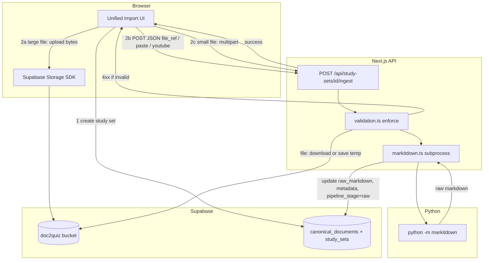

# Phase 2: Input & MarkItDown - Research

**Researched:** 2026-07-25
**Domain:** Multi-format ingest API + Microsoft MarkItDown (Python subprocess) + Supabase Storage + unified import UI
**Confidence:** HIGH

## Summary

Phase 2 wires the first real pipeline step: authenticated users submit any supported input, pass `INPUT-VAL-01` validation, convert to raw Markdown via **Microsoft MarkItDown (Python)**, and persist `canonical_documents.raw_markdown` plus source references in Supabase. Phase 1 already provides the ingest stub (`501`), validation contract (`src/lib/pipeline/validation.ts`), `doc2quiz` storage bucket + RLS, and `canonical_documents` schema — Phase 2 replaces the stub and connects the frontend import shell.

**MarkItDown integration (locked D-03):** Use **Python subprocess** (`python -m markitdown`), not community npm wrappers. MarkItDown 0.1.6 on PyPI requires **Python ≥ 3.10** [CITED: github.com/microsoft/markitdown README]. Install `markitdown[all]` (or at minimum `pdf,docx,pptx,xlsx,xls,audio-transcription,youtube-transcription`) to cover all `docs/pipeline.md` formats. CLI: `markitdown <path-or-url> -o output.md`; YouTube URLs work when passed as the positional argument [VERIFIED: local CLI test]. With `[youtube-transcription]` installed, output includes a `### Transcript` section [VERIFIED: local CLI test].

**Upload strategy (planner discretion, strong recommendation):** Do **not** rely on multipart-through-Next.js for files above ~10 MB. The project uses `src/proxy.ts` for Supabase session refresh; Next.js 16 buffers request bodies in proxy with default **10 MB** `proxyClientMaxBodySize`, silently truncating larger bodies without returning an error [CITED: nextjs.org/docs/app/api-reference/config/next-config-js/proxyClientMaxBodySize]. Validation allows PDFs up to 50 MB and audio up to 100 MB (`validation.ts`). **Recommended pattern:** browser uploads directly to Supabase Storage (`doc2quiz` bucket, path `{user_id}/{study_set_id}/{filename}`), then POST JSON to ingest with a storage reference; ingest route downloads to a temp file for MarkItDown. Multipart `request.formData()` remains valid for dev/small files and paste-as-file [CITED: nextjs.org/docs/app/api-reference/file-conventions/route].

**Frontend state:** Legacy PDF-only flows are already removed from disk; quiz/flashcards `/edit/new` routes use `NewStudySetTextImportFlow` (paste-only stub calling `createStudySetEarlyMeta` without ingest). Phase 2 replaces this with a unified input zone (file drop, paste, YouTube URL) reusing `StudySetNewImportStepContext` chrome.

**Primary recommendation:** Implement `src/lib/pipeline/markitdown.ts` (subprocess runner + temp-file hygiene), `src/lib/pipeline/ingest.ts` (validate → store → convert → persist), dual-mode ingest route (JSON + optional multipart), client-direct Storage upload for large files, and extend `validation.ts` with enforcement functions tested via existing Vitest setup.

<user_constraints>
## User Constraints (from CONTEXT.md)

### Locked Decisions

#### Carrying forward from Phase 1
- **D-P1-04–11:** `study_sets` 1:1 `canonical_documents`; Storage bucket `doc2quiz`; paste/YouTube = metadata-only source ref; `pipeline_stage` enum.
- **D-P1-17:** Ingest route is `POST /api/study-sets/[id]/ingest` — Phase 2 replaces stub with real handler.
- **D-P1-19:** `src/lib/pipeline/validation.ts` is the allowlist contract — Phase 2 enforces it.

#### MarkItDown integration
- **D-01:** Use **Microsoft MarkItDown** (Python) as the sole conversion engine per `docs/pipeline.md` and PROJECT.md — no custom PDF/OCR parsers.
- **D-02:** Conversion runs **server-side** in the ingest API route (or a dedicated server module it calls). Client never runs MarkItDown.
- **D-03:** MarkItDown invocation via **Python subprocess** from Node (`python -m markitdown` or equivalent CLI) unless research proves a better same-repo pattern. Pin MarkItDown version in project docs/requirements.

#### Ingest pipeline behavior
- **D-04:** Ingest flow: **validate input** → **store original** (file → Storage; paste/URL → metadata) → **MarkItDown convert** → **save `raw_markdown`** on `canonical_documents` → set `study_sets.pipeline_stage` to `raw`.
- **D-05:** On validation failure, return **4xx with clear error message** before any conversion or storage write (INPUT-VAL-01).
- **D-06:** On conversion failure, return **5xx/422 with actionable error**; do not leave partial `raw_markdown` without marking failure state in metadata.

#### Input types
- **D-07:** **File upload** path: multipart to ingest API (or signed upload then ingest) for PDF, Office, images, audio, HTML, CSV, JSON, XML.
- **D-08:** **Paste** path: JSON body with `{ kind: "paste", text }` — no Storage object; `metadata.input_type = "paste"`.
- **D-09:** **YouTube URL** path: JSON body with `{ kind: "youtube", url }` — MarkItDown handles URL where supported; store `metadata.source_url`; no separate yt-dlp unless MarkItDown cannot handle YouTube (research decides; prefer MarkItDown-only).

#### Input zone UI
- **D-10:** **Unified import flow** replacing legacy PDF-only `NewStudySetPdfImportFlow` — one surface for file drop, paste, and URL on `/edit/new` routes (quiz + flashcards).
- **D-11:** Reuse existing shell components (`StudySetNewImportStepContext`, step chrome) where possible; **identity preservation** per Impeccable — no full redesign.
- **D-12:** Show **conversion progress** states: idle → validating → uploading → converting → done/error. No fake progress bars — real step labels only.
- **D-13:** After successful ingest, navigate user to **next pipeline step placeholder** (view raw / await Phase 3 canonicalize) — not straight to quiz generation.

#### Storage
- **D-14:** Uploaded originals land in `doc2quiz` bucket at path `{user_id}/{study_set_id}/{filename}` (or equivalent); populate `canonical_documents.original_storage_path`, `original_filename`, `original_mime_type`.
- **D-15:** Do not store duplicate raw text in legacy `extracted_text` columns — `canonical_documents.raw_markdown` is source of truth.

#### Legacy cleanup
- **D-16:** Remove or bypass v1 import paths: `generate-from-file`, PDF parse pages, OCR/graphify hooks tied to old pipeline. Phase 2 ingest is the only import path.

### Claude's Discretion
- Multipart vs presigned upload strategy
- Exact MarkItDown CLI flags and temp file handling
- Whether to keep `NewStudySetTextImportFlow` as separate route or merge into unified flow
- Python runtime requirement documentation (README, Docker, dev setup)
- Progress UI component structure (reuse `UnifiedImportStatusCard` vs new minimal component)

### Deferred Ideas (OUT OF SCOPE)
- Canonical Knowledge Builder — Phase 3
- Quiz/flashcard generation after import — Phases 4–5
- Pre-save quality scoring — out of scope (OOS-03)
- Client-side MarkItDown / WASM — rejected (server-only per D-02)
</user_constraints>

<phase_requirements>
## Phase Requirements

| ID | Description | Research Support |
|----|-------------|------------------|
| INPUT-01 | User can upload PDF | MarkItDown `[pdf]` / `[all]`; MIME `application/pdf` in validation contract; Storage upload + subprocess convert |
| INPUT-02 | User can upload DOCX | MarkItDown `[docx]`; MIME in allowlist |
| INPUT-03 | User can upload PPTX | MarkItDown `[pptx]`; MIME in allowlist |
| INPUT-04 | User can upload XLSX/XLS | MarkItDown `[xlsx]` / `[xls]`; MIME in allowlist |
| INPUT-05 | User can upload JPG/JPEG/PNG | MarkItDown image/OCR; MIME `image/jpeg`, `image/png` |
| INPUT-06 | User can upload WAV/MP3 | MarkItDown `[audio-transcription]`; MIME `audio/wav`, `audio/mpeg` |
| INPUT-07 | User can upload HTML | MarkItDown HTML converter; MIME `text/html` |
| INPUT-08 | User can upload CSV | MarkItDown text-based formats; MIME `text/csv` |
| INPUT-09 | User can upload JSON | MarkItDown text-based formats; MIME `application/json` |
| INPUT-10 | User can upload XML | MarkItDown text-based formats; MIME `application/xml`, `text/xml` |
| INPUT-11 | User can paste plain text | JSON `{ kind: "paste", text }`; write temp `.txt` or pipe stdin to `markitdown` |
| INPUT-12 | User can submit a YouTube URL | JSON `{ kind: "youtube", url }`; `markitdown <url>` with `[youtube-transcription]` |
| INPUT-VAL-01 | System validates input type and size before conversion | Enforce `SUPPORTED_MIME_TYPES`, `MAX_UPLOAD_BYTES_BY_MIME`, paste/URL validators in `validation.ts` — 4xx before Storage/subprocess (D-05) |
| CONV-01 | Accepted inputs convert to raw Markdown via MarkItDown | `src/lib/pipeline/markitdown.ts` subprocess → `canonical_documents.raw_markdown` |
| CONV-02 | Original file (or source reference for paste/URL) is stored with the study set | Storage path columns for files; `metadata.input_type`, `metadata.source_url` for paste/YouTube |
</phase_requirements>

## Architectural Responsibility Map

| Capability | Primary Tier | Secondary Tier | Rationale |
|------------|-------------|----------------|-----------|
| Unified input zone UI (file/paste/URL) | Browser (client components) | API (ingest trigger) | User interaction on `/edit/new`; calls ingest after study set exists |
| Client-side file upload to Storage | Browser + Supabase Storage | API (path validation) | Bypasses Next.js body limits for files >10 MB; RLS enforces `owner = auth.uid()` |
| Multipart ingest (small files / dev) | API / Backend | Browser | `request.formData()` in Route Handler [CITED: nextjs.org/docs/app/api-reference/file-conventions/route] |
| INPUT-VAL-01 enforcement | API / Backend | Shared lib (`validation.ts`) | Validate before Storage write or subprocess (D-05) |
| MarkItDown conversion | API / Backend (Node subprocess → Python) | OS Python runtime | Locked server-side only (D-02, D-03) |
| `raw_markdown` + metadata persistence | API / Backend | Database (Postgres + RLS) | Server Supabase client updates `canonical_documents`, `study_sets.pipeline_stage` |
| YouTube URL fetch/transcribe | API / Backend (via MarkItDown) | External (YouTube) | MarkItDown performs HTTP fetch; must validate URL host allowlist first |
| Progress step labels | Browser | — | Real states only (D-12); no server push required for MVP |
| Auth gate on ingest | API / Backend | Frontend Server (proxy session) | `requireApiUser()` pattern from Phase 1 |

## Standard Stack

### Core

| Library | Version | Purpose | Why Standard |
|---------|---------|---------|--------------|
| `markitdown` (Python, PyPI) | 0.1.6 | All-format → Markdown conversion | Locked decision D-01; official Microsoft tool [CITED: github.com/microsoft/markitdown] |
| `next` | 16.2.11 | App Router Route Handlers | Project framework; `request.formData()` / `request.json()` [VERIFIED: package.json] |
| `@supabase/supabase-js` | 2.110.8 | Storage upload + DB updates | Phase 1 pattern; server client with user JWT |
| `zod` | 4.4.3 | Ingest request body schemas | Already in project; pair with `validation.ts` constants |
| Node `child_process` | built-in | Spawn `python -m markitdown` | Locked D-03; no official npm MarkItDown package |

### Supporting

| Library | Version | Purpose | When to Use |
|---------|---------|---------|-------------|
| `vitest` | 3.2.4 | Unit tests for validation + ingest helpers | Existing `validation.test.ts` pattern |
| `os.tmpdir()` + `fs/promises` | Node built-in | Temp files for upload bytes before MarkItDown | File and paste paths |
| `requirements.txt` | — | Pin `markitdown[all]==0.1.6` | Dev setup, CI, Docker; document Python ≥3.10 |

### Alternatives Considered

| Instead of | Could Use | Tradeoff |
|------------|-----------|----------|
| Python subprocess (locked) | `markitdown-ts`, `markitdown-js`, `@mote-software/markitdown` (npm) | Community ports/wrappers — not Microsoft MarkItDown; incomplete format parity; D-03 rejects unless proven better |
| Multipart through Next.js | Client-direct Supabase Storage upload + JSON ingest | Required for audio (100 MB) and PDF (50 MB) given proxy 10 MB default and Vercel ~4.5 MB serverless cap [CITED: nextjs.org proxyClientMaxBodySize; GitHub #57501] |
| yt-dlp for YouTube | MarkItDown URL mode only | D-09 prefers MarkItDown-only; verified YouTube works via CLI |
| Custom PDF/OCR parsers | MarkItDown | OOS-05; explicitly rejected |

**Installation (Python — not npm):**
```bash
python -m venv .venv
# Windows: .venv\Scripts\activate
pip install "markitdown[all]==0.1.6"
python -m markitdown --version
```

**Version verification:**
```bash
pip index versions markitdown   # latest 0.1.6 [VERIFIED: PyPI, 2026-07-25]
python --version                # requires >= 3.10 [CITED: MarkItDown README]
```

## Package Legitimacy Audit

> Phase 2 adds **no new npm dependencies**. Python package is installed via pip outside npm. Community npm wrappers were evaluated and **rejected** per D-03.

| Package | Registry | Age | Downloads | Source Repo | slopcheck | Disposition |
|---------|----------|-----|-----------|-------------|-----------|-------------|
| `markitdown` | PyPI | Microsoft OSS | High | github.com/microsoft/markitdown | N/A (official) | **Approved** — locked stack |
| `markitdown-ts` | npm | Community | Low | — | [OK] | **Rejected** — not official; subprocess preferred |
| `markitdown-js` | npm | Community | Low | github.com/Mirza-Glitch/markitdown-js | [OK] | **Rejected** — incomplete port |
| `@mote-software/markitdown` | npm | ~4 mo | ~236/wk | github.com/Mote-Software/markitdown | [OK] | **Rejected** — binary wrapper, not same-repo pattern |

**Packages removed due to slopcheck [SLOP] verdict:** none
**Packages flagged as suspicious [SUS]:** none (wrappers OK but intentionally not used)

## Architecture Patterns

### System Architecture Diagram



### Recommended Project Structure

```
src/
├── app/api/study-sets/[id]/ingest/route.ts   # dual Content-Type handler
├── lib/pipeline/
│   ├── validation.ts                          # extend with enforce* functions
│   ├── validation.test.ts                     # extend tests
│   ├── markitdown.ts                          # subprocess runner, temp cleanup
│   └── ingest.ts                              # orchestrate validate→store→convert→save
├── components/edit/new/
│   ├── NewStudySetUnifiedImportFlow.tsx       # replaces text-only flow (name TBD)
│   └── import/StudySetNewImportStepContext.tsx # reuse step chrome
requirements.txt                               # markitdown[all]==0.1.6
```

### Pattern 1: Dual-mode ingest Route Handler

**What:** Single `POST` handler branches on `Content-Type`: `application/json` for paste/YouTube/storage-ref; `multipart/form-data` for direct file upload (small files).

**When to use:** Always for `/ingest`; JSON is primary production path for large files.

**Example:**
```typescript
// Source: nextjs.org/docs/app/api-reference/file-conventions/route
export async function POST(request: Request, ctx: { params: Promise<{ id: string }> }) {
  const auth = await requireApiUser();
  if ("error" in auth) return auth.error;

  const contentType = request.headers.get("content-type") ?? "";
  if (contentType.includes("multipart/form-data")) {
    const form = await request.formData();
    const file = form.get("file");
    if (!(file instanceof File)) {
      return Response.json({ error: "Missing file" }, { status: 400 });
    }
    // validate mime + size BEFORE storage/subprocess
    return runIngest({ kind: "file", file, ... });
  }

  const body = await request.json();
  // zod parse { kind: "paste" | "youtube" | "file_ref" }
  return runIngest(body);
}
```

### Pattern 2: MarkItDown subprocess from Node

**What:** Write input to temp path (or pass URL for YouTube), spawn `python -m markitdown <input> -o <out.md>`, read stdout/file, always `finally` unlink temps.

**When to use:** All conversions (D-03).

**Example:**
```typescript
// Source: Node.js child_process docs + MarkItDown CLI README
import { spawn } from "node:child_process";
import { readFile, writeFile, unlink } from "node:fs/promises";
import { tmpdir } from "node:os";
import { join } from "node:path";

export async function convertWithMarkItDown(inputPath: string): Promise<string> {
  const outPath = join(tmpdir(), `md-out-${crypto.randomUUID()}.md`);
  const python = process.env.MARKITDOWN_PYTHON ?? "python";
  await new Promise<void>((resolve, reject) => {
    const child = spawn(python, ["-m", "markitdown", inputPath, "-o", outPath], {
      stdio: ["ignore", "pipe", "pipe"],
    });
    let stderr = "";
    child.stderr.on("data", (c) => { stderr += c; });
    child.on("close", (code) => {
      if (code === 0) resolve();
      else reject(new Error(stderr || `markitdown exited ${code}`));
    });
  });
  try {
    return await readFile(outPath, "utf8");
  } finally {
    await unlink(outPath).catch(() => {});
  }
}
```

For **paste**: write `text` to `join(tmpdir(), 'paste.txt')` then convert. For **YouTube**: pass validated URL directly as CLI arg (no download by app). Use `-m` / `--mime-type` when reading from stdin [CITED: `markitdown --help` output].

### Pattern 3: Client-direct Storage upload then ingest-by-reference

**What:** Browser uploads to `doc2quiz/{userId}/{studySetId}/{filename}` via authenticated Supabase client; ingest receives `{ kind: "file_ref", storagePath, mimeType, filename, sizeBytes }`, validates path prefix matches `auth.user.id` and `studySetId`, downloads to temp, converts.

**When to use:** Any file >10 MB or production deployment on Vercel/serverless.

**Example (client upload):**
```typescript
// Source: supabase.com/docs/guides/storage/uploads/standard-uploads
const path = `${userId}/${studySetId}/${sanitizedFilename}`;
const { error } = await supabase.storage.from("doc2quiz").upload(path, file, {
  contentType: file.type,
  upsert: true,
});
```

### Pattern 4: canonical_documents upsert on ingest

**What:** `POST /api/study-sets` currently inserts only `study_sets`. Ingest must `insert` or `upsert` the 1:1 `canonical_documents` row with storage refs + `raw_markdown` + `metadata` jsonb, then `update study_sets set pipeline_stage = 'raw'`.

**When to use:** Every successful ingest.

**Metadata keys (suggested):**
```json
{
  "input_type": "file" | "paste" | "youtube",
  "source_url": "https://youtube.com/...",
  "conversion_status": "ok" | "failed",
  "conversion_error": null,
  "markitdown_version": "0.1.6"
}
```

On conversion failure (D-06): set `conversion_status: "failed"`, `conversion_error`, leave `raw_markdown` empty or prior value; return 422.

### Anti-Patterns to Avoid

- **Multipart 50–100 MB files through Next.js proxy:** Silent truncation at 10 MB default — corrupt uploads with no client error.
- **Passing unvalidated URLs to MarkItDown:** SSRF risk; MarkItDown README explicitly warns about unsanitized inputs [CITED: github.com/microsoft/markitdown Security Considerations].
- **Trusting client MIME type alone:** Cross-check extension + `file.type`; MarkItDown uses `magika` internally but ingest validation must gate before Storage.
- **Community npm MarkItDown ports:** Violates D-01/D-03 spirit even if slopcheck-clean.
- **Skipping canonical_documents row:** Study set exists without document row — ingest must create it.

## Don't Hand-Roll

| Problem | Don't Build | Use Instead | Why |
|---------|-------------|-------------|-----|
| PDF/Office/image/audio → Markdown | Custom parsers, pdf.js text extraction, OCR pipelines | MarkItDown `[all]` | OOS-05; 15+ formats maintained upstream |
| YouTube transcript fetch | yt-dlp integration | `markitdown <youtube-url>` + `[youtube-transcription]` | D-09; verified CLI path |
| File upload to cloud | Custom S3 SDK wiring | Supabase Storage `.upload()` with RLS | Phase 1 bucket + policies exist |
| MIME/size allowlist | Ad-hoc checks in route | `validation.ts` `SUPPORTED_MIME_TYPES` + `MAX_UPLOAD_BYTES_BY_MIME` | INPUT-VAL-01 single contract |
| Auth on API routes | Custom JWT parsing | `requireApiUser()` | Phase 1 pattern |

**Key insight:** Phase 2 is glue — validate, store, subprocess, persist. The conversion intelligence lives entirely in MarkItDown.

## Common Pitfalls

### Pitfall 1: Proxy body truncation on large uploads
**What goes wrong:** 50 MB PDF upload succeeds in UI but MarkItDown receives truncated/corrupt file; bizarre conversion errors.
**Why it happens:** `proxyClientMaxBodySize` default 10 MB; truncation does not fail the request [CITED: nextjs.org/docs/app/api-reference/config/next-config-js/proxyClientMaxBodySize].
**How to avoid:** Client-direct Supabase upload for files above 10 MB; only use multipart for smaller files or raise limit in `next.config.ts` for self-hosted dev.
**Warning signs:** File size mismatch between client `file.size` and server-received buffer length.

### Pitfall 2: Python not available in deployment
**What goes wrong:** `spawn python ENOENT` in production.
**Why it happens:** Vercel/serverless Node runtimes do not include Python by default.
**How to avoid:** Document Python 3.10+ as deployment prerequisite; use Docker/VM with both Node and Python; or defer serverless deploy until conversion service is split (out of Phase 2 scope but flag for ops).
**Warning signs:** Ingest 500 with `ENOENT`; works locally only.

### Pitfall 3: Missing MarkItDown optional extras
**What goes wrong:** Audio upload returns empty markdown; YouTube lacks transcript section.
**Why it happens:** Base `pip install markitdown` omits `[audio-transcription]` and `[youtube-transcription]` [CITED: MarkItDown README Optional Dependencies].
**How to avoid:** Pin `markitdown[all]==0.1.6` in `requirements.txt`; verify in dev setup script.
**Warning signs:** CLI works for PDF but fails for `.mp3` or YouTube transcript section missing.

### Pitfall 4: Storage RLS 403 on upload
**What goes wrong:** Client upload fails with policy violation.
**Why it happens:** `storage.objects` INSERT requires `owner = auth.uid()`; upload must use authenticated browser client [VERIFIED: migration `doc2quiz_storage_insert_own`].
**How to avoid:** Upload from browser with user session; server-side upload must use user's JWT (not service role bypass unless intentional).
**Warning signs:** 403 from `storage.from('doc2quiz').upload`.

### Pitfall 5: Partial state on conversion failure
**What goes wrong:** `raw_markdown` contains half-written content; `pipeline_stage` stuck or incorrectly `raw`.
**Why it happens:** No transaction across subprocess + DB update.
**How to avoid:** D-06: on failure, set `metadata.conversion_status = 'failed'`, do not advance `pipeline_stage` to `raw`; return 422 with message.
**Warning signs:** User sees empty/broken raw view in Phase 3.

### Pitfall 6: YouTube SSRF / non-YouTube URLs
**What goes wrong:** User submits `http://169.254.169.254/` as "YouTube" URL; MarkItDown fetches internal resources.
**Why it happens:** MarkItDown `convert()` is permissive with URLs [CITED: MarkItDown Security Considerations].
**How to avoid:** Strict URL parser: only `youtube.com`, `www.youtube.com`, `youtu.be`, `m.youtube.com` hosts; require `https:`.
**Warning signs:** Ingest accepts arbitrary URLs.

## Code Examples

### Enforce validation before side effects
```typescript
// Extend src/lib/pipeline/validation.ts
import { isSupportedMimeType, MAX_UPLOAD_BYTES_BY_MIME } from "./validation";

export function validateFileUpload(mimeType: string, sizeBytes: number): string | null {
  if (!isSupportedMimeType(mimeType)) {
    return `Unsupported file type: ${mimeType}`;
  }
  const max = MAX_UPLOAD_BYTES_BY_MIME[mimeType];
  if (sizeBytes > max) {
    return `File exceeds ${max} byte limit for ${mimeType}`;
  }
  return null;
}
```

### Paste → temp file → MarkItDown
```typescript
const pastePath = join(tmpdir(), `paste-${id}.txt`);
await writeFile(pastePath, text, "utf8");
try {
  return await convertWithMarkItDown(pastePath);
} finally {
  await unlink(pastePath).catch(() => {});
}
```

### Route segment config for long conversions
```typescript
// Source: nextjs.org/docs/app/api-reference/file-conventions/route-segment-config
export const maxDuration = 120; // audio transcription may exceed default
export const runtime = "nodejs"; // required for child_process
```

## State of the Art

| Old Approach | Current Approach | When Changed | Impact |
|--------------|------------------|--------------|--------|
| v1 PDF-only `NewStudySetPdfImportFlow` + client pdf.js | Unified multi-format + MarkItDown server-side | v2.1 Phase 2 | All formats one path |
| `study_set_documents.extracted_text` | `canonical_documents.raw_markdown` | v2.1 Phase 1 schema | Ingest writes new column |
| `/api/uploads/pdf/*` multipart pipeline | Supabase Storage + `/ingest` | Phase 2 | Legacy routes should stay deleted (D-16) |
| Client-only `createStudySet({ extractedText })` | Create study set → POST ingest | Phase 2 | Text flow must call ingest API |

**Deprecated/outdated:**
- `src/lib/pdf/validatePdfFile.ts` — replace with pipeline validation (not on disk in current tree)
- `UnifiedImportStatusCard` — referenced in CONTEXT but not present on disk; build minimal progress labels inline or new small component

## Assumptions Log

| # | Claim | Section | Risk if Wrong |
|---|-------|---------|---------------|
| A1 | `MAX_UPLOAD_BYTES_BY_MIME` values in `validation.ts` are acceptable for MVP | Standard Stack | User rejects 50 MB PDF / 100 MB audio limits |
| A2 | Self-hosted or Docker deploy with Node + Python co-located | Environment | Vercel-only deploy blocks subprocess approach |
| A3 | `markitdown[all]` covers all pipeline formats without Azure Doc Intel | Standard Stack | PDF/image quality insufficient → need optional Azure flags later |
| A4 | YouTube metadata + transcript (with extra) satisfies INPUT-12 learning use case | Phase Requirements | Users may need richer transcript formatting |
| A5 | `createStudySetEarlyMeta` + separate ingest call is correct UX (study set exists before upload) | Architecture | Race conditions if ingest called before row exists — mitigated by POST /study-sets first |
| A6 | Post-ingest redirect to edit page (`/edit/quiz/:id` or similar) is acceptable Phase 3 placeholder | UI | May need dedicated `/sets/:id/source` raw preview route |

## Open Questions (RESOLVED)

1. **Deployment target for Phase 2** — **RESOLVED:** Document Python 3.10+ + `markitdown[all]==0.1.6` in `requirements.txt` and README; add Docker Compose dev service optional. Production deployment matrix is human checkpoint — local dev uses subprocess; Vercel pure serverless blocked until Docker sidecar (document limitation).

2. **Exact post-ingest navigation target** — **RESOLVED:** Navigate to `/sets/{id}/source` if route exists; else `/edit/quiz/{id}` or `/edit/flashcards/{id}` with inline banner: "Source converted — canonical builder coming next."

3. **Whether to create `canonical_documents` row at study-set creation or first ingest** — **RESOLVED:** Upsert `canonical_documents` on first ingest only; study set created empty via POST `/api/study-sets` before ingest.

## Environment Availability

| Dependency | Required By | Available | Version | Fallback |
|------------|------------|-----------|---------|----------|
| Python | MarkItDown subprocess | ✓ | 3.13.11 | Install 3.10+; set `MARKITDOWN_PYTHON` |
| `markitdown[all]` (pip) | All INPUT formats | ✓ (partial) | 0.1.5 installed / 0.1.6 latest | `pip install "markitdown[all]==0.1.6"` |
| Node.js | Next.js API | ✓ | (project standard) | — |
| Supabase project | Storage + DB | ✓ (configured via env) | — | Local Supabase CLI |
| Vitest | Validation tests | ✓ | 3.2.4 | — |

**Missing dependencies with no fallback:**
- Python on production host if deploying to pure serverless Node (blocks ingest until Docker/sidecar added)

**Missing dependencies with fallback:**
- `[youtube-transcription]` not in base install — install via `[all]` extra

## Validation Architecture

### Test Framework

| Property | Value |
|----------|-------|
| Framework | Vitest 3.2.4 |
| Config file | `vitest.config.ts` |
| Quick run command | `npm test -- --run src/lib/pipeline/validation.test.ts` |
| Full suite command | `npm test -- --run` |

### Phase Requirements → Test Map

| Req ID | Behavior | Test Type | Automated Command | File Exists? |
|--------|----------|-----------|-------------------|-------------|
| INPUT-VAL-01 | Reject unsupported MIME | unit | `npm test -- --run src/lib/pipeline/validation.test.ts` | ✅ extend |
| INPUT-VAL-01 | Reject oversize file per MIME | unit | same | ❌ Wave 0 — add `validateFileUpload` tests |
| INPUT-VAL-01 | Reject empty paste | unit | same | ❌ Wave 0 |
| INPUT-VAL-01 | Reject non-YouTube URL | unit | same | ❌ Wave 0 |
| INPUT-01–10 | Accept all MIME types in allowlist | unit | same | ✅ partial (constants only) |
| CONV-01 | MarkItDown runner returns markdown | unit (mocked spawn) | `npm test -- --run src/lib/pipeline/markitdown.test.ts` | ❌ Wave 0 |
| CONV-02 | Ingest persists storage path + metadata | integration | manual / future API test | ❌ defer to verify-work |
| INPUT-11 | Paste path produces raw_markdown | integration | manual smoke | ❌ manual Phase 2 gate |
| INPUT-12 | YouTube URL converts | integration | manual smoke (needs network) | ❌ manual |

### Sampling Rate

- **Per task commit:** `npm test -- --run src/lib/pipeline/`
- **Per wave merge:** `npm test -- --run`
- **Phase gate:** Full Vitest green + manual ingest smoke (PDF + paste + YouTube)

### Wave 0 Gaps

- [ ] `src/lib/pipeline/validation.ts` — add `validateFileUpload`, `validatePasteInput`, `validateYoutubeUrl` + tests
- [ ] `src/lib/pipeline/markitdown.test.ts` — mock `child_process.spawn`, assert CLI args
- [ ] `src/lib/pipeline/markitdown.ts` — subprocess module (implementation)
- [ ] Optional: `src/lib/pipeline/ingest.test.ts` — pure orchestration with mocked deps

## Security Domain

### Applicable ASVS Categories

| ASVS Category | Applies | Standard Control |
|---------------|---------|------------------|
| V2 Authentication | yes | `requireApiUser()` on ingest route |
| V3 Session Management | yes | Supabase SSR cookies via `proxy.ts` |
| V4 Access Control | yes | RLS `user_id = auth.uid()`; storage path prefix validation |
| V5 Input Validation | yes | `validation.ts` + Zod ingest body schemas; URL host allowlist |
| V6 Cryptography | no | No new crypto in Phase 2 |

### Known Threat Patterns for {stack}

| Pattern | STRIDE | Standard Mitigation |
|---------|--------|---------------------|
| SSRF via YouTube URL field | Spoofing/Tampering | Host allowlist before MarkItDown; never pass arbitrary URLs |
| Oversized upload DoS | Denial of service | `MAX_UPLOAD_BYTES_BY_MIME`; client-direct upload limits |
| Storage path traversal (`../other-user/`) | Elevation | Reject paths not matching `^${userId}/${studySetId}/` |
| Malicious file content | Tampering | MarkItDown runs with process privileges — validate type/size; temp dir only |
| Unauthorized ingest on another user's study set | Elevation | `verifyStudySet` + RLS (existing stub pattern) |

## Project Constraints (from .cursor/rules/)

No `.cursor/rules/` files present on disk at research time (orchestrator rule referenced in workspace metadata but agent files deleted per git status). No additional project rule constraints beyond CONTEXT.md and `docs/pipeline.md`.

## Sources

### Primary (HIGH confidence)
- [microsoft/markitdown README](https://github.com/microsoft/markitdown/blob/main/README.md) — formats, Python 3.10+, CLI, optional deps, security
- [nextjs.org Route Handlers — formData](https://nextjs.org/docs/app/api-reference/file-conventions/route) — `request.formData()`
- [nextjs.org proxyClientMaxBodySize](https://nextjs.org/docs/app/api-reference/config/next-config-js/proxyClientMaxBodySize) — 10 MB default, silent truncation
- [supabase.com Storage standard uploads](https://supabase.com/docs/guides/storage/uploads/standard-uploads) — client `.upload()` pattern
- Local verification — `python -m markitdown --help`, YouTube URL conversion, PyPI `markitdown` 0.1.6

### Secondary (MEDIUM confidence)
- [GitHub vercel/next.js #57501](https://github.com/vercel/next.js/issues/57501) — no per-route body limit in App Router handlers
- Codebase — `validation.ts`, ingest stub, baseline migration, `StudySetNewImportStepContext`, quiz/flashcards new pages

### Tertiary (LOW confidence)
- Community npm wrappers (`markitdown-ts`, `@mote-software/markitdown`) — evaluated, rejected per D-03

## Metadata

**Confidence breakdown:**
- Standard stack: **HIGH** — MarkItDown official docs + local CLI verification + locked CONTEXT decisions
- Architecture: **HIGH** — codebase artifacts verified; upload limit constraints from Next.js docs
- Pitfalls: **HIGH** — proxy truncation and Python deployment are well-documented risks

**Research date:** 2026-07-25
**Valid until:** 2026-08-25 (MarkItDown stable; re-check if deploying to new hosting target)

## RESEARCH COMPLETE

**Phase:** 2 - Input & MarkItDown
**Confidence:** HIGH

### Key Findings
- Use **Python subprocess** (`python -m markitdown`) with `markitdown[all]==0.1.6` — reject community npm wrappers per D-03.
- **Client-direct Supabase Storage upload + JSON ingest-by-reference** is required for files above ~10 MB given proxy body buffering limits and validation max sizes up to 100 MB.
- YouTube URLs work via MarkItDown CLI; install `[youtube-transcription]` for transcript section.
- Extend `validation.ts` with enforcement functions; validate **before** any Storage write or subprocess (D-05).
- Frontend: replace paste-only `NewStudySetTextImportFlow` with unified import; legacy PDF flows already absent from disk.

### File Created
`.planning/phases/02-input-markitdown/02-RESEARCH.md`

### Confidence Assessment

| Area | Level | Reason |
|------|-------|--------|
| Standard Stack | HIGH | Official MarkItDown docs + PyPI + local CLI tests |
| Architecture | HIGH | Phase 1 schema/routes verified; upload limits documented |
| Pitfalls | HIGH | Proxy truncation and Python deployment verified |

### Open Questions
- Production deployment target (serverless vs Docker) affects Python availability.
- Post-ingest redirect URL for Phase 3 placeholder.

### Ready for Planning
Research complete. Planner can now create PLAN.md files.
