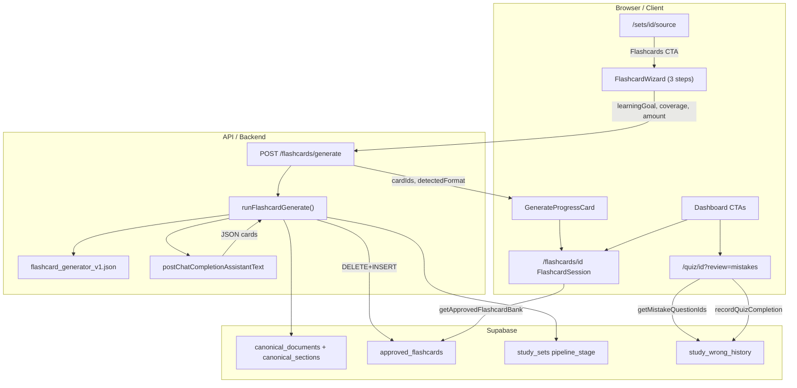

# Phase 5: Flashcards & E2E - Research

**Researched:** 2026-07-25
**Domain:** Canonical flashcard generation pipeline, wizard UX, mistakes drill verification, milestone E2E
**Confidence:** HIGH

## Summary

Phase 5 completes the express pipeline's **Flashcards** branch by mirroring the Phase 4 quiz generation architecture: prompt JSON contract → Zod schemas → `runFlashcardGenerate()` service → `POST /flashcards/generate` route → client DB port → existing `FlashcardSession` practice shell. The codebase already has the UI shells, routes, dashboard links, and `approved_flashcards` schema; the critical gaps are the **501 API stub**, **stubbed `getApprovedFlashcardBank`**, **disabled Flashcards CTA**, and **no wizard/generation client flow**.

**Primary recommendation:** Copy the Phase 4 quiz pipeline file-for-file (`quizGenerate` → `flashcardGenerate`, `quizPrompt` → `flashcardPrompt`, `quizSchemas` → `flashcardSchemas`, `mapQuizOutputToRows` → `mapFlashcardOutputToRows`) and wire a 3-step wizard on `/sets/[id]/source` that posts the locked API body from CONTEXT D-12. Port flashcard CRUD from `src/lib/db/studySetDb.ts` into `src/lib/client/studySetDb.ts` (same pattern Phase 4 used for quiz bank). Verify CORE-MIST-01 with an automated unit test suite (already present) plus a human E2E checklist at milestone close.

<user_constraints>
## User Constraints (from CONTEXT.md)

### Locked Decisions

#### Carrying forward
- **D-P4-01:** Mode selection on `/sets/[id]/source` — enable **Flashcards** CTA (currently disabled placeholder).
- **D-P4-09:** Server env AI (`AI_PROVIDER_URL/KEY`) — same pattern as quiz/canonicalize.
- **D-P1-08:** `approved_flashcards` table: front, back, tags, source jsonb.
- **D-P1-17:** `POST /api/study-sets/[id]/flashcards/generate` — replace 501 stub.

#### Mode selection (MODE-01 — Flashcards path)
- **D-01:** Flashcards CTA sets `content_kind = 'flashcards'` and `pipeline_stage = 'mode_selected'` before wizard.
- **D-02:** Quiz path unchanged; resume strips remain mode-specific (quiz vs flashcards).

#### Wizard (FLASH-01–03)
- **D-03:** **Three prompts only** per `docs/pipeline.md`:
  1. **Learning goal:** `memorize` | `understand` | `exam_preparation`
  2. **Coverage:** `entire_document` | `selected_sections` (section multi-select from `canonical_sections` when selected)
  3. **Amount:** `recommended` | custom number (bounded, e.g. 5–60)
- **D-04:** Wizard UI on source page (inline sheet/dialog) or dedicated `/sets/[id]/flashcards/setup` — planner discretion; prefer inline continuation from mode footer to minimize routes.
- **D-05:** Do **not** reuse legacy `FlashcardGenerationConfig` vision types (`quick_recall`, `focusMode`) — map pipeline vocabulary to new schemas.

#### Generation (AI)
- **D-06:** **Canonical knowledge only** — same read pattern as quiz: `canonical_markdown` + filtered `canonical_sections` + metadata hints; never `raw_markdown`.
- **D-07:** **Prompt contract** — create `prompt/flashcard_generator_v1.json` (mirror quiz/canonical pattern).
- **D-08:** **FLASH-04:** LLM returns `detected_format` per batch: `term_definition` | `question_answer` | `cloze` | `mixed` — system picks dominant format for the set (or per-card `format` field if simpler).
- **D-09:** **Output schema per card:** `{ front, back, format?, concept_id?, section_key?, source_excerpt? }` — Zod validate before insert.
- **D-10:** **FLASH-06:** Bulk insert `approved_flashcards` **before** API response (replace-all on re-generate, mirror quiz).
- **D-11:** On success: `pipeline_stage = 'flashcards'`, return `{ recommendedCount, generatedCount, detectedFormat, cardIds[] }`.

#### API
- **D-12:** `POST /flashcards/generate` body:
  ```json
  {
    "learningGoal": "memorize" | "understand" | "exam_preparation",
    "coverage": "entire_document" | { "sectionKeys": ["sec_001", ...] },
    "amount": "recommended" | { "count": number }
  }
  ```
- **D-13:** Requires `pipeline_stage` ≥ `canonical`.

#### Client data & practice (wire existing UI)
- **D-14:** Port `getApprovedFlashcardBank` / `putApprovedFlashcardBankForStudySet` in `studySetDb.ts` (currently stubs returning empty).
- **D-15:** **`FlashcardSession`** at `/flashcards/[id]` — load real bank; keyboard flip (Space), prev/next arrows.
- **D-16:** **`/flashcards/[id]/done`** — session summary (card count reviewed); optional polish only.
- **D-17:** **Dashboard** — **Start flashcards** CTA when `content_kind=flashcards` and cards exist.

#### Mistakes drill (CORE-MIST-01)
- **D-18:** `QuizSession` already supports `?review=mistakes` + `getMistakeQuestionIds` — verify `recordQuizCompletion` populates `study_wrong_history` and dashboard **Drill mistakes** link works end-to-end.
- **D-19:** Dashboard card shows mistakes indicator when `hasMistakesForStudySet` true; CTA routes to `/quiz/{id}?review=mistakes`.

#### E2E milestone
- **D-20:** Phase includes verification plan: ingest → canonical → quiz path smoke + flashcard path smoke + `npm run build` + vitest suite green.
- **D-21:** Human checkpoint at end for full express paths (both modes).

### Claude's Discretion
- Wizard as dialog vs stepped inline panel
- Whether flashcard review/edit page (`/edit/flashcards/[id]`) is in scope or defer to post-MVP
- Exact flashcard_generator_v1.json wording

### Deferred Ideas (OUT OF SCOPE)
- Flashcard edit/review workspace beyond minimal (if not needed for FLASH-07)
- Post-MVP: spaced repetition, card editing UI polish
</user_constraints>

<phase_requirements>
## Phase Requirements

| ID | Description | Research Support |
|----|-------------|------------------|
| FLASH-01 | User selects learning goal: memorize, understand, or exam preparation | Wizard step 1 → `learningGoal` in API body (D-12); Zod enum in `flashcardGenerateBodySchema` |
| FLASH-02 | User selects coverage: entire document or selected sections | Wizard step 2 → `coverage` union; section multi-select from `canonical_sections.section_key` |
| FLASH-03 | User selects amount: recommended or custom count | Wizard step 3 → `amount` union; clamp 5–60 in Zod + post-processor |
| FLASH-04 | System auto-detects best card format | `detected_format` in LLM output; dominant format aggregation in `dedupeAndCapFlashcards` |
| FLASH-05 | System generates flashcards from canonical knowledge only | `runFlashcardGenerate` reads `canonical_documents` + `canonical_sections` only (mirror `quizGenerate.ts`) |
| FLASH-06 | Generated cards save to Supabase immediately | DELETE + INSERT `approved_flashcards` before response (mirror quiz replace-all) |
| FLASH-07 | User can start flashcard learning from saved cards | Port `getApprovedFlashcardBank`; enable footer + dashboard CTA → `/flashcards/[id]` |
| CORE-MIST-01 | User can run mistakes-only drill from wrong answers | Already wired in code; E2E verification checklist + fix any silent-failure paths |
</phase_requirements>

## Architectural Responsibility Map

| Capability | Primary Tier | Secondary Tier | Rationale |
|------------|-------------|----------------|-----------|
| Flashcard wizard (FLASH-01–03) | Browser / Client | — | User input collection; posts to API |
| `POST /flashcards/generate` | API / Backend | — | Auth, validation, orchestration entry |
| `runFlashcardGenerate()` | API / Backend | — | Canonical reads, LLM call, Zod, persist |
| LLM prompt + schema repair | API / Backend | — | Server-only AI keys (D-P4-09) |
| `approved_flashcards` persistence | Database / Storage | API / Backend | Supabase RLS; bulk insert from service |
| Flashcard practice session | Browser / Client | — | `FlashcardSession` loads bank client-side |
| Mistakes drill filtering | Browser / Client | Database / Storage | Client reads `study_wrong_history`; filters local question bank |
| `study_wrong_history` writes | Browser / Client | Database / Storage | `recordQuizCompletion` upserts on session end |
| Dashboard CTAs / resume strips | Browser / Client | — | Reads meta + bank counts |
| E2E build gate | CDN / Static (build) | — | `next build` + vitest in CI/local |

## Standard Stack

### Core

| Library | Version | Purpose | Why Standard |
|---------|---------|---------|--------------|
| Next.js App Router | (project) | API routes + pages | Existing quiz/canonical pattern [VERIFIED: codebase] |
| `@supabase/supabase-js` | ^2.110.8 | `approved_flashcards` CRUD | Already used for quiz bank [VERIFIED: package.json] |
| `zod` | ^4.4.3 (registry 4.4.3) | Request body + LLM output validation | Phase 4 quiz schemas [VERIFIED: npm registry] |
| OpenAI-compatible chat API | (env) | Flashcard generation | `postChatCompletionAssistantText` in quiz pipeline [VERIFIED: codebase] |

### Supporting

| Library | Version | Purpose | When to Use |
|---------|---------|---------|-------------|
| `sonner` | (project) | Toast errors on wizard/generate failure | Source page quiz flow already uses it |
| `vitest` | ^3.2.4 | Unit/route tests | Mirror `quizGenerate.test.ts`, `route.test.ts` |

### Alternatives Considered

| Instead of | Could Use | Tradeoff |
|------------|-----------|----------|
| Mirror quiz pipeline | Extend vision `FlashcardGenerationConfig` path | **Rejected** — D-05 locks pipeline vocabulary; vision path uses different schema |
| Dedicated `/flashcards/setup` route | Inline sheet on source page | Sheet preferred per D-04 discretion; fewer routes |
| Per-card `format` only | Batch `detected_format` | Per-card `format?` in D-09 allows both; batch-level `detectedFormat` in API response satisfies FLASH-04 |

**Installation:** No new packages required for Phase 5.

```bash
# Verify only — no install step
npm view zod version   # 4.4.3
```

## Package Legitimacy Audit

> Phase 5 adds **no new external packages**. Existing dependencies only.

| Package | Registry | Age | Downloads | Source Repo | slopcheck | Disposition |
|---------|----------|-----|-----------|-------------|-----------|-------------|
| zod | npm | mature | very high | github.com/colinhacks/zod | [OK] | Approved (pre-existing) |
| @supabase/supabase-js | npm | mature | very high | github.com/supabase/supabase-js | [OK] | Approved (pre-existing) |

**Packages removed due to slopcheck [SLOP] verdict:** none
**Packages flagged as suspicious [SUS]:** none

## Architecture Patterns

### System Architecture Diagram



### Recommended Project Structure

```
prompt/
└── flashcard_generator_v1.json      # NEW — mirror quiz_generator_v1.json

src/lib/pipeline/
├── flashcardSchemas.ts              # NEW — body + LLM output Zod
├── flashcardPrompt.ts               # NEW — load JSON, build messages
├── flashcardGenerate.ts             # NEW — runFlashcardGenerate orchestration
├── mapFlashcardOutputToRows.ts      # NEW — LLM card → approved_flashcards row
└── dedupeAndCapFlashcards.ts        # NEW — dedupe concept_id, cap count

src/lib/client/
├── flashcardGenerateStudySet.ts     # NEW — postFlashcardGenerate fetch helper
└── studySetDb.ts                    # MODIFY — port flashcard bank from lib/db

src/app/api/study-sets/[id]/flashcards/generate/
└── route.ts                         # MODIFY — replace 501 stub

src/components/
├── canonical/CanonicalModeSelectionFooter.tsx   # MODIFY — enable Flashcards + resume strip
├── canonical/FlashcardWizardSheet.tsx           # NEW (or inline panel)
└── flashcards/FlashcardSession.tsx              # MINOR — done → flashcardsDone(id)

src/app/(app)/sets/[id]/source/page.tsx          # MODIFY — wizard + generate flow
```

### Pattern 1: `runFlashcardGenerate()` mirrors `runQuizGenerate()`

**What:** Server orchestration with canonical preflight, LLM call + repair, Zod validation, replace-all persist, stage update.

**When to use:** All flashcard generation (FLASH-05, FLASH-06).

**Pipeline stages** (same order as quiz) [VERIFIED: `src/lib/pipeline/quizGenerate.ts`]:

```typescript
const PIPELINE_STAGES = [
  "input", "raw", "canonical", "mode_selected", "quiz", "flashcards",
] as const;
// Require stage >= "canonical" (D-13)
// On success: pipeline_stage = "flashcards", content_kind = "flashcards" (D-11)
```

**Canonical reads** (identical to quiz, plus section filter):

```typescript
// 1. study_sets — pipeline_stage, title
// 2. canonical_documents — canonical_markdown, metadata (language, extracted_questions)
// 3. canonical_sections — filter by body.coverage.sectionKeys when not entire_document
// 4. truncate canonical_markdown at 80_000 chars (reuse quiz constant)
// NEVER read raw_markdown (D-06)
```

**Replace-all persist** (mirror quiz lines 279–297):

```typescript
await supabase.from("approved_flashcards").delete()
  .eq("study_set_id", studySetId).eq("user_id", userId);
if (rows.length > 0) {
  await supabase.from("approved_flashcards").insert(rows);
}
```

**Return shape** (D-11):

```typescript
export type FlashcardGenerateSuccess = {
  ok: true;
  recommendedCount: number;
  generatedCount: number;
  detectedFormat: "term_definition" | "question_answer" | "cloze" | "mixed";
  cardIds: string[];
};
```

### Pattern 2: Wizard UX → API body mapping (FLASH-01–03)

| Wizard step | UI control | API field | Zod |
|-------------|-----------|-----------|-----|
| 1. Learning goal | Radio: Memorize / Understand / Exam prep | `learningGoal` | `z.enum(["memorize","understand","exam_preparation"])` |
| 2. Coverage | Radio: Entire document / Selected sections + checkbox list | `coverage` | `z.union([z.literal("entire_document"), z.object({ sectionKeys: z.array(sectionKeySchema).min(1) })])` |
| 3. Amount | Radio: Recommended / Custom + number input | `amount` | `z.union([z.literal("recommended"), z.object({ count: z.number().int().min(5).max(60) })])` |

**Section multi-select source:** `canonical_sections` from preview data already loaded on source page (`fetchCanonicalPreview`). Use `section_key` values (`sec_001` pattern) — same as quiz `sectionKeySchema` [VERIFIED: `quizSchemas.ts`].

**Flow on source page** (mirror quiz `handleSelectQuiz`):

1. User clicks **Flashcards** → open wizard (do not generate yet)
2. On wizard submit → `putStudySetMeta({ contentKind: "flashcards", pipelineStage: "mode_selected" })`
3. `postFlashcardGenerate(studySetId, wizardPayload)`
4. Show progress card (reuse `QuizGenerateProgressCard` with flashcard copy, or extract shared `GenerationProgressCard`)
5. On success → `router.push(flashcardsPlay(studySetId))` (D-11: cards already saved; skip edit page for MVP per discretion)

**Do not import** `FlashcardGenerationConfig`, `FlashcardsGenerationControls`, or vision `quick_recall`/`focusMode` vocabulary (D-05) [VERIFIED: `src/types/flashcardGeneration.ts`].

### Pattern 3: `flashcard_generator_v1.json` output_schema proposal

Mirror `prompt/quiz_generator_v1.json` structure [VERIFIED: codebase]. Proposed contract:

```json
{
  "name": "flashcard_generator",
  "version": "1.0",
  "system": "Generate flashcards from canonical knowledge only. Use only facts present in the supplied canonical markdown and sections. Never use raw extraction text or external knowledge. Return valid JSON only.",
  "input": {
    "study_set_id": "{{study_set_id}}",
    "title": "{{title}}",
    "language": "{{language}}",
    "learning_goal": "{{learning_goal}}",
    "canonical_markdown": "{{canonical_markdown}}",
    "sections_json": "{{sections_json}}",
    "extracted_questions_json": "{{extracted_questions_json}}",
    "requested_count": "{{requested_count}}",
    "coverage_mode": "{{coverage_mode}}"
  },
  "tasks": [
    "Analyze canonical content and detect the best flashcard format for this material: term_definition, question_answer, cloze, or mixed.",
    "Assign stable concept_id values: concept_001, concept_002, ...",
    "Recommend an appropriate card count based on content depth and learning_goal. When requested_count is a number, treat it as the target unless content is insufficient.",
    "Generate one card per distinct concept. Front/back must be grounded in canonical text.",
    "For memorize: favor concise term→definition. For understand: favor why/how prompts. For exam_preparation: favor exam-style Q→A.",
    "When content is thin, recommend and generate fewer cards rather than inventing topics."
  ],
  "output_schema": {
    "detected_format": "term_definition | question_answer | cloze | mixed",
    "recommended_count": "number",
    "concepts": [
      {
        "concept_id": "concept_001",
        "label": "string",
        "section_key": "sec_001",
        "importance": "high | medium | low"
      }
    ],
    "cards": [
      {
        "concept_id": "concept_001",
        "front": "string",
        "back": "string",
        "format": "term_definition | question_answer | cloze",
        "section_key": "sec_001",
        "source_excerpt": "string"
      }
    ],
    "warnings": ["string"]
  },
  "constraints": [
    "Canonical knowledge only — no raw_markdown, no original file, no external facts.",
    "Each card must have non-empty front and back.",
    "No duplicate concept_id across cards.",
    "Do not invent information not supported by canonical_markdown or sections.",
    "Return JSON matching the schema exactly."
  ]
}
```

**FLASH-04 resolution:** LLM returns batch-level `detected_format`. If per-card `format` values disagree, use plurality vote; tie → `"mixed"`. Store batch result in API `detectedFormat` and in each row's `source.detected_format`.

### Pattern 4: `approved_flashcards` row mapping

**DB schema** [VERIFIED: `supabase/migrations/20260725120000_v21_baseline.sql` lines 133–146]:

| DB column | Source |
|-----------|--------|
| `id` | `createRandomUuid()` per card |
| `user_id` | auth user |
| `study_set_id` | route param |
| `front` | `card.front` |
| `back` | `card.back` |
| `tags` | `[card.concept_id]` when present (mirror quiz `tags`) |
| `source` jsonb | `{ concept_id, section_key, source_excerpt, format, detected_format, learning_goal, prompt_version, generated_at }` |

**Reference implementation to port** [VERIFIED: `src/lib/db/studySetDb.ts` lines 639–748]:

```typescript
export function mapFlashcardOutputToRows(cards, meta): ApprovedFlashcardInsertRow[] {
  return cards.map((card) => ({
    id: createRandomUuid(),
    user_id: meta.userId,
    study_set_id: meta.studySetId,
    front: card.front,
    back: card.back,
    tags: card.concept_id ? [card.concept_id] : [],
    source: {
      concept_id: card.concept_id,
      section_key: card.section_key,
      source_excerpt: card.source_excerpt,
      format: card.format,
      detected_format: meta.detectedFormat,
      learning_goal: meta.learningGoal,
      prompt_version: meta.promptVersion,
      generated_at: new Date().toISOString(),
    },
  }));
}
```

**Client read mapper** (port from `lib/db/studySetDb.ts`):

```typescript
// getApprovedFlashcardBank: SELECT id,front,back,tags,source → FlashcardVisionItem[]
// putApprovedFlashcardBankForStudySet: upsert + orphan delete (same as quiz bank)
```

Current stub in `src/lib/client/studySetDb.ts` lines 189–198 returns `emptyFlashcardBank()` — **must be replaced** (D-14).

### Pattern 5: Enable Flashcards in `CanonicalModeSelectionFooter` + source page

**Current state** [VERIFIED: `CanonicalModeSelectionFooter.tsx`]:
- Flashcards button is `disabled` with "coming soon" copy
- `onSelectFlashcards` prop exists in type but is **not destructured/used**
- Resume strip only handles `pipeline_stage === "quiz"` (not flashcards)

**Required changes:**

1. **Footer:** Wire `onSelectFlashcards`, remove disabled state, add flashcards resume strip when `pipelineStage === "flashcards" && approvedCount > 0` with "Start flashcards" → `flashcardsPlay(id)` (mirror quiz resume strip D-02).

2. **Source page** (`source/page.tsx`):
   - Extend `loadApprovedCount` to also load flashcard count when `stage === "flashcards"` via `getApprovedFlashcardBank`
   - Add wizard state + `handleSelectFlashcards` → open wizard
   - Add `runFlashcardGenerate` callback (mirror `runQuizGenerate`)
   - Pass `onSelectFlashcards`, `startFlashcardsHref`, `approvedFlashcardCount` to footer

3. **Dashboard** [VERIFIED: already wired]:
   - `useDashboardHome` loads `getApprovedFlashcardBank` when `contentKind === "flashcards"`
   - `dashboardCardPrimaryCtaLabel` returns `"Open flip study"` for ready flashcard sets
   - `playHref` routes to `/flashcards/{id}`

### Pattern 6: CORE-MIST-01 — wired vs gaps

#### Already wired [VERIFIED: codebase]

| Component | Status | Location |
|-----------|--------|----------|
| `recordQuizCompletion` | Inserts `quiz_sessions`; upserts/deletes `study_wrong_history` | `src/lib/client/activityTracking.ts` |
| `getMistakeQuestionIds` | Reads `study_wrong_history.question_ids` | same file |
| `hasMistakesForStudySet` | Wraps `getMistakeQuestionIds` | same file |
| Unit tests | Mock Supabase chains | `src/lib/client/activityTracking.test.ts` |
| Quiz filter | `review=mistakes` → filter bank by mistake IDs | `QuizSession.tsx` lines 229–233 |
| Quiz done CTA | "Drill mistakes" → `?review=mistakes` | `QuizSession.tsx` lines 680–695 |
| Dashboard link | "Review mistakes" when `hasMistakes` | `DashboardStudySetCard.tsx` lines 203–209 |
| Route | `reviewMistakesHref` → `/quiz/{id}?review=mistakes` | `studySetDashboardLinks.ts` |

#### Gaps / verification fixes for Phase 5

| Gap | Risk | Fix |
|-----|------|-----|
| `recordQuizCompletion` silently returns on DB error | Mistakes never saved; drill empty | Add dev console.error or toast; E2E test asserts upsert called |
| Mistake IDs not in current bank | Drill session shows 0 questions | Show empty-state message ("No mistake questions in bank") in `PlaySession` when `reviewMistakesOnly && list.length === 0` |
| Dashboard label says "Review mistakes" not "Drill mistakes" | UX inconsistency only | Optional copy alignment — functionally same href |
| `getActivityStats` still stub | Not CORE-MIST-01 scope | No action unless stats block milestone |
| No integration test for full drill loop | E2E reliance on human | Add vitest test: record completion → getMistakeQuestionIds returns IDs |

### Anti-Patterns to Avoid

- **Reusing vision `FlashcardGenerationConfig`:** Different vocabulary and generation path; violates D-05.
- **Saving cards after API response:** Must persist before return (D-10), same as quiz D-08.
- **Client-side LLM calls:** AI keys stay server-only (D-P4-09).
- **Skipping mode_selected transition:** Both quiz and flashcards set `content_kind` + `pipeline_stage` before generate.

## Don't Hand-Roll

| Problem | Don't Build | Use Instead | Why |
|---------|-------------|-------------|-----|
| LLM JSON parsing + repair | Custom retry logic | `stripJsonFence` + one repair pass from `quizGenerate.ts` | Proven pattern; handles fence-wrapped JSON |
| Flashcard bank CRUD | New table/API | Port `lib/db/studySetDb.ts` flashcard functions to client module | RLS + upsert/delete-orphans already designed |
| Prompt versioning | Ad-hoc strings | JSON file + `loadFlashcardPrompt()` | Matches quiz/canonical contracts |
| Format detection UI | Manual user picker | LLM `detected_format` (FLASH-04) | Pipeline says "detect automatically" |
| Spaced repetition | SRS scheduler | Defer post-MVP | Out of scope per CONTEXT deferred |

## Common Pitfalls

### Pitfall 1: Stub flashcard bank blocks entire flashcard path
**What goes wrong:** `FlashcardSession` always shows "No items yet" even after successful generation.
**Why it happens:** `getApprovedFlashcardBank` in `src/lib/client/studySetDb.ts` returns empty stub.
**How to avoid:** Port implementation from `src/lib/db/studySetDb.ts` before wiring session (D-14).
**Warning signs:** Dashboard shows 0 cards; session empty state with "Open Editor" link.

### Pitfall 2: Section coverage not applied to LLM input
**What goes wrong:** Cards generated from whole document when user selected specific sections.
**Why it happens:** Wizard collects `sectionKeys` but service passes all sections.
**How to avoid:** Filter `canonical_sections` array before `sections_json`; set `coverage_mode` template var.
**Warning signs:** Cards reference sections outside user's selection.

### Pitfall 3: Quiz and flashcard content_kind collision
**What goes wrong:** Switching modes leaves stale questions or cards.
**Why it happens:** Replace-all only within same table; cross-mode data persists.
**How to avoid:** On flashcard generate, optionally delete `approved_questions` (and vice versa) — `lib/db/studySetDb.ts` already has cross-delete helpers [VERIFIED: grep lines 757, 836].
**Warning signs:** Dashboard shows wrong counts; practice loads wrong content kind.

### Pitfall 4: Resume strip only for quiz
**What goes wrong:** Returning user with `pipeline_stage=flashcards` sees mode picker instead of "Start flashcards".
**Why it happens:** `isResumeStrip` only checks `pipeline_stage === "quiz"`.
**How to avoid:** Add parallel branch for `flashcards` in `CanonicalModeSelectionFooter` (D-02).
**Warning signs:** User must re-run wizard to practice existing cards.

### Pitfall 5: Silent mistakes persistence failure
**What goes wrong:** CORE-MIST-01 appears broken in E2E despite correct quiz play.
**Why it happens:** `recordQuizCompletion` returns early on Supabase errors without surfacing.
**How to avoid:** Log errors; verify `study_wrong_history` row in E2E checklist.
**Warning signs:** Drill link never appears on dashboard after wrong answers.

## Code Examples

### API route (mirror quiz generate)

```typescript
// Source: src/app/api/study-sets/[id]/quiz/generate/route.ts
export async function POST(request: Request, ctx: { params: Promise<{ id: string }> }) {
  const auth = await requireApiUser();
  // ... verifyStudySet, isAiProcessingConfigured
  const body = flashcardGenerateBodySchema.parse(await request.json());
  const result = await runFlashcardGenerate({
    supabase: auth.supabase,
    userId: auth.user.id,
    studySetId: id,
    user: auth.user,
    ...body,
  });
  return NextResponse.json({
    recommendedCount: result.recommendedCount,
    generatedCount: result.generatedCount,
    detectedFormat: result.detectedFormat,
    cardIds: result.cardIds,
  });
}
export const runtime = "nodejs";
export const maxDuration = 120;
```

### Zod body schema

```typescript
// Source: pattern from src/lib/pipeline/quizSchemas.ts
export const flashcardGenerateBodySchema = z.object({
  learningGoal: z.enum(["memorize", "understand", "exam_preparation"]),
  coverage: z.union([
    z.literal("entire_document"),
    z.object({ sectionKeys: z.array(sectionKeySchema).min(1) }),
  ]),
  amount: z.union([
    z.literal("recommended"),
    z.object({ count: z.number().int().min(5).max(60) }),
  ]),
});
```

### Client POST helper

```typescript
// Source: pattern from src/lib/client/quizGenerateStudySet.ts
export async function postFlashcardGenerate(studySetId: string, body: FlashcardGenerateBody) {
  const res = await fetch(`/api/study-sets/${studySetId}/flashcards/generate`, {
    method: "POST",
    headers: { "Content-Type": "application/json" },
    body: JSON.stringify(body),
  });
  // ... parseApiError, mapNetworkError
}
```

## State of the Art

| Old Approach | Current Approach | When Changed | Impact |
|--------------|------------------|--------------|--------|
| Vision PDF flashcard generation | Canonical-only pipeline flashcards | v2.1 milestone | New `flashcard_generator_v1.json` path; ignore vision controls |
| IndexedDB flashcard bank | Supabase `approved_flashcards` | Phase 1 baseline | Client must query Supabase, not local stub |
| Quiz-only express path | Quiz + Flashcards mode selection | Phase 4–5 | Enable footer CTA + wizard |

**Deprecated/outdated for this phase:**
- `FlashcardGenerationConfig` / `FlashcardsGenerationControls` — legacy vision import workbench only (D-05)
- `POST /flashcards/generate` 501 stub — replace in Phase 5

## Assumptions Log

| # | Claim | Section | Risk if Wrong |
|---|-------|---------|---------------|
| A1 | Port from `src/lib/db/studySetDb.ts` is sufficient for client flashcard CRUD | Pattern 4 | If client module needs different shape, extra mapping work |
| A2 | Reusing `QuizGenerateProgressCard` for flashcard generation UX is acceptable | Pattern 2 | May need copy/prop tweaks for detectedFormat display |
| A3 | Redirect to `/flashcards/[id]` after generate (skip edit) satisfies FLASH-07 | Pattern 2 | User may expect `/edit/flashcards/[id]` review step |
| A4 | 5–60 card bounds are correct for custom amount | Wizard | REQUIREMENTS don't specify bounds; CONTEXT says "e.g. 5–60" |

## Open Questions (RESOLVED)

1. **Flashcard edit page in MVP?** — **RESOLVED:** Post-generate redirect → `/flashcards/[id]` (play). Skip edit workspace for MVP (05-04).

2. **Cross-mode cleanup on generate?** — **RESOLVED:** `runFlashcardGenerate` deletes `approved_questions` on success (mirror quiz deleting flashcards) — 05-02 Task 2.

3. **`FlashcardSession` done navigation** — **RESOLVED:** `onDone` routes to `/flashcards/[id]/done` via `flashcardsDone(studySetId)` — 05-04 Task 2.

## Environment Availability

| Dependency | Required By | Available | Version | Fallback |
|------------|------------|-----------|---------|----------|
| Node.js | build, vitest | ✓ | v25.2.1 | — |
| npm | scripts | ✓ | 11.6.2 | — |
| AI provider (env) | flashcard generation | ✓/✗ (env) | — | 503 `ai_not_configured` (same as quiz) |
| Supabase | persistence | ✓/✗ (env) | — | Blocks E2E; required for milestone |
| Python/slopcheck | package audit | ✓ | slopcheck 0.6.1 | Manual review |

**Missing dependencies with no fallback:**
- Supabase + auth session for human E2E (D-21)
- `AI_PROVIDER_URL` + `AI_PROVIDER_KEY` for generation smoke

**Missing dependencies with fallback:**
- None for implementation — all code paths mirror existing quiz infrastructure

## Validation Architecture

### Test Framework

| Property | Value |
|----------|-------|
| Framework | vitest ^3.2.4 |
| Config file | `vitest.config.ts` |
| Quick run command | `npx vitest run src/lib/pipeline/flashcardGenerate.test.ts -x` |
| Full suite command | `npm test run` |

### Phase Requirements → Test Map

| Req ID | Behavior | Test Type | Automated Command | File Exists? |
|--------|----------|-----------|-------------------|-------------|
| FLASH-01–03 | Body schema accepts valid wizard payloads | unit | `npx vitest run src/lib/pipeline/flashcardSchemas.test.ts -x` | ❌ Wave 0 |
| FLASH-04 | Dominant format detection from LLM output | unit | `npx vitest run src/lib/pipeline/dedupeAndCapFlashcards.test.ts -x` | ❌ Wave 0 |
| FLASH-05–06 | Canonical-only reads + delete→insert order | unit | `npx vitest run src/lib/pipeline/flashcardGenerate.test.ts -x` | ❌ Wave 0 |
| FLASH-06 | Row mapping to `approved_flashcards` | unit | `npx vitest run src/lib/pipeline/mapFlashcardOutputToRows.test.ts -x` | ❌ Wave 0 |
| FLASH-07 | Client bank read returns cards | unit | `npx vitest run src/lib/client/studySetDb.test.ts -x` | ❌ Wave 0 (extend) |
| FLASH-07 | Route 200/400/422/503 | unit | `npx vitest run src/app/api/study-sets/[id]/flashcards/generate/route.test.ts -x` | ❌ Wave 0 |
| CORE-MIST-01 | recordQuizCompletion writes wrong IDs | unit | `npx vitest run src/lib/client/activityTracking.test.ts -x` | ✅ |
| D-20 | Production build | smoke | `npm run build` | ✅ (command exists) |
| D-20 | Full unit suite | smoke | `npm test run` | ✅ |

### Sampling Rate

- **Per task commit:** `npx vitest run <new-test-file> -x`
- **Per wave merge:** `npm test run`
- **Phase gate:** `npm run build` + `npm test run` green before `/gsd-verify-work`

### Wave 0 Gaps

- [ ] `src/lib/pipeline/flashcardSchemas.ts` + `.test.ts`
- [ ] `src/lib/pipeline/flashcardPrompt.ts` + `.test.ts`
- [ ] `src/lib/pipeline/flashcardGenerate.ts` + `.test.ts`
- [ ] `src/lib/pipeline/mapFlashcardOutputToRows.ts` + `.test.ts`
- [ ] `src/lib/pipeline/dedupeAndCapFlashcards.ts` + `.test.ts`
- [ ] `src/lib/client/flashcardGenerateStudySet.ts` + `.test.ts`
- [ ] `src/app/api/study-sets/[id]/flashcards/generate/route.test.ts`
- [ ] Extend `src/lib/client/studySetDb.test.ts` for flashcard bank CRUD
- [ ] `prompt/flashcard_generator_v1.json`

## E2E Verification Checklist (Milestone Close — D-20, D-21)

### Automated gates (CI/local)

- [ ] `npm test run` — all vitest tests green
- [ ] `npm run typecheck` — no TS errors
- [ ] `npm run build` — Next.js production build succeeds
- [ ] `npm run lint` — no new errors (if enforced in milestone)

### Express path — Quiz (regression from Phase 4)

- [ ] Ingest document → canonical knowledge saved (`pipeline_stage >= canonical`)
- [ ] `/sets/{id}/source` → Quiz → generation progress → `/edit/quiz/{id}` with questions
- [ ] Edit persists on refresh
- [ ] Start quiz → keyboard 1–4 works → done page shows score
- [ ] Dashboard "Start quiz" CTA on ready quiz set

### Express path — Flashcards (FLASH-01–07)

- [ ] `/sets/{id}/source` → **Flashcards enabled** (not disabled / coming soon)
- [ ] Wizard step 1: learning goal selection
- [ ] Wizard step 2: entire document OR section multi-select from canonical TOC
- [ ] Wizard step 3: recommended OR custom count (5–60)
- [ ] Generation progress shows `recommendedCount`, `generatedCount`, `detectedFormat`
- [ ] `approved_flashcards` rows exist in Supabase before navigation
- [ ] `/flashcards/{id}` loads cards; Space flips; arrows navigate
- [ ] Dashboard shows "Open flip study" for `content_kind=flashcards` ready set
- [ ] Resume strip on source page when `pipeline_stage=flashcards` + cards exist

### Mistakes drill (CORE-MIST-01)

- [ ] Complete quiz with ≥1 wrong answer
- [ ] `study_wrong_history` row has `question_ids` for that set
- [ ] Dashboard shows "Review mistakes" link
- [ ] Link opens `/quiz/{id}?review=mistakes` with only wrong questions
- [ ] Quiz done page "Drill mistakes" button works when `wrongCount > 0`
- [ ] Perfect score → mistakes link hidden/disabled; `study_wrong_history` cleared

### Human checkpoint (D-21)

- [ ] Full ingest → canonical → quiz path with live AI + Supabase
- [ ] Full ingest → canonical → flashcards path with live AI + Supabase
- [ ] Both modes work on same account without cross-contamination

## Security Domain

### Applicable ASVS Categories

| ASVS Category | Applies | Standard Control |
|---------------|---------|-----------------|
| V2 Authentication | yes | `requireApiUser()` on generate route |
| V3 Session Management | yes | Supabase auth cookies (existing) |
| V4 Access Control | yes | RLS `user_id` on `approved_flashcards`; `verifyStudySet` ownership |
| V5 Input Validation | yes | Zod on request body + LLM output |
| V6 Cryptography | no | No new crypto; AI keys in server env only |

### Known Threat Patterns

| Pattern | STRIDE | Standard Mitigation |
|---------|--------|---------------------|
| Prompt injection via canonical content | Tampering | Server-side prompt constraints; canonical-only input; no tool execution |
| IDOR on study set generate | Elevation | `verifyStudySet` + `user_id` eq filter |
| LLM output schema bypass | Tampering | Zod validation + one repair pass; reject on failure |
| Client-side API key exposure | Information disclosure | `postChatCompletionAssistantText` server-only (D-P4-09) |

## Project Constraints (from .cursor/rules/)

No `.cursor/rules/` directory found in workspace. No additional project rule constraints beyond CONTEXT.md and REQUIREMENTS.md.

## Sources

### Primary (HIGH confidence)
- `src/lib/pipeline/quizGenerate.ts` — orchestration pattern to mirror
- `prompt/quiz_generator_v1.json` — prompt contract pattern
- `.planning/phases/04-quiz-pipeline/04-PATTERNS.md` — file analog map
- `supabase/migrations/20260725120000_v21_baseline.sql` — `approved_flashcards` schema
- `docs/pipeline.md` — flashcard wizard vocabulary
- `.planning/phases/05-flashcards-e2e/05-CONTEXT.md` — locked decisions

### Secondary (MEDIUM confidence)
- `src/lib/db/studySetDb.ts` — flashcard CRUD reference implementation
- `.planning/phases/04-quiz-pipeline/04-VERIFICATION.md` — E2E checklist template
- npm registry `zod@4.4.3` — version verification

### Tertiary (LOW confidence)
- None requiring validation — all critical claims verified in codebase

## Metadata

**Confidence breakdown:**
- Standard stack: HIGH — no new packages; mirrors proven Phase 4 stack
- Architecture: HIGH — analog files exist for every new module
- Pitfalls: HIGH — gaps identified by direct codebase inspection (stubs, disabled CTA)

**Research date:** 2026-07-25
**Valid until:** 2026-08-25 (stable pipeline patterns)
