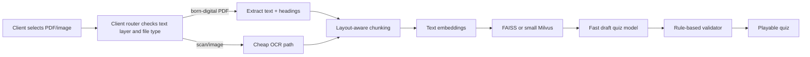
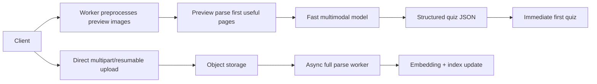

# Accelerating Image and PDF Uploads for Quiz Generation

## Executive summary

The fastest path from “user selects a file” to “user sees the first playable quiz” is usually not a single better model. It is a routed system that decides, as early as possible, whether a file is a born-digital PDF with a text layer, a scanned PDF, or a camera image; then applies the lightest extraction path that preserves enough structure to generate good questions. In practice, that means: extract text directly when the PDF already contains it; use layout-aware OCR only for bitmap-heavy pages; preprocess large images in a browser worker before upload; start parsing the first useful pages while the rest of the file is still uploading; and generate a first quiz draft from a small, highly relevant context window instead of waiting for full-document indexing. Official docs from major vendors consistently support this direction: layout-aware parsers preserve structure better than flat OCR, resumable and multipart uploads reduce retransmission waste, and prompt/context caching can materially reduce repeated model latency and cost. citeturn25view4turn25view5turn30view0turn31view0turn20search1turn21search1

For most educational quiz products, the best default architecture is a hybrid pipeline: client-side file triage and lightweight preprocessing; direct resumable upload to object storage with short-lived signed access; selective PDF page processing; layout-aware chunking into semantically coherent blocks; embeddings for retrieval; then structured quiz generation with a fast model and optional second-pass validation on uncertain items. For high-volume, cost-sensitive workloads, open-source OCR/layout stacks can be excellent, especially when paired with in-process retrieval. For stricter latency SLOs or faster time-to-production, managed OCR/layout APIs still hold a strong advantage because they combine OCR, structured blocks, page selection, and tables/forms parsing with lower operational burden. citeturn30view1turn30view3turn31view0turn28view0turn29view0turn26view1turn24view2turn35view0

The biggest near-term wins are usually these: stop rasterizing born-digital PDFs unless required; switch from whole-file upload to direct multipart or resumable upload; move image compression/downscaling off the main thread; parse the first useful pages first; replace page-level chunking with layout-aware or heading-aware chunking; cache prompt prefixes and embeddings; and split quiz generation into a cheap draft pass plus a smaller validation pass. Those changes often improve both p95 latency and quiz quality more than swapping one frontier model for another. citeturn34search1turn30view0turn31view0turn32search1turn32search0turn25view4turn25view5turn20search1turn21search1

## Assumptions and baseline

This report assumes that “fastest time-to-quiz” means **time from file selection to the first valid, playable set of questions**, not merely “time until the full document is fully indexed.” It also assumes a mixed corpus of educational PDFs and images: some born-digital PDFs, some scanned handouts, some screenshots or photos, and documents ranging from a few pages to roughly a few hundred pages. Because the request was written in English despite the note about writing in Vietnamese, I am delivering the report in English and prioritizing Vietnamese-language official sources where they materially add value, especially for compliance.

For the concrete recommendations, I am also assuming the target product resembles the uploaded Doc2Quiz-style code map: browser-heavy ingestion, client-side PDF-to-image rendering in at least some paths, OCR currently skipped in the main product quiz flow, sequential page batching, and local browser persistence/staging that makes main-thread contention and sequential model calls especially expensive. That baseline makes routing, progressive upload, and selective extraction higher priority than model replacement alone. fileciteturn0file0

A final assumption is that apples-to-apples latency numbers across vendors are **not** available from official docs in a truly normalized way. Where the tables below use latency bands such as low, medium, and high, those are engineering judgments derived from vendor-stated capabilities, sync-vs-async behavior, context-window class, and deployment topology, not a claim of benchmark parity on the same corpus. Vendor-specific prices, quotas, and model capabilities are cited directly. citeturn24view0turn27search0turn26view0turn24view2turn24view4turn24view5turn24view6

## Model landscape and trade-offs

No single stack is best for every document type. The best pattern is usually **routing by document subtype**:

- **Born-digital PDF with selectable text:** direct text extraction first, layout parser second, OCR only for bitmap subregions or damaged pages.
- **Scanned PDF:** layout-aware OCR or document parsing service.
- **Camera image / screenshot:** lightweight client preprocessing, then OCR or multimodal parsing depending whether diagrams/tables matter.
- **Rich documents with figures, formulas, or tables:** layout-aware parsers and multimodal reasoning matter more than raw OCR quality. citeturn34search1turn25view4turn25view5turn26view2turn35view1turn35view0

Managed stacks from entity["organization","OpenAI","ai company"], entity["company","Anthropic","ai company"], entity["company","Google","internet company"], entity["company","Microsoft","software company"], entity["company","Amazon","technology company"], and entity["company","Mistral AI","ai company"] now overlap heavily, but they still specialize differently. Google’s document stack is particularly strong when you want OCR plus structure plus context-aware chunks in one pass; Microsoft’s layout/Markdown outputs are strong for structural segmentation; Amazon Textract remains pragmatic for OCR/forms/tables with clear sync/async behavior; Mistral OCR is aggressively priced and focused on document extraction; Anthropic and Google expose very direct PDF-native multimodal workflows; OpenAI is strongest in structured-output generation, retrieval primitives, prompt caching, and multilingual embeddings even when you do not use it as the primary OCR layer. citeturn25view4turn25view5turn26view1turn24view2turn21search2turn24view5turn24view3turn20search6turn20search1turn9search0

### Comparative table of OCR and layout tools

| Tool | Best fit | Latency note | Accuracy / structure note | Cost / deploy note | Main trade-off |
|---|---|---:|---|---|---|
| Google Document AI OCR | OCR-heavy PDFs and scans | **Low–medium** for online OCR; supports imageless mode and up to 30 synchronous pages in that mode citeturn28view0 | OCR for 200+ languages, better printed text/checkbox/reading-order improvements in current versions citeturn28view0 | OCR pricing starts at **$1.50 / 1,000 pages**; OCR add-ons extra citeturn24view0 | Strong OCR economics, but structure is weaker than the layout parser for RAG/quiz segmentation |
| Google Document AI Layout Parser | Complex reports, lists, tables, heading-aware chunking | **Medium**; higher than plain OCR but still production-oriented citeturn25view4turn28view0 | Preserves document hierarchy and creates context-aware chunks; designed for search/RAG pipelines citeturn25view4turn23search11 | **$10 / 1,000 pages**, includes initial chunking citeturn24view0 | Better downstream retrieval quality, but costs more than OCR-only processing |
| Azure Read / Layout in Document Intelligence | Selective page extraction and Markdown-friendly structure | **Low** for Read; **medium** for Layout; page ranges supported citeturn22search12turn22search0 | Layout returns sections/subsections and Markdown-friendly structured output citeturn25view5turn23search1 | Official pricing indicates **Read ~ $1.50 / 1,000 pages** and **Layout / prebuilt ~ $10 / 1,000 pages** in common tiers citeturn27search0turn27search7 | Strong structural output, but quota/TPS tuning may be needed at scale |
| Amazon Textract Detect / Analyze / Layout | OCR, forms, tables, and page-level routing in AWS-centric stacks | **Low** for synchronous single-page docs; multipage goes async citeturn26view1 | Layout blocks are returned in implied reading order and include titles, headers, lists, tables, figures, key-values, and text citeturn26view2 | Detect text about **$1.50 / 1,000 pages**; tables/forms markedly higher; layout is free with tables in one pricing example citeturn26view0 | Clear operational behavior and good structure, but structured extraction can become expensive quickly |
| Mistral OCR 3 | Cost-efficient OCR plus annotations / bounding boxes | **Low–medium** as a focused OCR API class citeturn24view2 | OCR plus structured annotations, bbox extraction, and document Q&A hooks citeturn24view2 | **$2 / 1,000 pages** and **$3 / 1,000 annotated pages** citeturn24view2 | Very attractive price/performance, but less of an end-to-end document platform than big cloud suites |
| PaddleOCR-VL 1.5 | Self-hosted document parsing where GPU control matters | **Low–medium** with optimized inference stacks; faster than prior pipeline-style systems per project docs citeturn35view0 | Multilingual (109 languages), strong on text/tables/formulas/charts, irregular bbox support in v1.5 citeturn35view0 | Open-source, but infra/GPU and service ops become your responsibility citeturn35view0 | Excellent for privacy/cost control, but deployment complexity is non-trivial |
| Tesseract + OCRmyPDF | Cheapest text-layer recovery for simple scans and mixed PDFs | **Low** per page on CPU for basic OCR; slower on difficult pages | Tesseract works best near **300 DPI**; OCRmyPDF can skip text pages, redo OCR, downsample huge images, and preserve originals while only downsampling the OCR image citeturn35view1turn35view2 | Very low direct software cost; highest tuning burden citeturn35view1turn35view2 | Best for cost control and text recovery, weakest on complex layout semantics |
| Docling | Self-hosted PDF understanding and conversion for RAG | **Medium**; depends on selected backends and hardware | Advanced PDF understanding with reading order, tables, formulas, image classification, and Markdown/JSON exports citeturn25view3 | Open-source; good interoperability | Strong normalization layer, but not the cheapest simple OCR path |

### Comparative table of multimodal generation models for quiz synthesis

| Model family | Best fit | Latency / cost note | PDF / image handling note | Main trade-off |
|---|---|---|---|---|
| Gemini 3.1 Pro | Highest-quality multimodal reasoning and complex quiz generation | Higher latency and cost than Flash-class models; 1M-token context citeturn24view5 | Accepts text, images, audio, video, and PDF directly citeturn24view5turn8search7 | Best reasoning, but not the cheapest path to first quiz |
| Gemini 3.1 Flash-Lite | First-pass quiz draft, high-volume low-latency flows | Google describes it as the most cost-efficient low-latency Gemini model citeturn24view6 | Also accepts PDF and images directly citeturn24view6 | Great for time-to-first-quiz, somewhat weaker for ambiguous or conceptually dense documents |
| Claude Sonnet 4.6 | Fast, strong document reasoning with good structured prompting | Anthropic lists Sonnet 4.6 as **fast** with 1M context; cheaper than Opus-class models citeturn24view4 | Direct PDF support is documented; PDF support is ZDR-eligible, while Files API is not ZDR-eligible citeturn21search2turn21search5 | Strong middle ground, but you still need careful cost control on large image/PDF contexts |
| OpenAI GPT-4.1 and latest GPT models | Structured JSON quiz generation, retrieval-backed synthesis, multilingual post-processing | GPT-4.1 is medium-speed with 1M context; latest OpenAI models support image input, and smaller variants offer lower cost/latency than flagship classes citeturn24view3turn18search16turn9search2 | Strong image-input and structured-output support; OpenAI retrieval/vector-store primitives handle parsing/chunking/embedding workflows well citeturn20search3turn20search6turn20search10 | Often best when paired with a dedicated OCR/layout layer rather than used as the only document parser |

**Practical recommendation.** If your dominant workload is mixed educational PDFs, the strongest default stack is usually: **text-layer extraction or layout parser first, then a fast multimodal model for first-pass quiz generation, then a lightweight validation pass.** Use a more expensive model only when the router flags low OCR confidence, dense tables, diagrams, or ambiguous source material. citeturn25view4turn25view5turn26view3turn24view5turn24view6turn24view4

## Upload pipeline and preprocessing for minimum latency

The upload path should be designed around two goals that often conflict unless you explicitly separate them: **fast first-results** and **reliable full-file completion**. The right pattern is usually direct-to-object-store upload using presigned or session-based access, resumable or multipart transport for large files, and a separate “preview extraction” lane that sends just enough data to begin parsing immediately. Official cloud and protocol docs strongly support this structure: S3 multipart upload allows parallel part upload and retransmission of only failed parts; GCS resumable uploads are the recommended method for large files and let you resume without restarting from byte zero; tus standardizes resumable semantics and optional checksum/expiration behavior. citeturn30view0turn31view0turn30view3

Client-side preprocessing should happen off the main UI thread. Web Workers, `createImageBitmap`, `OffscreenCanvas`, and Blob conversion let you downscale and recompress images without blocking the interface. For a browser-heavy product, that matters twice: it reduces bytes on the wire and removes main-thread contention that would otherwise delay preview rendering, progress updates, and quiz startup. `IndexedDB` remains useful for temporary local staging of page previews or resumable state because it is designed for sizeable structured data and blobs. citeturn32search1turn32search3turn32search0turn33search0

### Comparative table of upload techniques

| Technique | Best use | Latency effect | Bandwidth effect | Reliability / security note | Main trade-off |
|---|---|---|---|---|---|
| Single request upload | Small images and tiny PDFs | Lowest protocol overhead for small files | Neutral | Poor failure recovery for large files | Fine under ~tens of MB; degrades badly on network interruption |
| Multipart upload | Large PDFs and large image bundles | Better throughput via parallel parts; retry only failed parts citeturn30view0 | Neutral | Needs part bookkeeping and finalization | Best default for large object storage uploads |
| Resumable upload session | Large or unstable-network uploads | Avoids restarting from zero after failure citeturn31view0turn30view3 | Neutral | Session URIs/tokens must be protected; expiration varies by system citeturn31view0turn30view3 | Ideal for mobile/spotty networks; slightly more session complexity |
| tus protocol | Cross-provider resumable standard | Good for browser/server interoperability; resumable offsets and optional checksums citeturn30view3 | Neutral | Checksum and expiration extensions improve robustness | Extra infrastructure unless your stack already supports it |
| Presigned direct upload | Keep your app servers off the hot data path | Cuts proxy hop and application-server egress/CPU overhead citeturn30view1 | Neutral | Use short TTLs and least-privilege object keys | Excellent for scale; requires careful object naming and validation |
| Transfer acceleration / edge ingress | Global users uploading into a central bucket | Can materially help long-distance uploads by entering the cloud network earlier citeturn30view2 | Neutral | Extra cost applies | Useful only when geography is the bottleneck |
| Client-side downscale/recompress | Camera images and rasterized page previews | Faster end-to-end because fewer bytes go up and image tokens go down later | High positive impact on photo uploads | Must not destroy small text legibility | Very effective for photos; not a substitute for text-layer extraction in PDFs |
| Progressive upload plus preview parse | “First quiz fast” products | Best time-to-first-result because preview processing starts before full upload ends | Small extra bytes if preview artifact is duplicated | Requires orchestration discipline | Highest UX payoff when done carefully |

For PDFs, the single most important optimization is **do not rasterize by default**. Use a PDF parser to test whether a page already has extractable text. `PDF.js` exposes `getDocument`, page fetching, and `getTextContent`, so you can cheaply determine whether you have a born-digital text-bearing page before you pay the cost of rendering it into an image for OCR or VLM ingestion. If text exists, parse text and structure first; if it does not, rasterize selectively. For scanned or low-quality images, Tesseract and OCRmyPDF docs reinforce familiar OCR hygiene: keep text dark on light background, target roughly 300 DPI, use thresholding when backgrounds are uneven, and downsample only huge pages that exceed OCR engine limits. citeturn34search0turn34search1turn35view1turn35view2turn13search2turn13search3

For managed OCR/layout services, page selection is a major speed lever. Azure explicitly supports the `pages` parameter for ranges, Google Document AI exposes page subset controls in `ProcessOptions`, and Google and Azure both expose layout outputs that are more useful than flat OCR when the downstream task is semantic chunking for quizzes. Selective page routing is often the difference between “interactive” and “background-only.” citeturn22search0turn22search4turn22search12turn22search14turn25view5turn25view4

```ts
// TypeScript: browser-side image preprocessing in a Worker-friendly style.
// Tunable heuristic: maxLongEdge defaults to 2200px for preview/quiz parsing;
// raise it for tiny-font documents, lower it for camera photos.

export async function preprocessImageForUpload(
  file: File,
  opts: { maxLongEdge?: number; quality?: number; mime?: string } = {}
): Promise<Blob> {
  const maxLongEdge = opts.maxLongEdge ?? 2200;
  const quality = opts.quality ?? 0.82;
  const mime = opts.mime ?? "image/webp";

  const bitmap = await createImageBitmap(file);
  try {
    const scale = Math.min(1, maxLongEdge / Math.max(bitmap.width, bitmap.height));
    const width = Math.max(1, Math.round(bitmap.width * scale));
    const height = Math.max(1, Math.round(bitmap.height * scale));

    const canvas = new OffscreenCanvas(width, height);
    const ctx = canvas.getContext("2d");
    if (!ctx) throw new Error("2D context unavailable");

    ctx.drawImage(bitmap, 0, 0, width, height);
    return await canvas.convertToBlob({ type: mime, quality });
  } finally {
    bitmap.close();
  }
}
```

The browser APIs used above are specifically designed for non-blocking image preparation and background-thread work. In practice, I would pair this with a direct upload session and a small “preview artifact” lane: first page text or first few page thumbnails go immediately to the parser; the full file continues uploading in parallel. citeturn32search1turn32search3turn32search0turn32search7turn30view1turn30view0

```ts
// TypeScript pseudocode: progressive upload + parse-first-pages pattern.

type InitResponse = {
  uploadId: string;
  objectKey: string;
  partUrls: string[];      // or a resumable session URL
  previewParseUrl: string; // backend endpoint for first-page parsing
};

export async function uploadAndPrimeQuiz(file: File): Promise<void> {
  const init = await fetch("/api/uploads/init", {
    method: "POST",
    headers: { "content-type": "application/json" },
    body: JSON.stringify({ name: file.name, size: file.size, type: file.type })
  });
  if (!init.ok) throw new Error("Failed to initialize upload");
  const session = (await init.json()) as InitResponse;

  // Start preview extraction immediately.
  const previewPromise = buildPreviewArtifact(file).then(async (artifact) => {
    const resp = await fetch(session.previewParseUrl, { method: "POST", body: artifact });
    if (!resp.ok) throw new Error("Preview parse failed");
  });

  // Upload the full file in parallel using multipart or resumable semantics.
  const uploadPromise = uploadLargeFileMultipart(file, session);

  await Promise.all([previewPromise, uploadPromise]);
}
```

## Fast content-to-quiz conversion

Question generation becomes much faster and more reliable when you stop treating the source as a flat page stream. The most effective pattern is **structure-aware segmentation**: detect headings, lists, tables, figures, and their hierarchy, then create chunks that roughly match teaching units. Google’s layout parser explicitly emphasizes that standard OCR flattens documents and destroys the relationships that matter for search and generation, while Azure’s layout model exposes sections and subsections and can emit Markdown-compatible structure. That is exactly the right shape for quiz generation because good questions usually target one coherent concept, not arbitrary 800-token slices that cut through section boundaries. citeturn25view4turn25view5turn23search1

A useful operational rule is this. For simple text-heavy PDFs, fixed token chunking is acceptable. For mixed educational materials, **layout-aware chunking is superior**. OpenAI’s vector-store defaults of 800 tokens with 400 overlap are a reasonable generic baseline, but for quiz generation from rich documents I would usually start from layout blocks and only then apply token budgets. The goal is not just higher retrieval recall; it is higher **question faithfulness**, because the model sees a single concept, table, or explanation rather than a semantically fractured chunk. citeturn20search10turn20search21turn25view4turn25view5

On embeddings, the simplest split is also the most pragmatic. If the document has already been converted into text or Markdown, use a strong multilingual text embedding model. OpenAI describes `text-embedding-3-large` as its most capable model for English and non-English tasks, which is useful if Vietnamese content matters. If you need unified retrieval across original images, PDFs, and text without committing to a text-only normalization path, Google’s Gemini Embedding 2 Preview is notably interesting because it places text, images, audio, video, and PDFs into a shared embedding space. citeturn9search0turn9search4turn9search9turn9search15

For actual quiz generation, a two-pass pattern is usually fastest **and** better than a single high-cost call:

1. **Draft pass:** fast model generates candidate questions in strict JSON schema.
2. **Validation pass:** a second call checks grounding, answer uniqueness, distractor quality, and difficulty balance; it only rewrites bad items.

This works well because structured-output interfaces are now first-class in OpenAI and Gemini, and Anthropic’s prompting guidance explicitly recommends examples and rigorous success criteria rather than assuming prompting alone solves all failure modes. Fine-tuning becomes valuable only after the failure modes stop moving and you have a reviewed dataset of acceptable quizzes; at that point, distillation or supervised fine-tuning can move work from an expensive generator to a cheaper model class with more stable output shape. citeturn6search17turn8search3turn21search13turn9search3turn9search7turn9search10

```python
from __future__ import annotations

from dataclasses import dataclass
from typing import Iterable, List, Dict, Any
import hashlib

@dataclass
class Block:
    page: int
    kind: str         # heading, paragraph, table, figure, list
    text: str
    level: int = 0    # heading depth if known

@dataclass
class Chunk:
    chunk_id: str
    title_path: List[str]
    text: str
    pages: List[int]

def chunk_layout_blocks(blocks: Iterable[Block], max_chars: int = 2600) -> List[Chunk]:
    chunks: List[Chunk] = []
    current_title_path: List[str] = []
    buffer: List[str] = []
    pages: List[int] = []

    def flush() -> None:
        nonlocal buffer, pages
        if not buffer:
            return
        text = "\n".join(buffer).strip()
        digest = hashlib.sha1(text.encode("utf-8")).hexdigest()[:12]
        chunks.append(
            Chunk(
                chunk_id=f"ch_{digest}",
                title_path=current_title_path.copy(),
                text=text,
                pages=sorted(set(pages)),
            )
        )
        buffer, pages = [], []

    for block in blocks:
        if block.kind == "heading":
            flush()
            current_title_path = current_title_path[: block.level]
            current_title_path.append(block.text.strip())
            continue

        candidate = ("\n".join(buffer + [block.text])).strip()
        if len(candidate) > max_chars and buffer:
            flush()

        buffer.append(block.text.strip())
        pages.append(block.page)

    flush()
    return chunks

QUIZ_PROMPT = """
You are generating grounded study questions from a source chunk.

Return JSON only with this schema:
{
  "questions": [
    {
      "type": "mcq|short_answer|true_false",
      "question": "...",
      "choices": ["..."],     // omit for short_answer
      "answer": "...",
      "explanation": "...",
      "difficulty": "easy|medium|hard",
      "evidence": ["exact supporting facts paraphrased from the chunk"]
    }
  ]
}

Rules:
- Generate 3 to 5 questions only.
- Every question must be answerable from the source chunk alone.
- Do not repeat the same fact in multiple questions unless difficulty differs.
- Prefer concept, definition, comparison, cause/effect, and table-reading questions.
- If the chunk is too weak, return {"questions": []}.
"""

def prepare_generation_payload(chunk: Chunk) -> Dict[str, Any]:
    return {
        "title_path": " > ".join(chunk.title_path),
        "pages": chunk.pages,
        "source_text": chunk.text,
        "schema_mode": "strict_json",
        "prompt": QUIZ_PROMPT,
    }
```

The code above deliberately chunks by structure first and only then by size. In production, I would add three more steps: deduplicate candidate questions by normalized answer/evidence overlap, score groundedness with a validator model, and cache embeddings and quiz outputs by content hash so repeated uploads of the same handout do not re-run the full generation path. Vendors now document explicit prompt/context caching and structured outputs precisely because repeated prefixes and rigid formats are common production patterns. citeturn20search1turn21search1turn8search2turn8search6turn6search17turn8search3

**Few-shot versus fine-tuned.** Start with few-shot examples when you are still deciding question style, grade level, distractor style, and JSON schema. Move to fine-tuning or distillation when you have enough reviewed examples that “style drift” and “format drift” dominate your p95 latency and rejection rate. Few-shot has the best iteration speed; fine-tuned or distilled smaller models have the best long-run cost/latency once the target behavior stabilizes. citeturn9search3turn9search7turn9search16turn21search16

## Retrieval, caching, and architecture trade-offs

Caching should be layered, not monolithic. The most valuable layers are usually: **upload-session cache** for resumable state, **page artifact cache** for rendered page images and extracted Markdown, **embedding cache** keyed by content hash, **retrieval cache** for common quiz queries, and **prompt-prefix cache** for repeated instructions and few-shot exemplars. Google, OpenAI, and Anthropic all now document explicit or automatic context/prompt caching because repeated prefixes are a major source of avoidable cost and repeated latency in production. citeturn8search2turn8search6turn20search1turn21search1

### Comparative table of embedding stores

| Store | Latency profile | Best fit | Operational burden | Main trade-off |
|---|---|---|---|---|
| FAISS | Lowest possible deployment latency when embedded in the same process or host; GPU support available for some indexes citeturn11search2turn25view2 | Single-tenant or tightly controlled services, local/offline use, and cost-sensitive deployments | High, because durability, replication, multi-tenancy, and distributed ops are mostly your job | Best raw control and often best latency, but weak as a turnkey production database |
| Milvus | Strong middle ground; AUTOINDEX is the recommended default, with HNSW for high recall in RAM and DiskANN for larger-than-RAM datasets citeturn36view0 | Teams that want an open deployment model with richer database behavior than FAISS | Medium | More moving parts than FAISS, but more scalable and production-friendly |
| Pinecone on-demand | Good managed latency, but queries still pay a network hop and can be affected by shared read infrastructure/caching behavior citeturn25view1turn25view0 | Fast time-to-production, variable workloads, multi-tenant apps | Low | Easiest managed option, but not always the lowest p95 for sustained heavy read traffic |
| Pinecone dedicated read nodes | Predictable low-latency under sustained high QPS; all data warm in memory/local SSD and no read cold starts citeturn25view1 | Mission-critical, high-throughput semantic search and recommendation workloads | Low–medium | Better p95 at scale, but fixed hourly capacity cost changes the economics |

For quiz generation workloads, the retrieval choice is usually straightforward:

- **Use FAISS** if you are single-tenant, cost-sensitive, or need offline/on-device prototypes.
- **Use Milvus** if you need open-source control and expect to outgrow FAISS.
- **Use Pinecone** if velocity and managed ops matter more than absolute lowest infra cost.
- **Do not over-index too early.** If your per-document chunk counts are small, retrieval overhead can dominate before ANN complexity pays off. FAISS itself notes that direct computation remains efficient when searches are few, and its Flat index is the exact baseline. citeturn25view2turn36view0turn25view1

### Recommended architecture patterns

#### Low-cost pipeline



This design minimizes paid OCR and premium-model usage. It is the right choice when most PDFs already contain text, your corpus is reasonably clean, and you can tolerate occasional fallback to a slower path for difficult pages. Pair it with batch or flex-style asynchronous processing for full indexing after the first quiz is shown, not before. citeturn34search1turn35view2turn20search0turn20search13

#### Low-latency pipeline



This is the best pattern when your product promise is “quiz starts almost immediately.” The unstable work—full upload, full indexing, long-tail OCR—moves out of the request path. The interactive lane parses only what is needed for the first questions, while full-document enrichment continues asynchronously. This is also the design most aligned with presigned uploads, multipart/resumable transport, and browser-worker preprocessing. citeturn30view0turn30view1turn31view0turn32search1turn32search0

#### High-accuracy pipeline


This is the right choice when documents are messy, multilingual, or visually rich, and quiz quality matters more than first-response speed. It costs more and adds latency, but it also reduces hallucinated distractors, duplicate questions, and misread table/chart questions. Use it for premium flows, teacher-facing review flows, or difficult-document fallback. citeturn25view4turn25view5turn24view5turn24view4

### Serverless versus containerized inference

| Architecture style | Best for | Latency note | Cost note | Main trade-off |
|---|---|---|---|---|
| Serverless request path | Bursty traffic, fast rollout, low idle cost | Cold starts exist; AWS documents cold-start behavior and mitigation via provisioned concurrency / SnapStart, while Cloud Run keeps idle instances warm temporarily to reduce cold starts citeturn16search4turn16search0turn16search16turn16search1 | Excellent when demand is spiky | Simplest to operate, but harder to guarantee low p95 for custom GPU OCR/VLM paths |
| Containerized CPU/GPU services | Sustained throughput, custom OCR/VLM stacks | Better steady-state p95; dynamic batching in Triton improves throughput and can also reduce latency when tuned correctly citeturn16search2turn16search6turn16search18 | Better for steady load and heavy inference | More ops complexity |
| Hybrid: serverless frontend + async workers + dedicated inference | Most production quiz systems | Best balance: fast API path, long work offloaded to queue/workers such as Cloud Tasks or equivalents citeturn16search3turn16search11 | Usually the best long-run economics | Slightly more architecture complexity, but usually worth it |

My default recommendation is a **hybrid architecture**: serverless or lightweight containers for API ingress and upload session management; async workers for full-document parse/index; dedicated CPU/GPU services only for the expensive OCR/layout/VLM stages that truly need them. Pure serverless is attractive early, but it becomes awkward once you own OCR models or need strict p95 guarantees. Pure containerization is powerful, but usually overkill before traffic stabilizes. citeturn16search0turn16search1turn16search2turn16search3

## Measurement, security, and prioritized optimization roadmap

The core latency metrics should follow the user journey, not just infrastructure tiers. The most important ones are: **time-to-first-preview**, **time-to-first-quiz**, **upload completion p95**, **parse p95 per page**, **retrieval latency p95**, **quiz-validity rate** (schema-valid and answerable), **groundedness rate** (supported by source chunk), **duplicate-question rate**, and **human acceptance rate** by reviewers. On quality, use both automated evals and a small but persistent human review set; current model providers explicitly recommend evaluation loops rather than relying on prompting alone. citeturn18search0turn18search8turn18search9turn20search12

Security-wise, file upload remains a classic attack surface. OWASP’s file upload guidance still applies directly: strict allowlists, size limits, malicious-file scanning or quarantine, content-type validation beyond trusting file extensions, and strong isolation between the upload tier and the rest of the app. Presigned direct uploads help remove your application server from the bulk data path, but they do not remove the need for post-upload validation. Use encryption at rest by default; on object stores, server-side encryption is standard, and managed vector databases increasingly expose CMEK and audit-log options. OpenAI documents that API data is not used for training by default unless you opt in, but its background mode is not ZDR-compatible; Anthropic documents that PDF support is ZDR-eligible while Files API is not. Those distinctions matter if uploaded school materials contain student data. citeturn17search0turn30view1turn17search9turn17search1turn17search6turn17search3turn17search17turn21search2turn21search5

For compliance in entity["country","Vietnam","southeast asia"], the current legal baseline has changed materially since 2025. The official government legal portal shows that the **Law on Personal Data Protection, No. 91/2025/QH15**, took effect on **January 1, 2026**, and **Decree 356/2025/NĐ-CP** now provides implementing detail from the same date. In other words, teams should not keep relying solely on the older Decree 13/2023 framework when designing present-day upload, retention, and processor/vendor controls. If your uploaded files contain personal data, build explicit purpose limitation, retention periods, incident procedures, access controls, and cross-border transfer review into the design from the start. Also note a subtle vendor-compliance issue: some preview Google Document AI processor versions use a global Gemini endpoint and are explicitly marked as not compliant with certain data residency constraints. citeturn15search0turn15search1turn15search7turn28view0

### Prioritized optimization checklist

The impact estimates below are **engineering estimates**, intended to help sequencing rather than serve as benchmark claims.

| Priority | Optimization | Why it matters | Estimated impact | Effort |
|---|---|---|---|---|
| Highest | **Skip rasterization for born-digital PDFs; extract text layer first** | Removes the biggest avoidable CPU, memory, bandwidth, and OCR cost in many document sets | **Very high**: often the single largest reduction in time-to-first-quiz for text PDFs | **Low** |
| Highest | **Direct multipart/resumable upload to object storage** | Eliminates proxy-hop overhead and avoids whole-file retransmission on failure | **Very high** on large files and mobile networks | **Medium** |
| Highest | **Preview-first parsing while full upload continues** | Lets the first quiz appear before full ingest/index completes | **Very high** on UX-perceived latency | **Medium** |
| Highest | **Move image preprocessing into Web Workers** | Prevents UI stalls and shortens upload payloads for camera images | **High** for browser-heavy apps | **Low–medium** |
| High | **Route by page type: text page vs bitmap page vs rich layout page** | Avoids paying layout/OCR costs on pages that do not need them | **High** on mixed PDFs | **Medium** |
| High | **Replace page-level chunking with layout-aware chunking** | Improves both retrieval precision and question faithfulness | **High** on quiz quality, medium on latency | **Medium** |
| High | **Cache prompt prefixes, embeddings, and content hashes** | Repeated uploads/course materials should not repeat expensive work | **High** on cost and repeated-query p95 | **Medium** |
| High | **Use draft-pass generation plus validator-pass rewrite** | Cheaper than running a top-tier model for every item while improving quality control | **High** on cost-quality balance | **Medium** |
| Medium | **Adopt a vector store matched to your scale** | Avoids premature operational complexity or premature managed spend | **Medium** | **Medium** |
| Medium | **Add async workers / task queue for full indexing** | Keeps interactive path clean and protects p95 from long-tail docs | **Medium–high** | **Medium** |
| Medium | **Tune OCR preprocessing: thresholding, downsample huge pages, 300-DPI target** | Improves OCR reliability on bad scans without brute-force reprocessing everything | **Medium** | **Low** |
| Medium | **Queue-based fallback to high-accuracy pipeline only on uncertain docs** | Reserves the slowest/most expensive path for hard cases | **Medium–high** | **Medium–high** |
| Lower | **Global transfer acceleration / edge ingress** | Useful mainly when geography, not CPU/model time, is the bottleneck | **Variable** | **Low** |
| Lower | **Full fine-tuning or distillation for quiz style** | Valuable only after you have enough reviewed examples and stable requirements | **Variable but potentially large over time** | **High** |

If I were implementing this roadmap against the uploaded baseline, I would sequence it this way:

1. **Hybrid document router**: text-layer detection, bitmap detection, and page selection.
2. **Direct resumable upload** plus **preview-first parse**.
3. **Worker-based preprocessing** for images and raster previews.
4. **Layout-aware chunking** and **content-hash caching**.
5. **Draft + validator quiz generation** with strict JSON schema.
6. **Async full indexing** and a better-matched vector store only after traffic data justifies it.

That ordering usually yields the best ratio of impact to engineering effort because it attacks the structural bottlenecks before spending time on model replacements or fine-tuning. citeturn34search1turn30view0turn31view0turn32search1turn25view4turn25view5turn20search1turn21search1