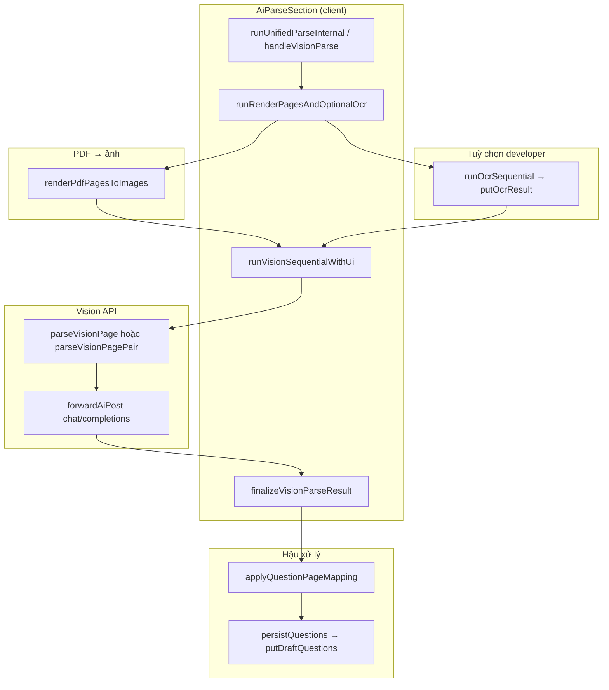

# Workflow: Vision parse (chi tiết)

**Mục đích:** mô tả đúng theo code hiện tại để phân tích, đánh giá, cải tiến và **rút ngắn vòng test** (biết chỗ chèn log, flag, và nhánh rẽ).

**Phạm vi:** luồng **full-page vision** (Accurate, hoặc Fast/Hybrid khi không có OCR / rơi về vision), từ lúc user bấm parse đến khi draft `Question[]` được lưu IDB. Không mô tả sâu **layout-chunk** (OCR → chunk text → `parseChunk`); chỉ nhắc khi nào **không** vào vision trực tiếp.

---

## 1. Điều kiện trước khi vision chạy

| Điều kiện | Nguồn |
|-----------|--------|
| Có `File` PDF (`activePdfFile`) | `AiParseSection` props |
| BYOK OpenAI-compatible: **API key** (+ Custom: base URL + model) | `readForwardSettings()` / `getForwardOpenAiCompatKind()` |
| `getSurfaceAvailability` cho phép vision (multimodal hoặc attach) | `parseCapabilities.ts` — nếu block → nút parse disabled |
| Không đang `isRunning` | `progress` + `visionRendering` |

**Anthropic native** không đi qua vision multimodal trong luồng này (URL resolve khác); thực tế dùng vision là **openai | custom** tới `/v1/chat/completions`.

---

## 2. Ai vào `handleVisionParse`?

**File:** `src/components/ai/AiParseSection.tsx`  
**Hàm:** `runUnifiedParseInternal` → theo `parseStrategy`:

- **`accurate`** → luôn `handleVisionParse()`.
- **`hybrid` / `fast`** → `handleHybridParse` / `handleLayoutAwareParse`; **chỉ** gọi `handleVisionParse()` khi `enableOcr === false` hoặc sau khi chuẩn bị trang mà **không có** `OcrRunResult` hợp lệ (nhánh “no OCR data — vision only”), hoặc hybrid **OCR gate** chọn full vision.

**Policy thuần (gợi ý intent, không thay handler):** `decideParseRoute` trong `parseRoutePolicy.ts` — Accurate → `executionFamily: "vision_pages"`.

**Surface sản phẩm (`surface === "product"`):** trong `runRenderPagesAndOptionalOcr`, bước prefetch **`runOcrSequential` bị tắt**; vision vẫn rasterize PDF rồi gọi `runVisionSequential` như dưới.

---

## 3. Sơ đồ tổng quan (mermaid)

### 3.1 Nhánh batch (Phase 21)

Khi **`attachPageImage`** tắt (hoặc không có `studySetId`), sau rasterize `handleVisionParse` gọi **`runVisionBatchSequential`** (`src/lib/ai/runVisionBatchSequential.ts`): tối đa 10 ảnh trang mỗi request, overlap 2 trang giữa các batch, dedupe cuối pipeline, cache theo hash batch, báo cáo benchmark (verbose). Khi **bật attach** và có `studySetId`, luồng vẫn dùng **`runVisionSequentialWithUi`** → `runVisionSequential` như trước.

**Quiz vs flashcard:** prop **`parseOutputMode`** trên `AiParseSection` (mặc định `quiz`; trang source product map từ `StudySetMeta.contentKind`). Flashcard → **`putDraftFlashcardVisionItems`**; quiz → **`putDraftQuestions`** (và `putDraftQuestions` xóa draft flashcard khi lưu MCQ).

**Local + proxy từ chối `data:`:** staging không có **`BLOB_READ_WRITE_TOKEN`** trả về URL `http://localhost:3000/api/ai/vision-staging/...` — server upstream **không** tải được localhost. Code chỉ thử URL đó nếu host **public** (`isPublicHostedVisionImageUrl` trong `stageVisionDataUrl.ts`); còn không thì chỉ còn `data:`. Giải pháp: thêm token Blob, hoặc deploy origin public, hoặc upstream chấp nhận `data:image/...`.

---

## 4. Chuỗi gọi chi tiết (theo thứ tự thời gian)

### Bước 0 — User trigger

- **Auto (embedded):** `useEffect` khi `autoStartWhenDraftEmpty` + đủ điều kiện → `runUnifiedParseInternal()` (`AiParseSection.tsx` ~1723+).
- **Manual:** nút parse / imperative `ref.runParse()`.

**Trước parse:** có thể `onBeforeParse?.()` (persist PDF lên IDB) — tùy parent.

---

### Bước 1 — `handleVisionParse`

**File:** `src/components/ai/AiParseSection.tsx`

1. Clear `error` / `summary`.
2. Kiểm tra `apiKey`, `visionDisabled`.
3. `AbortController` → `abortRef`.
4. UI: `setParseMode("vision")`, `setVisionRendering(true)`, `setProgress`, `setParseOverlay` (log đầu: *Preparing document for vision…*).
5. Gọi **`runRenderPagesAndOptionalOcr(file, controller, apiKey, forwardProvider, timeStamp, "vision")`**.

---

### Bước 2 — `runRenderPagesAndOptionalOcr`

**File:** `src/components/ai/AiParseSection.tsx`

1. **`renderPdfPagesToImages`** (`src/lib/pdf/renderPagesToImages.ts`):
   - `pdfjs.getDocument` → render từng trang JPEG data URL.
   - Hằng số: `VISION_MAX_PAGES_DEFAULT = 20`, `VISION_MAX_WIDTH_DEFAULT = 1024`, `VISION_JPEG_QUALITY = 0.78`.
   - `onPageRendered` → cập nhật overlay (log *Page i/n rasterized*, thumbnails).

2. **(Tuỳ chọn) OCR prefetch** — chỉ khi `enableOcrEffective === true`  
   (`enableOcr` từ localStorage **và** `surface !== "product"` **và** có `studySetId` **và** `visionForwardReady`):

   - `runOcrSequential` → `runOcrPage` (mỗi trang) → `putOcrResult` IDB.
   - UI phase tạm: `parseMode === "ocr"` → overlay `ocr_extract` (`ParseProgressOverlay.tsx`).

3. Trả về `{ kind: "prepared", pages: PageImageResult[], ocrForMapping }`.

---

### Bước 3 — `runVisionSequentialWithUi` → `runVisionSequential`

**File UI:** `AiParseSection.tsx` — set progress, overlay log, gọi `runVisionSequential`.  
**File core:** `src/lib/ai/runVisionSequential.ts`

**Rẽ nhánh theo `attachPageImages` + `studySetId`:**

| Điều kiện | Hành vi |
|-----------|---------|
| `attachPageImages && studySetId` (**attach mode**) | Vòng **từng trang** `i = 0..n-1`: `parseVisionPage` cho **một** ảnh/trang. Mỗi trang tối đa **2 attempt** nếu throw (không phải `FatalParseError` / abort). Ảnh câu hỏi: `putMediaBlob` + gán `questionImageId` / `sourceImageMediaId` (`tryAssignQuestionImageIds`). |
| `pages.length === 1` | Một trang: `parseVisionPage` × tối đa 2 attempt; gán `sourcePageIndex`. |
| Còn lại (**pair mode**, mặc định multimodal không attach) | `total = pages.length - 1`; vòng `i = 0..total-1`: **`parseVisionPagePair`**(trang `i`, `i+1`). Mỗi cặp tối đa **2 attempt**. |

**Cuối:** `dedupeQuestionsByStem` trên toàn bộ `questions`.

**Progress:** `onProgress({ current, total, questionsSoFar })` → `AiParseSection` đẩy vào `ParseProgressContext` (`reportParse`) với phase `vision_pages` khi `parseMode === "vision"` và không còn `visionRendering` (xem effect ~306 trong `AiParseSection.tsx`).

---

### Bước 4 — Một lần gọi API vision (trang đơn)

**File:** `src/lib/ai/parseVisionPage.ts` — **`parseVisionPage`**

1. `resolveChatApiUrl` / `resolveModelId` (`parseChunk.ts`).
2. `userText = visionPageUserPrompt(pageIndex, totalPages)` — template từ `mcq-extraction.prompts.json` → `visionPageImage.userTemplate`.
3. **`imageTransportUrls`** (`stageVisionDataUrlForUpstream`): thử **data URL** trước, có thể thêm URL staging nếu ảnh quá lớn / policy staging.
4. Vòng transport `t = 0..urls-1`:
   - **`postVisionCompletion`**: POST OpenAI-compatible `chat/completions`, body có `response_format: { type: "json_object" }` lần đầu.
   - Nếu **400** → gọi lại **không** `response_format`.
   - 401/429 → `FatalParseError` (dừng cả parse vision).
   - Đọc body → **`readChatCompletionContent`** (JSON choices[0].message.content).
   - **`questionsFromAssistantContent(content)`** (`parseChunk.ts`): parse JSON (có strip markdown fence) → **`validateQuestionsFromJson`** → `Question[]`.

**Cặp trang:** `parseVisionPagePair` — tương tự, 2 ảnh trong một message, prompt `visionPagePair.userTemplate`.

**System prompt chung:** `MCQ_EXTRACTION_SYSTEM_PROMPT` (cùng file JSON `mcqExtraction.system`).

---

### Bước 5 — `finalizeVisionParseResult`

**File:** `src/components/ai/AiParseSection.tsx`

1. `ocrSnapshot = ocrForMapping ?? getOcrResult(studySetId)` (nếu có).
2. **`applyQuestionPageMapping(result.questions, ocrSnapshot, { parseMode })`** (`mapQuestionsToPages.ts`) — `parseMode`: `attach_single` | `single` | `pair` tùy attach và số trang.
3. `setQuestions`, build `summary`, `persistQuestions` → **`putDraftQuestions`** + **`touchStudySetMeta`**.
4. Toast nếu mapping uncertain (`appendUncertainMappingSummaryClause` / `countUncertainMappings`).

---

## 5. Progress overlay & IDB parse record

- **Context:** `ParseProgressContext` (`src/components/ai/ParseProgressContext.tsx`) — `live.phase`: `rendering_pdf` | `ocr_extract` | `vision_pages` | `text_chunks` | `idle`.
- **Mapping phase ← state:** effect trong `AiParseSection.tsx`: `visionRendering` → `rendering_pdf`; `parseMode === "ocr"` → `ocr_extract`; v.v.
- **IDB:** `putParseProgressRecord` khi đang chạy (throttle ~400ms) để resume/debug.

**Copy UI phase (tiếng Anh):** `ParseProgressOverlay.tsx` — `PHASE_MESSAGES`, ví dụ `vision_pages` → *Extracting questions with vision…*.

---

## 6. Retry & lỗi (tóm tắt test)

| Layer | Retry / ghi chú |
|--------|-------------------|
| `parseVisionPage` | 400 → bỏ `json_object`; lỗi mạng/5xx: thử URL transport tiếp theo trong `imageUrls`. |
| `runVisionSequential` | **2 attempt** / trang (attach hoặc single) hoặc / cặp (pair). |
| `withRetries("llm_vision", …)` | Dùng ở layer khác (chunk/vision khác); **không** bọc `parseVisionPage`. |
| `FatalParseError` | Dừng sớm, trả `fatalError` trong `RunVisionSequentialResult`. |

---

## 7. Biến môi trường / verbose hỗ trợ test

| Biến | Tác dụng |
|------|-----------|
| `NODE_ENV=development` | `pipelineLog` **info** cho PDF render (verbose). |
| `NEXT_PUBLIC_D2Q_PIPELINE_DEBUG=1` | Bật `pipelineLog` info trong production build client. |

---

## 8. Checklist test nhanh (gợi ý)

1. **PDF có text layer dày** + strategy Fast + OCR on → thường **không** vào `handleVisionParse` làm primary (chunk trước); có thể có vision fallback sau chunk — luồng khác file `AiParseSection` hybrid/layout.
2. **PDF scan / ít chữ** + Accurate → luôn vision; product → không OCR prefetch; kiểm tra phase overlay không kẹt `ocr_extract`.
3. **Attach on** (toggle trong Advanced / developer): 1 request vision / trang, kiểm tra `questionImageId` trong draft.
4. **Attach off**, N>1: số bước vision = **N−1** (cặp); kiểm tra câu vượt trang.
5. **Hủy:** `AbortController` — raster + từng `forwardAiPost` nhận `signal`.

---

## 9. File “một dòng” để grep khi đổi hành vi

| Mục | File |
|-----|------|
| Điều phối parse + vision entry | `AiParseSection.tsx` — `handleVisionParse`, `runRenderPagesAndOptionalOcr`, `finalizeVisionParseResult` |
| Raster JPEG | `renderPagesToImages.ts` |
| OCR prefetch (developer) | `runOcrSequential.ts`, `ocrAdapter.ts` |
| Vòng trang / cặp | `runVisionSequential.ts` |
| HTTP + prompt user | `parseVisionPage.ts` |
| JSON → `Question[]` | `parseChunk.ts` — `questionsFromAssistantContent`, `validateQuestionsFromJson` |
| Prompt text | `prompts/mcq-extraction.prompts.json` |
| Map trang | `mapQuestionsToPages.ts` — `applyQuestionPageMapping` |
| Overlay | `ParseProgressOverlay.tsx` |

---

**Last updated:** 2026-04-11 — căn cứ mã trong repo Doc2Quiz tại thời điểm viết; khi refactor `AiParseSection`, cập nhật lại mục 2 và 4 cho khớp.
